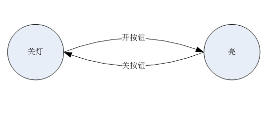
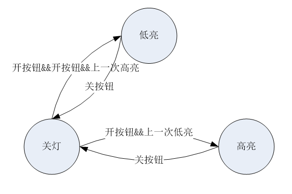

# 状态机模式

> 【摘要】 状态（state）模式是C语言实现相当常用的模式，也是能够在C语言下 体现出来的最显性的模式之一。在面向对象里，状态模式允许一个对象在内部状态改变的时候改变其行为。

## 模式介绍

状态（state）模式是C语言实现相当常用的模式，也是能够在C语言现出来的最显性的模式之一。在面向对象里，状态模式允许一个对象在内部状态改变的时候改变其行为。

状态用法很多，最常见的是状态机，分为无限状态机和有限状态机。

有限状态机 `finite-state machine， FSM`， 输入集合和输出集合都是有限的，并只有有限数目的状态。 一般说到状态机即是对有限状态机的简称。

无限状态机 `infinite-state machine，ISM` ，输入和输出集合无线，状态数目无限的状态机。

在C语言里，状态模式有且仅有一种经典用法，就是有限状态机（FSM）的实现。实现的方式极为突出明显，大部分情况都能直接照搬框架。

状态机最常见的使用场景是实现协议。通常协议会有几个核心状态机描述。

## 有限状态机

### 状态机示例1

有一个灯，按下开按钮，就会开灯，按下关按钮就会关灯。这就是一个很典型的简单的有限状态机。简单的描述有2个状态，关灯`[STATE_OFF]`，亮 `[STATE_LIGHT_ON]` 。有两个事件，开和关按钮。这两个事件促使状态机间的转换。



### 状态机示例2

有一个灯，按下开按钮，就会开灯，按下关按钮就会关灯。和一般等不同的是，两次开之间的灯的明暗不一样。也就是说，第一次开的时候，是高亮，关灯后，再开是低亮，下次再开是高亮，循环往复。

这就是一个很典型的简单的有限状态机。简单的描述有3个状态，关灯 `[STATE_OFF]`，高亮`[STATE_HIGH_LIGHT]`，低亮 `[STATE_LOW_LIGHT]`。



### 简单状态机模式实现

以状态机示 `例1` 为目标，如果用 `if/switch/case` 来，就没有什么设计和模式的意义，那只是最普通的流程开发技能。以下是简单状态机模式实现，适用于转移条件单一，对结果很确定的状态机。

```c
#define STATE_OFF  0
#define STATE_LIGHT_ON 1
#define STATE_MAX  2
#define EVETN_BTN_OFF
#define EVETN_BTN_ON
#define EVETN_MAX

int light_fsm_simple_table[STATE_MAX][EVETN_MAX] =
{
    [STATE_OFF][EVETN_BTN_OFF] = STATE_OFF,
    [STATE_OFF][EVETN_BTN_ON] = STATE_LIGHT_ON,
    [STATE_LIGHT_ON][EVETN_BTN_OFF] = STATE_OFF,
    [STATE_LIGHT_ON][EVETN_BTN_ON] = STATE_LIGHT_ON
};

int light_fsm_event(int cur_stat, int event)
{
    int next_state;
    next_state = light_fsm_simple_table[cur_stat][event];
    return next_state;
}

int main()
{
    int light_state = STATE_OFF; 
    int eve1 = EVETN_BTN_OFF; 
    int eve2 = EVETN_BTN_ON;

    light_state = light_fsm_event(light_state, eve1);
    printf("now light state is %d\n", light_state);

    light_state = light_fsm_event(light_state, eve2);
    printf("now light state is %d\n", light_state);
}
```

以上代码有几个要点

1. 状态转移数组。由于简单模式某种状态下发生某事件的结果是确定的，所以数组的值就是下一个状态。

2. 需要一个状态处理的封装函数 `light_fsm_event`。里面除了转移状态，可以增加扩展处理。不然简单模式应用就很局限。比如可以在 `light_fsm_event` 里面加入

```c
if(next_state == STATE_LIGHT_ON) { 
    printf("light is on");
}
```

### 普通状态机模式实现

大型一点的项目，比如复杂协议的实现，一个状态转移到下一个状态的情况是比较复杂的，无法用当前状态和事件简单确定，所以一般需要函数。

以下代码实现了状态机 `示例二`，为样例代码，未运行实验过。

```c
#define STATE_DEPEND 	4
#define STATE_OFF   	0
#define STATE_HIGH_LIGHT  	1
#define STATE_LOW_LIGHT  	2
#define STATE_MAX   	3
#define EVETN_BTN_OFF
#define EVETN_BTN_ON
#define EVETN_MAX

int last_state = STATE_LOW_LIGHT;
int last_light_state = STATE_LOW_LIGHT;

struct {
    int (*func) ();
    int next_state;
} light_fsm [STATE_MAX][EVETN_MAX] =
{
    //STATE_OFF
    {
        { lfsm_ignore, STATE_MAX }, /*EVETN_BTN_OFF*/
        { lfsm_btn_on, STATE_DEPEND }, /*EVETN_BTN_ON*/
    }

    //STATE_HIGH_LIGHT
    {
        { lfsm_btn_off, STATE_OFF }, /*EVETN_BTN_OFF*/
        { lfsm_ignore, STATE_MAX }, /*EVETN_BTN_ON*/
    }

    //STATE_LOW_LIGHT
    {
        { lfsm_btn_off, STATE_OFF }, /*EVETN_BTN_OFF*/
        { lfsm_ignore, STATE_MAX }, /*EVETN_BTN_ON*/
    }
}

int lfsm_ignore(int cur_stat, int event)
{
    printf("invalid state or event\n");
    return 0;
}

int lfsm_btn_on(int cur_stat, int event)
{
    if(last_light_state == STATE_HIGH_LIGHT)
    {
        return STATE_LOW_LIGHT;
    }
    else if(last_light_state == STATE_LOW_LIGHT)
    {
        return STATE_HIGH_LIGHT;
    }
    else
    {
        printf("invalid state\n");
        return STATE_MAX;
    }
}

int lfsm_btn_off(int cur_stat, int event)
{
    last_light_state = cur_stat;
    return 0;
}

int light_change_state(int cur_stat, int next_state,int event)
{
    //if light on has special handling
    if(next_state = STATE_HIGH_LIGHT)
    {
        printf("rejoice, now bright light\n")
    };

    //other state change related handlings, maybe use current state and next state, or event type  
    last_state = cur_stat;
    cur_stat = next_state;

    return 0;
}

int light_event_happen(int event)
{
    //if light on has special handling
    if(event = EVETN_BTN_OFF)
    {
        printf("someone turn off light\n");
    }

    //other event type related handlings

    return 0;
}

int light_fsm_event(int cur_stat, int event)
{
    int next_state, next_state_tmp;

    next_state_tmp = *(light_fsm[cur_stat][event].func);

    if(next_state_tmp == STATE_MAX)
    {
        printf("fsm error\n");
        return -1;
    }

    if(light_fsm[cur_stat][event].next_state == STATE_DEPEND)
    {
        next_state = next_state_tmp;
    }
    else
    {
        next_state = light_fsm[cur_stat][event].next_state;       
    }

    light_change_state(next_state, cur_stat, event);
    light_event_happen(event);
}

int main()
{
    int light_state = STATE_OFF;  

    light_fsm_event(light_state, EVETN_BTN_OFF);
    light_fsm_event(light_state, EVETN_BTN_ON);
    light_fsm_event(light_state, EVETN_BTN_OFF);
    light_fsm_event(light_state, EVETN_BTN_ON);   
}
```

普通模式的状态机的几个关键点

1. 状态机数组由状态事件处理函数 + 下一个状态数组代替简单模式的下一个状态的数组

2. 由于在特定模式特定事件发生时，有的情况不能确定下一个状态的跳转，有的情况可以。所以下一状态有个特殊值为 `STATE_DEPEND`。如果遇到这个值，就从状态变化函数里获得下一个状态。否则按照状态机数组设定的状态。

3. 设定一个状态 `STATE_MAX` 用来表示错误事件，加上一个 `lfsm_ignore` 函数来处理这种情况。比如本例中，设定 `EVETN_BTN_ON` 不可能在开灯的时候发生。

4. 状态机里除了状态机数字函数执行，有两类通用的函数，不参与主要的状态机运行，但是对状态机有影响。一类和特定的状态或状态转移有关，另外一类是和特定的事件有关。在样例代码里分别以 `light_change_state` 和 `light_event_happen` 来表示。

5. 一般情况下，有一个全局变量保存当前状态和上一个状态。

面向对象语言实现状态机通常是一个状态的抽象父类，每个状态有一个子类和一个实例。C语言里状态转移表的函数指针是通过状态子类的成员函数实现。其他的写法思路比较接近。

### 复杂状态机模式实现

最常见的复杂状态机是为了实现网络协议。比如 `OSPF`，可以参见我写的另外一篇文章 ZEBRA中FSM编写总结.doc

## 模式实现总结

1. 项目开发里最常见的使用为普通状态机，网络协议使用的复杂状态机也是在普通状态机上添加一些特性而来，基本特征是非常类似的。

2. C语言实现状态机的模式是非常固定的。**状态转移表和核心的状态转移函数是核心**。普通状态机的几个要素，不管在初始设计中有没有使用到，建议都写上。

