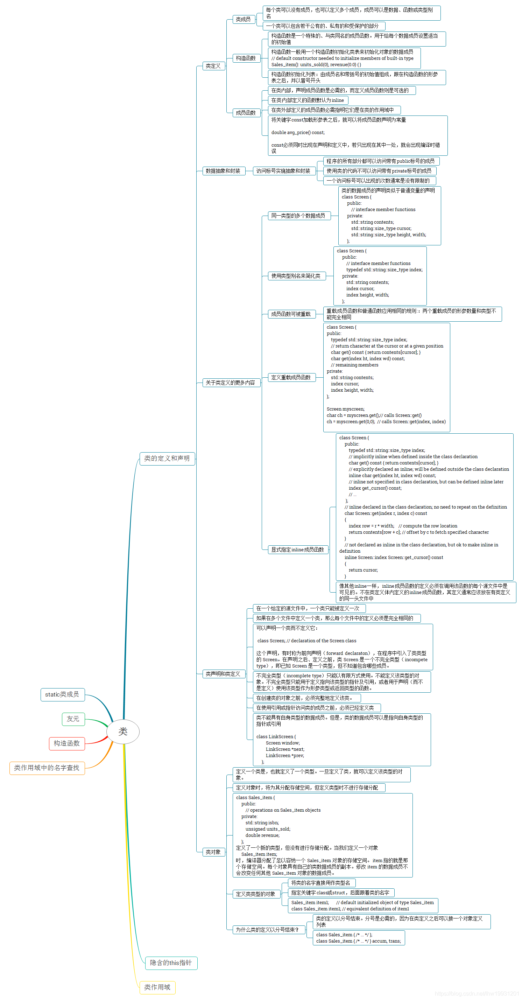
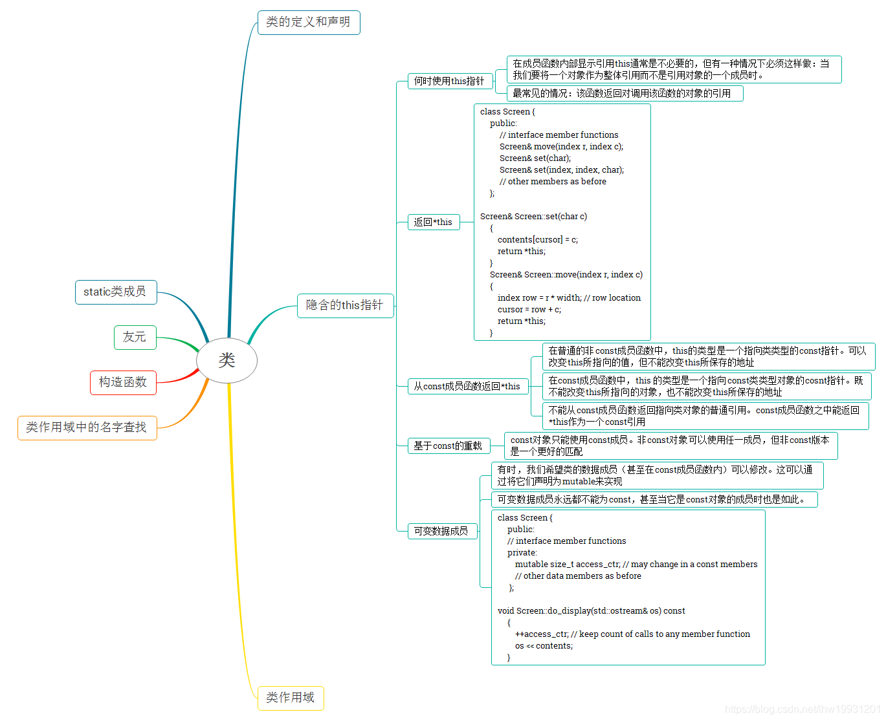
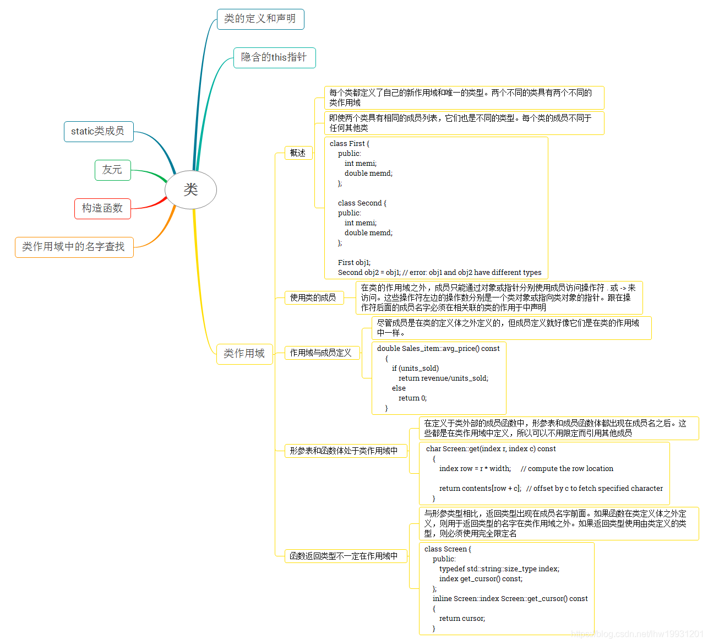
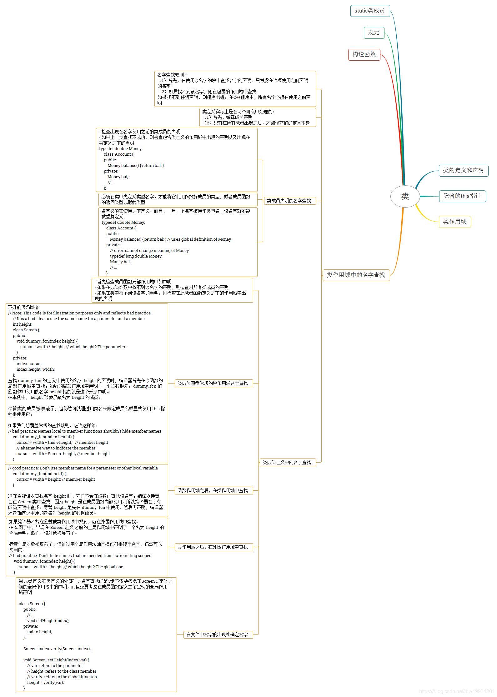
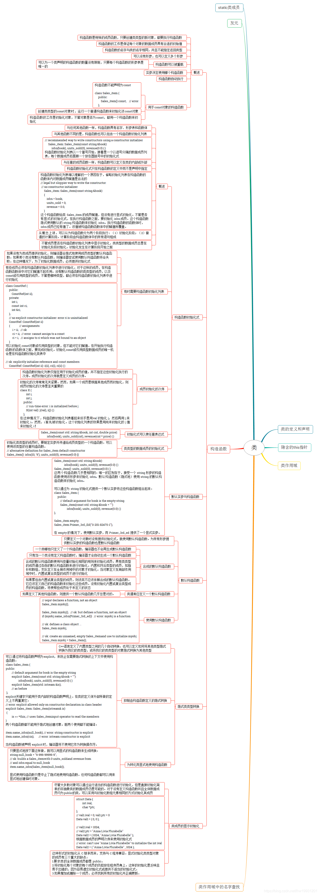
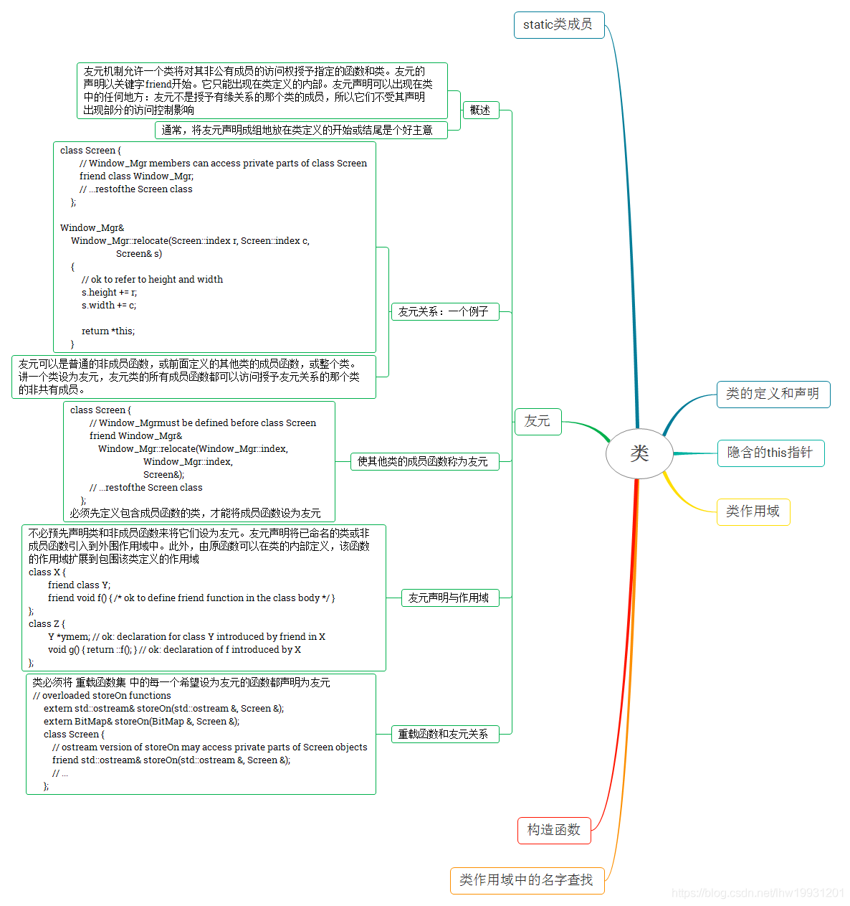
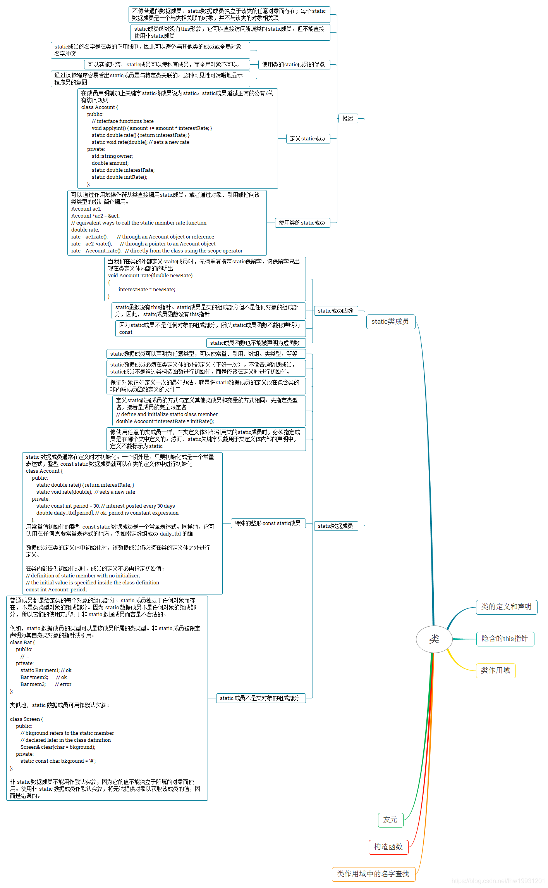

## c++ 实用汇总

> [《C++ Primer》第十二章 类 思维导图](https://blog.csdn.net/lhw19931201/article/details/103706112)
>
> [effective c++ 思维导图](https://www.cnblogs.com/harlanc/p/6760057.html)

### 类的定义和声明

### 隐含的this指针

### 类作用域

### 类作用域中名字查找

### 类-构造函数

### 类-友元

### 类-static类成员

