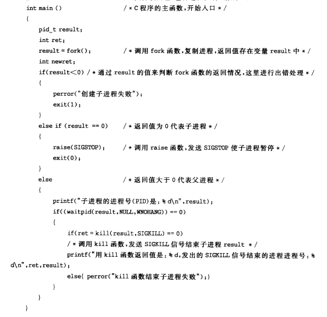
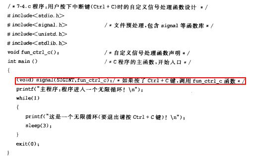
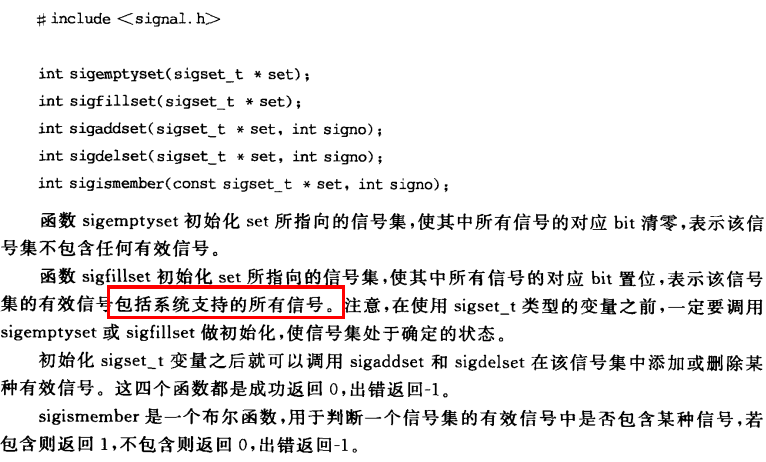
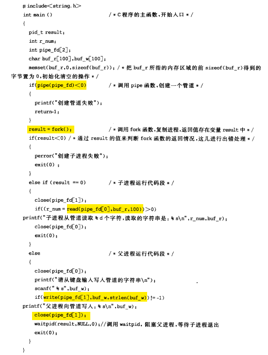
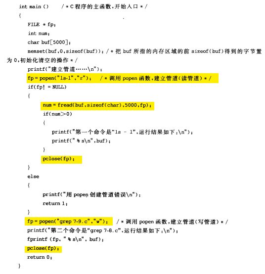
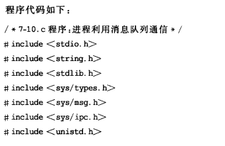
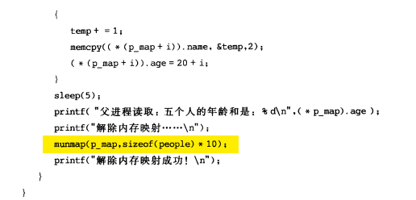
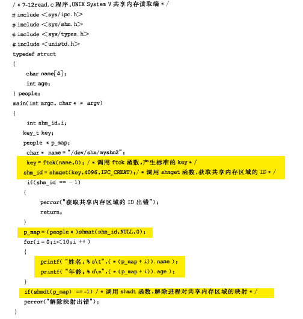

# 进程间通信的方式 -- 信号、管道、消息队列、共享内存

## 多进程

首先，先来讲一下fork之后，发生了什么事情。

由fork创建的新进程被称为子进程（child process）。**该函数被调用一次，但返回两次。两次返回的区别是子进程的返回值是0**，而**父进程的返回值则是新进程（子进程）的进程 id。将子进程id返回给父进程的理由是：因为一个进程的子进程可以多于一个，没有一个函数使一个进程可以获得其所有子进程的进程id**。对子进程来说，之所以fork返回0给它，是因为它随时可以调用**getpid()来获取自己的pid；也可以调用getppid()来获取父进程的id**。(进程id 0总是由交换进程使用，所以一个子进程的进程id不可能为0 )。

fork之后，**操作系统会复制一个与父进程完全相同的子进程，虽说是父子关系，但是在操作系统看来，他们更像兄弟关系，这2个进程共享代码空间，但是数据空间是互相独立的，子进程数据空间中的内容是父进程的完整拷贝，指令指针也完全相同，子进程拥有父进程当前运行到的位置**（**两进程的程序计数器pc值相同，也就是说，子进程是从fork返回处开始执行的**），但有一点不同，如果fork成功，子进程中fork的返回值是0，父进程中fork的返回值是子进程的进程号，如果fork不成功，父进程会返回错误。
可以这样想象，2个进程一直同时运行，而且步调一致，在fork之后，他们分别作不同的工作，也就是分岔了。这也是fork为什么叫fork的原因

至于那一个最先运行，可能与操作系统（调度算法）有关，而且这个问题在实际应用中并不重要，如果需要父子进程协同，可以通过原语的办法解决。

## 常见的通信方式

1. **管道pipe：**管道是一种半双工的通信方式，数据只能单向流动，而且只能在具有亲缘关系的进程间使用。进程的亲缘关系通常是指父子进程关系。
2. **命名管道FIFO：**有名管道也是半双工的通信方式，但是它允许无亲缘关系进程间的通信。
3. **消息队列MessageQueue：**消息队列是由消息的链表，存放在内核中并由消息队列标识符标识。消息队列克服了信号传递信息少、管道只能承载无格式字节流以及缓冲区大小受限等缺点。
4. **共享存储SharedMemory：**共享内存就是映射一段能被其他进程所访问的内存，这段共享内存由一个进程创建，但多个进程都可以访问。共享内存是最快的 IPC 方式，它是针对其他进程间通信方式运行效率低而专门设计的。它往往与其他通信机制，如信号两，配合使用，来实现进程间的同步和通信。
5. **信号量Semaphore：**信号量是一个计数器，可以用来控制多个进程对共享资源的访问。它常作为一种锁机制，防止某进程正在访问共享资源时，其他进程也访问该资源。因此，主要作为进程间以及同一进程内不同线程之间的同步手段。
6. **套接字Socket：**套解口也是一种进程间通信机制，与其他通信机制不同的是，它可用于不同及其间的进程通信。
7. **信号 ( sinal ) ：** 信号是一种比较复杂的通信方式，用于通知接收进程某个事件已经发生。

## 信号

信号是Linux系统中用于进程之间通信或操作的一种机制，信号可以在任何时候发送给某一进程，而无须知道该进程的状态。如果该进程并未处于执行状态，则该信号就由内核保存起来，知道该进程恢复执行并传递给他为止。如果一个信号被进程设置为阻塞，则该信号的传递被延迟，直到其阻塞被取消时才被传递给进程。

Linux提供了几十种信号，分别代表着不同的意义。信号之间依靠他们的值来区分，但是通常在程序中使用信号的名字来表示一个信号。在Linux系统中，这些信号和以他们的名称命名的常量被定义在`/usr/includebitssignum.h`文件中。通常程序中直接包含`<signal.h>`就好。

信号是在软件层次上对中断机制的一种模拟，是一种异步通信方式，信号可以在用户空间进程和内核之间直接交互。内核也可以利用信号来通知用户空间的进程来通知用户空间发生了哪些系统事件。信号事件有两个来源：

1）硬件来源，例如按下了`cltr+C`，通常产生中断信号 sigint

2）软件来源，例如使用系统调用或者命令发出信号。最常用的发送信号的系统函数是`kill,raise,setitimer,sigation,sigqueue`函数。软件来源还包括一些非法运算等操作。

一旦有信号产生，用户进程对信号产生的相应有三种方式：

1）执行默认操作，linux对每种信号都规定了默认操作。

2）捕捉信号，定义信号处理函数，当信号发生时，执行相应的处理函数。

3）忽略信号，当不希望接收到的信号对进程的执行产生影响，而让进程继续执行时，可以忽略该信号，即不对信号进程作任何处理。

有两个信号是应用进程无法捕捉和忽略的，即 `SIGKILL` 和 `SEGSTOP`，这是为了使系统管理员能在任何时候中断或结束某一特定的进程。


上图表示了Linux中常见的命令

### 信号发送：

信号发送的关键使得系统知道向哪个进程发送信号以及发送什么信号。下面是信号操作中常用的函数：


例子：创建子进程，为了使子进程不在父进程发出信号前结束，子进程中使用 `raise` 函数发送 `sigstop` 信号，使自己暂停；父进程使用信号操作的kill函数，向子进程发送 `sigkill` 信号，子进程收到此信号，结束子进程。



### 信号处理

当某个信号被发送到一个正在运行的进程时，该进程即对次特定的信号注册相应的信号处理函数，以完成所需处理。设置信号处理方式的是 `signal` 函数，在程序正常结束前，在应用 `signal` 函数恢复系统对信号的

默认处理方式。



### 信号阻塞

有时候既不希望进程在接收到信号时立刻中断进程的执行，也不希望此信号完全被忽略掉，而是希望延迟一段时间再去调用信号处理函数，这个时候就需要信号阻塞来完成。



例子：主程序阻塞了`cltr+c` 的 `sigint `信号。用 `sigpromask` 将 `sigint` 假如阻塞信号集合。


## 管道

管道允许在进程之间按先进先出的方式传送数据，是进程间通信的一种常见方式。

管道是Linux 支持的最初Unix IPC形式之一，具有以下特点：

1) 管道是**半双工的**，数据只能向一个方向流动；**需要双方通信时，需要建立起两个管道**；

2) 匿名管道只能用于父子进程或者兄弟进程之间（具有亲缘关系的进程）；

3) 单独构成一种独立的文件系统：管道对于管道两端的进程而言，就是一个文件，但它不是普通的文件，它不属于某种文件系统，而是自立门户，单独构成一种文件系统，并且只存在与内存中。

 管道分为pipe（**无名管道**）和fifo（**命名管道**）两种，除了建立、打开、删除的方式不同外，这两种管道几乎是一样的。他们都是通过内核缓冲区实现数据传输。

- pipe用于相关进程之间的通信，例如父进程和子进程，它通过pipe()系统调用来创建并打开，当最后一个使用它的进程关闭对他的引用时，pipe将自动撤销。
- FIFO即命名管道，**在磁盘上有对应的节点，但没有数据块**——换言之，只是拥有一个名字和相应的访问权限，通过mknode()系统调用或者mkfifo()函数来建立的。一旦建立，任何进程都可以通过文件名将其打开和进行读写，而不局限于父子进程，当然前提是进程对FIFO有适当的访问权。当不再被进程使用时，FIFO在内存中释放，但磁盘节点仍然存在。

管道的实质是一个内核缓冲区，进程以先进先出的方式从缓冲区存取数据：管道一端的进程顺序地将进程数据写入缓冲区，另一端的进程则顺序地读取数据，该缓冲区可以看做一个循环队列，读和写的位置都是自动增加的，一个数据只能被读一次，读出以后再缓冲区都不复存在了。当缓冲区读空或者写满时，有一定的规则控制相应的读进程或写进程是否进入等待队列，当空的缓冲区有新数据写入或慢的缓冲区有数据读出时，就唤醒等待队列中的进程继续读写。


### 无名管道

pipe的例子：父进程创建管道，并在管道中写入数据，而子进程从管道读出数据



### 命名管道

和无名管道的主要区别在于，命名管道有一个名字，命名管道的名字对应于一个磁盘索引节点，有了这个文件名，任何进程有相应的权限都可以对它进行访问。

而无名管道却不同，进程只能访问自己或祖先创建的管道，而不能访任意访问已经存在的管道——因为没有名字。

Linux中通过系统调用 `mknod()` 或 `makefifo()` 来创建一个命名管道。最简单的方式是通过直接使用shell

```bash
mkfifo myfifo
```

 等价于

```bash
mknod myfifo p
```

以上命令在当前目录下创建了一个名为 `myfifo` 的命名管道。用 `ls -p` 命令查看文件的类型时，可以看到命名管道对应的文件名后有一条竖线 `"|"`，表示该文件不是普通文件而是命名管道。

使用 `open()` 函数通过文件名可以打开已经创建的命名管道，而无名管道不能由 `open` 来打开。当一个命名管道不再被任何进程打开时，它没有消失，还可以再次被打开，就像打开一个磁盘文件一样。

可以用删除普通文件的方法将其删除，实际删除的事磁盘上对应的节点信息。

例子：用命名管道实现聊天程序，一个张三端，一个李四端。两个程序都建立两个命名管道，fifo1,fifo2,张三写fifo1，李四读fifo1；李四写fifo2，张三读fifo2。

用 `select` 把，管道描述符和 stdin 假如集合，用 select 进行阻塞，如果有 i/o 的时候唤醒进程。（粉红色部分为select部分，黄色部分为命名管道部分）


在linux系统中，除了用pipe系统调用建立管道外，还可以使用C函数库中管道函数popen函数来建立管道，使用pclose关闭管道。

例子：设计一个程序用popen创建管道，实现  `ls -l |grep main.c` 的功能

分析：先用popen函数创建一个读管道，调用fread函数将ls -l的结果存入buf变量，用printf函数输出内容，用pclose关闭读管道；

接着用popen函数创建一个写管道，调用fprintf函数将buf的内容写入管道，运行grep命令。



popen的函数原型：

```c
FILE* popen(const char* command,const char* type);
```

参数说明：

- **command** 是子进程要执行的命令，
- **type** 表示管道的类型，r表示读管道，w代表写管道。

如果成功返回管道文件的指针，否则返回NULL。

使用popen函数读写管道，实际上也是调用pipe函数调用建立一个管道，再调用fork函数建立子进程，接着会建立一个shell 环境，并在这个shell环境中执行参数所指定的进程。

## 消息队列

消息队列，就是一个消息的链表，是一系列保存在内核中消息的列表。用户进程可以向消息队列添加消息，也可以向消息队列读取消息。

消息队列与管道通信相比，其优势是对每个消息指定特定的消息类型，接收的时候不需要按照队列次序，而是可以根据自定义条件接收特定类型的消息。

可以把消息看做一个记录，具有特定的格式以及特定的优先级。对消息队列有写权限的进程可以向消息队列中按照一定的规则添加新消息，对消息队列有读权限的进程可以从消息队列中读取消息。

消息队列的常用函数如下表：


进程间通过消息队列通信，主要是：创建或打开消息队列，添加消息，读取消息和控制消息队列。

例子：用函数 `msget` 创建消息队列，调用 `msgsnd` 函数，把输入的字符串添加到消息队列中，然后调用 `msgrcv` 函数，读取消息队列中的消息并打印输出，最后再调用 `msgctl` 函数，删除系统内核中的消息队列。（黄色部分是消息队列相关的关键代码，粉色部分是读取stdin的关键代码）




## 共享内存

共享内存允许两个或多个进程共享一个给定的存储区，这一段存储区可以被两个或两个以上的进程映射至自身的地址空间中，一个进程写入共享内存的信息，可以被其他使用这个共享内存的进程，通过一个简单的内存读取错做读出，从而实现了进程间的通信。

采用共享内存进行通信的一个主要好处是效率高，因为进程可以直接读写内存，而不需要任何数据的拷贝，对于像管道和消息队里等通信方式，**则需要再内核和用户空间进行四次的数据拷贝，而共享内存则只拷贝两次：一次从输入文件到共享内存区，另一次从共享内存到输出文件。**


一般而言，进程之间在共享内存时，并不总是读写少量数据后就解除映射，有新的通信时在重新建立共享内存区域；而是保持共享区域，直到通信完毕为止，这样，数据内容一直保存在共享内存中，并没有写回文件。共享内存中的内容往往是在解除映射时才写回文件，因此，采用共享内存的通信方式效率非常高。


共享内存有两种实现方式：

1、内存映射 

2、共享内存机制

### 内存映射

内存映射 memory map机制使进程之间通过映射同一个普通文件实现共享内存，通过 `mmap()` 系统调用实现。普通文件被映射到进程地址空间后，进程可以

像访问普通内存一样对文件进行访问，不必再调用read/write等文件操作函数。

例子：创建子进程，父子进程通过匿名映射实现共享内存。

分析：主程序中先调用 `mmap` 映射内存，然后再调用 `fork` 函数创建进程。那么在调用 `fork` 函数之后，子进程继承父进程匿名映射后的地址空间，同样也继承 `mmap` 函数的返回地址，这样，父子进程就可以通过映射区域进行通信了。




### UNIX System V共享内存机制

IPC的共享内存指的是把所有的共享数据放在共享内存区域（IPC shared memory region），任何想要访问该数据的进程都必须在本进程的地址空间新增一块内存区域，用来映射存放共享数据的物理内存页面。

和前面的 `mmap` 系统调用通过映射一个普通文件实现共享内存不同，UNIX system V共享内存是通过映射特殊文件系统 `shm` 中的文件实现进程间的共享内存通信。

例子：设计两个程序，通过unix system v共享内存机制，一个程序写入共享区域，另一个程序读取共享区域。

分析：一个程序调用 fotk 函数产生标准的key，接着调用 `shmget` 函数，获取共享内存区域的id，调用 `shmat` 函数，映射内存，循环计算年龄，另一个程序读取共享内存。

（fotk函数在消息队列部分已经用过了，根据pathname指定的文件（或目录）名称，以及proj参数指定的数字，ftok函数为IPC对象生成一个唯一性的键值。）

```
key_t ftok(char* pathname,char proj)
```




