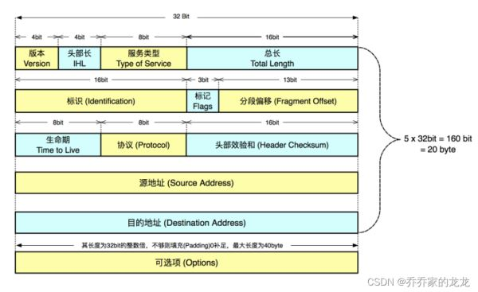

## 网络字节序大小端

计算机硬件有两种储存数据的方式：大端字节序（big endian）和小端字节序（little endian）。

举例来说，数值`0x2211`使用两个字节储存：高位字节是`0x22`，低位字节是`0x11`。

> - **大端字节序**：高位字节在前，低位字节在后，这是人类读写数值的方法。
> - **小端字节序**：低位字节在前，高位字节在后，即以`0x1122`形式储存。

同理，`0x1234567`的大端字节序和小端字节序的写法如下图。


> 首先，为什么会有小端字节序？
>
> 答案是，计算机电路先处理低位字节，效率比较高，因为计算都是从低位开始的。所以，计算机的内部处理都是小端字节序。
>
> 但是，人类还是习惯读写大端字节序。所以，**除了计算机的内部处理，其他的场合几乎都是大端字节序**，比如网络传输和文件储存。

计算机处理字节序的时候，不知道什么是高位字节，什么是低位字节。它只知道按顺序读取字节，先读第一个字节，再读第二个字节。

如果是大端字节序，先读到的就是高位字节，后读到的就是低位字节。小端字节序正好相反。

理解这一点，才能理解计算机如何处理字节序。

字节序的处理，就是一句话：

> **"只有读取的时候，才必须区分字节序，其他情况都不用考虑。"**

处理器读取外部数据的时候，必须知道数据的字节序，将其转成正确的值。然后，就正常使用这个值，完全不用再考虑字节序。

即使是向外部设备写入数据，也不用考虑字节序，正常写入一个值即可。外部设备会自己处理字节序的问题。

举例来说，处理器读入一个16位整数。如果是大端字节序，就按下面的方式转成值。

```c
x = buf[offset] * 256 + buf[offset+1];
```

上面代码中，`buf`是整个数据块在内存中的起始地址，`offset`是当前正在读取的位置。第一个字节乘以256，再加上第二个字节，就是大端字节序的值，这个式子可以用逻辑运算符改写。

```c
x = buf[offset]<<8 | buf[offset+1];
```

上面代码中，第一个字节左移8位（即后面添8个`0`），然后再与第二个字节进行或运算。

如果是小端字节序，用下面的公式转成值。

```c
x = buf[offset+1] * 256 + buf[offset];
```

32位整数的求值公式也是一样的。

```c
/* 大端字节序 */
i = (data[3]<<0) | (data[2]<<8) | (data[1]<<16) | (data[0]<<24);

/* 小端字节序 */
i = (data[0]<<0) | (data[1]<<8) | (data[2]<<16) | (data[3]<<24);
```


## 动态库和静态库


## define


## 指针


## C中回调函数使用

1、使用typedef声明一个函数指针。

2、使用C语言实现一个和函数指针返回值类型。

函数参数都一样的函数(函数名字任意取)。

3、将实现的C语言函数作为参数传递（实际上就是传递的函数指针）。

4、满足特定的情况下，调用回调函数。

**实例**

```c
//没有参数的回调函数
typedef  int (*callBackFunc)();
 
//含有参数的回调函数，回调函数参数可以是一个或者多个
typedef  int (*callBackFunc)(int x);
typedef  int (*callBackFunc)(int x, int y, int z);
```

## union

TODO

- 使用union时，要留意平台的大小端问题。

## 结构体相关

C语言中[结构体](https://so.csdn.net/so/search?q=结构体&spm=1001.2101.3001.7020)定义如果某个变量不需要基础数据类型的字节数，则可以通过**冒号**的方式**通过位域（bitfield）来定义需要的字节数**。

```c
typedef struct {
    uint8_t r   : 8;
    uint8_t g   : 8;
    uint8_t b   : 8;
    uint8_t hdr : 1;
    uint8_t a   : 2;
    uint8_t pad : 5;
} HDRPIXEL;
```

上面这个结构体的真实所占字节数为 4 。

位段跨平台不支持，跟多少位的操作系统有关系，跟内存存放从左到右还是从右到左有关系。

应用场景：网络上数据包格式



## attribute 关键字

> [linux 中`__attribute__` 机制详解](https://blog.csdn.net/shift_wwx/article/details/103689854)

GNU C 的一大特色就是`__attribute__ `机制。attribute 可以设置函数属性（Function Attribute）、变量属性（Variable Attribute）和类型属性（Type Attribute）。用于编译器对源代码的优化。

当`__attribute__ ` 用于修饰对象时，它就如同C 语言语法体系结构的类型限定符，跟const , volatile , restrict 等属一类。
当`__attribute__` 用于修饰函数时，它就相当于一个函数说明符，跟inline，Noreturn 属同一类。
当`__attribute__` 用于修饰一个结构体，联合体或者枚举类型，该限定符只能放在类型标识符之前。

**`__attribute__`语法格式为：** `__attribute__` ( ( attribute-list ) )

`__attribute__` 结构体中的应用：

- `__attribute__`((aligned (n)))： 让所作用的结构成员对齐在n字节自然边界上。如果结构体中有成员的长度大于n，则按照最大成员的长度来对齐。

- `__attribute__` ((packed))：取消结构在编译过程中的优化对齐，按照实际占用字节数进行对齐。

【注】__attribute__机制是GCC的一大特色，可以设置函数属性(Function Attribute)、变量属性(Variable Attribute)和类型属性(Type Attribute)。

## inline

TODO

内联函数在某些情况下类似与宏（macro）。

在一定条件下编译，内联函数将直接将代码内嵌到调用它的父函数中，编译时指定-O选项才可能被内嵌。也可以指定内嵌函数一个属性“always_inline”强制内嵌。

有几种情况将不内嵌，而作为普通函数调用：

1、 不确定数量参数的函数

2、 调用alloca类库函数的

3、 有可变尺寸数组声明的。

4、 非本地goto的。

5、 嵌套调用的。

