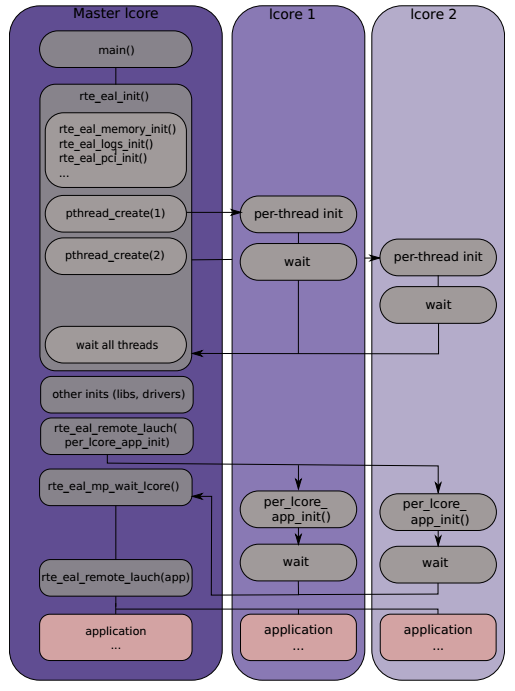

---

[DPDK 网卡收包流程](https://blog.csdn.net/Rong_Toa/article/details/109400686)

[DPDK收发包流程分析（一）](https://blog.csdn.net/u014787815/article/details/109019273)

[DPDK 收发包流程](https://www.jianshu.com/p/69aa4c99cdb0)

[dpdk报文收发流程--理解dma控制器、UIO驱动、描述符空间、mbuf空间、KNI](https://blog.csdn.net/gengzhikui1992/article/details/112538641)

[dpdk框架介绍](https://www.daimajiaoliu.com/daima/4793d63569003fc)


DPDK 模块概念理解：

[NIC（网络适配器）](https://www.cnblogs.com/yjds/p/8597003.html)

[网卡工作原理详解](https://blog.csdn.net/tao546377318/article/details/51602298)

[搞懂Linux零拷贝，DMA](https://rtoax.blog.csdn.net/article/details/108825666)

[深入浅出DPDK之内存特点和IOVA - DMA](https://blog.51cto.com/u_14813976/5253343)

[dpdk 网络数据包e1000和DMA](https://blog.csdn.net/weixin_43836778/article/details/119802263)


[DPDK之PMD原理](https://cloud.tencent.com/developer/article/1408847)

[深入理解DPDK架构|经典PDF分享](https://zhuanlan.zhihu.com/p/435030809)


---

# DPDK 准备知识

> [DPDK（二）：准备知识1---hugepage](https://www.cnblogs.com/xiaomayi-cyj/p/10542924.html)
>
> [DPDK（二）：准备知识3 ---内存屏障](https://www.cnblogs.com/xiaomayi-cyj/p/10542946.html)
>
> [DPDK（二）：准备知识4 --- 无锁FIFO环形队列](https://www.cnblogs.com/xiaomayi-cyj/p/10542962.html)
>
> [DPDK（二）准备6---PMD](https://www.cnblogs.com/xiaomayi-cyj/p/10542973.html)
>
> [DPDK（二）：准备知识9 --- Linux内核收报流程](https://www.cnblogs.com/xiaomayi-cyj/p/10543027.html)
>
> [DPDK（二）：准备知识11 --- 网卡DMA控制器](https://www.cnblogs.com/xiaomayi-cyj/p/10543048.html)
>
> [LLDP 链路层发现协议](https://www.cnblogs.com/xiaomayi-cyj/p/10543181.html)


> [DPDK（三）：入门1---DPDK官方用例](https://www.cnblogs.com/xiaomayi-cyj/p/10543157.html)
>
> [DPDK（三）：入门2---DPDK部分代码解释](https://www.cnblogs.com/xiaomayi-cyj/p/10543165.html)


---

# DPDK 术语

**EAL**：Environment Abstraction Layer

**LPM**：Longest Prefix Match

**IOVA-contiguous**：

**VFIO**：VFIO是一个可以安全的把设备I/O、中断、DMA等暴露到用户空间，从而可以在用户空间完成设备驱动的框架。

**NUMA**：Non Uniform Memory Access Architecture 非统一内存访问

**DMA**：Direct Memory Access，直接存储器访问（它允许不同速度的硬件装置来沟通，而不需要依赖于[ CPU ](https://baike.baidu.com/item/ CPU /120556)的大量中断负载）

**TLS**：Thread Local Storage

**UIO**：Userspace I/O 是运行在用户空间的I/O技术，只支持一个中断号

**NIC**：Network Interface Card ，网卡也叫“网络适配器”

**PMD**：Physical Media Dependent，物理介质关联层接口

**LSC**：link status change

**IOMMU**：(i/o memory management unit)。IOMMU有两大功能：控制设备DMA地址映射到机器物理地址（dmar），中断重映射（intremap）

**IOVA**：

**TLS**：Thread Local Storage

**Offload**: 谷歌的解释 Computers To transfer (data) to a peripheral device.在这里就是解释为发包的意思。卸载嘛，把包从网卡上卸出去，发出去的意思。

**MMIO**: Memory-mapped I/O 内存映射I/O，它是PCI规范的一部分，I/O设备被放置在内存空间而不是I/O空间。从处理器的角度看，内存映射I/O后系统设备访问起来和内存一样。

**DDIO**：Intel DDIO, Intel的以太网服务器NICs和控制器直接与处理器缓存通信，无需绕道通过系统内存。Intel DDIO使处理器缓存成为I/O数据的主要目的地和来源，而不是主存储器。


---

# DPDK 框架

> [DPDK documentation 中文](https://dpdk-docs.readthedocs.io/en/latest/linux_gsg/sys_reqs.html)
>
> [DPDK API](https://doc.dpdk.org/api/index.html)
>
> [DPDK - gitbook](https://feisky.gitbooks.io/sdn/content/dpdk/)
>
> [赵子清技术文档 - DPDK](https://zzqcn.github.io/opensource/dpdk/hf-dpdk/intro.html#id2)
>
> [一文看懂DPDK](https://cloud.tencent.com/developer/article/1198333)
>
> [DPDK技术介绍](https://www.jianshu.com/p/6ced3e5a0c7a)
>
> [《深入浅出DPDK》与《DPDK应用基础》读书笔记](https://www.devopstory.cn/archives/网络编程/《深入浅出dpdk》与《dpdk应用基础》读书笔记/)
>
> [DPDK — 架构解析](https://blog.51cto.com/u_15127649/3854067)
>
> [【协议森林】DPDK原理及使用（三）](https://blog.csdn.net/u012503639/article/details/121002122)


### 概述

DPDK的主要目标就是要为数据面快速报文处理应用提供一个简洁但是完整的框架。 用户可以通过代码来理解其中使用的一些技术，并用来构建自己的应用原型或是添加自己的协议栈。 用户也可以替换DPDK提供的原生的选项。

通过创建环境抽象层EAL，DPDK框架为每个特殊的环境创建了运行库。 这个环境抽象层是对底层架构的抽象，通过make和配置文件，在Linux用户空间编译完成。 一旦EAL库编译完成，用户可以通过链接这些库来构建自己的app。 除开环境抽象层，还有一些其他库，包括哈希算法、最长前缀匹配、环形缓冲器。 DPDK提供了一些app用例用来指导如何使用这些特性来创建自己的应用程序。

DPDK实现了run-to-complete报文处理模型，数据面处理程序在调用之前必须预先分配好所有的资源，并作为执行单元运行与逻辑核心上。 这种模型并不支持调度，且所有的设备通过轮询方式访问。 不使用中断方式的主要原因就是中断处理增加了性能开销。

作为RTC模型的扩展，**通过使用ring在不同core之间传递报文和消息，也可以实现报文处理的流水线模型（pipeline）**。 流水线模型允许操作分阶段执行，在多核代码执行中可能更高效。

### 环境适配层EAL

环境适配层(Environment Abstraction Layer)提供了通用的接口来隐藏了环境细节，使得上层app和库无需考虑这些细节。 EAL提供的服务有：

- DPDK的加载和启动
- 支持多线程和多进程执行方式
- CPU亲和性设置
- 系统内存分配和释放
- 原子操作
- 定时器引用
- PCI总线访问
- 跟踪和调试功能
- CPU特性编号
- 中断处理
- 警告操作
- 内存管理

### 核心组件

*核心组件* 指一系列的库，用于为高性能包处理程序提供所有必须的元素。核心组件及其之间的关系如下图所示:


### 1. 环形缓冲区管理(librte_ring)

Ring数据结构提供了一个无锁的多生产者，多消费者的FIFO表处理接口。 他比无锁队列优异的地方在于它容易部署，适合大量的操作，而且更快。 Ring库在 [Memory Pool Manager (librte_mempool)](https://dpdk-docs.readthedocs.io/en/latest/prog_guide/mempool_lib.html#mempool-library) 中使用到， 而且ring还用于不同核之间或是逻辑核上处理单元之间的通信。 Ring缓存机制及其使用可以参考 [Ring Library](https://dpdk-docs.readthedocs.io/en/latest/prog_guide/ring_lib.html#ring-library)。

### 2. 内存池管理(librte_mempool)

内存池管理的主要职责就是在内存中分配指定数目对象的POOL。 每个POOL以名称来唯一标识，并且使用一个ring来存储空闲的对象节点。 它还提供了一些其他的服务如对象节点的每核备份缓存及自动对齐以保证元素能均衡的处于每核内存通道上。 内存池分配器具体行为参考 [Mempool Library](https://dpdk-docs.readthedocs.io/en/latest/prog_guide/mempool_lib.html#mempool-library)。

### 3. 网络报文缓冲区管理(librte_mbuf)

报文缓存管理器提供了创建、释放报文缓存的能力，DPDK应用程序中可能使用这些报文缓存来存储消息。 而消息通常在程序开始时通过DPDK的MEMPOOL库创建并存储。 BUFF库提供了报文申请释放的API，通常消息buff用于缓存普通消息，报文buff用于缓存网络报文。 报文缓存管理参考 [Mbuf Library](https://dpdk-docs.readthedocs.io/en/latest/prog_guide/mbuf_lib.html#mbuf-library)。

### 4. 定时器管理(librte_timer)

这个库位DPDK执行单元提供了定时服务，为函数异步执行提供支持。 定时器可以设置周期调用或只调用一次。 使用EAL提供的接口获取高精度时钟，并且能在每个核上根据需要初始化。 具体参考 [Timer Library](https://dpdk-docs.readthedocs.io/en/latest/prog_guide/timer_lib.html#timer-library)。

## 以太网轮询驱动架构

DPDK的PMD驱动支持1G、10G、40G。 同时DPDK提供了虚拟的以太网控制器，被设计成非异步，基于中断的模式。 详细内容参考 [Poll Mode Driver](https://dpdk-docs.readthedocs.io/en/latest/prog_guide/poll_mode_drv.html#poll-mode-driver)。

## 报文转发算法支持

DPDK提供了哈希（librte_hash）、最长前缀匹配的（librte_lpm）算法库用于支持包转发。 详细内容查看 [Hash Library](https://dpdk-docs.readthedocs.io/en/latest/prog_guide/hash_lib.html#hash-library) 和 [LPM Library](https://dpdk-docs.readthedocs.io/en/latest/prog_guide/lpm_lib.html#lpm-library) 。

## 网络协议库(librte_net)

这个库提供了IP协议的一些定义，以及一些常用的宏。 这些定义都基于FreeBSD IP协议栈的代码，并且包含相关的协议号，IP相关宏定义，IPV4和IPV6头部结构等等。

[Next ](https://dpdk-docs.readthedocs.io/en/latest/prog_guide/env_abstraction_layer.html)[ Previous](https://dpdk-docs.readthedocs.io/en/latest/prog_guide/intro.html)

## 源码组织结构

### Makefiles 和 Config

//TODO

### 库

库文件源码位于目录 `$(RTE_SDK)/lib` 中。 按照惯例，库指的是为应用程序提供API的任何代码。 通常，它会生成一个 (`.a`) 文件，这个目录中可能也保存一些内核模块。

Lib目标包含如下项目

```shell
lib
+-- librte_cmdline      # 命令行接口
+-- librte_distributor  # 报文分发器
+-- librte_eal          # 环境抽象层
+-- librte_ether        # PMD通用接口
+-- librte_hash         # 哈希库
+-- librte_ip_frag      # IP分片库
+-- librte_kni          # 内核NIC接口
+-- librte_kvargs       # 参数解析库
+-- librte_lpm          # 最长前缀匹配库
+-- librte_mbuf         # 报文及控制缓冲区操作库
+-- librte_mempool      # 内存池管理器
+-- librte_meter        # QoS metering 库
+-- librte_net          # IP相关的一些头部
+-- librte_power        # 电源管理库
+-- librte_ring         # 软件无锁环形缓冲区
+-- librte_sched        # QoS调度器和丢包器库
+-- librte_timer        # 定时器库
```

### 驱动

驱动程序是为设备（硬件设备或者虚拟设备）提供轮询模式驱动程序实现的特殊库。 他们包含在 *drivers* 子目录中，按照类型分类，各自编译成一个库，其格式为 `librte_pmd_X.a` ，其中 `X` 是驱动程序的名称。

驱动程序目录下有个 *net* 子目录，包括如下项目:

```shell
drivers/net
+-- af_packet          # 基于Linux af_packet的pmd
+-- bonding            # 绑定pmd驱动
+-- cxgbe              # Chelsio Terminator 10GbE/40GbE pmd
+-- e1000              # 1GbE pmd (igb and em)
+-- enic               # Cisco VIC Ethernet NIC Poll-mode Driver
+-- fm10k              # Host interface PMD driver for FM10000 Series
+-- i40e               # 40GbE poll mode driver
+-- ixgbe              # 10GbE poll mode driver
+-- mlx4               # Mellanox ConnectX-3 poll mode driver
+-- null               # NULL poll mode driver for testing
+-- pcap               # PCAP poll mode driver
+-- ring               # Ring poll mode driver
+-- szedata2           # SZEDATA2 poll mode driver
+-- virtio             # Virtio poll mode driver
+-- vmxnet3            # VMXNET3 poll mode driver
+-- xenvirt            # Xen virtio poll mode driver
```

> 部分 `driver/net` 目录包含一个 `base` 子目录，这个目录通常包含用户不能直接修改的代码。 任何修订或增强都应该 `X_osdep.c` 或 `X_osdep.h` 文件完成。 请参阅base目录中本地的自述文件以获取更多的信息。

### 应用程序

应用程序是包含 `main()` 函数的源文件。 他们位于 `$(RTE_SDK)/app` 和 `$(RTE_SDK)/examples` 目录中。

应用程序目录包含用于测试DPPDK（如自动测试）或轮询模式驱动程序（test-pmd）的实例应用程序:

```shell
app
+-- chkincs            # Test program to check include dependencies
+-- cmdline_test       # Test the commandline library
+-- test               # Autotests to validate DPDK features
+-- test-acl           # Test the ACL library
+-- test-pipeline      # Test the IP Pipeline framework
+-- test-pmd           # Test and benchmark poll mode drivers
```

Example目录包含示例应用程序，显示了如何使用库:

```shell
examples
+-- cmdline            # Example of using the cmdline library
+-- exception_path     # Sending packets to and from Linux TAP device
+-- helloworld         # Basic Hello World example
+-- ip_reassembly      # Example showing IP reassembly
+-- ip_fragmentation   # Example showing IPv4 fragmentation
+-- ipv4_multicast     # Example showing IPv4 multicast
+-- kni                # Kernel NIC Interface (KNI) example
+-- l2fwd              # L2 forwarding with and without SR-IOV
+-- l3fwd              # L3 forwarding example
+-- l3fwd-power        # L3 forwarding example with power management
+-- l3fwd-vf           # L3 forwarding example with SR-IOV
+-- link_status_interrupt # Link status change interrupt example
+-- load_balancer      # Load balancing across multiple cores/sockets
+-- multi_process      # Example apps using multiple DPDK processes
+-- qos_meter          # QoS metering example
+-- qos_sched          # QoS scheduler and dropper example
+-- timer              # Example of using librte_timer library
+-- vmdq_dcb           # Example of VMDQ and DCB receiving
+-- vmdq               # Example of VMDQ receiving
+-- vhost              # Example of userspace vhost and switch
```


## DPDK架构图


## EAL

EAL（Environment Abstraction Layer，环境抽象层）对 DPDK 的运行环境（e.g. Linux 操作系统）进行初始化，并为上层应用（用户态 DPDK App）提供了一个通用接口，隐藏了与底层库与设备打交道的相关细节。

EAL 主要实现了 DPDK 运行的初始化工作，包括：HugePage 内存分配、NUMA 亲和性、CPU 绑定、Memory 划分、Buffer 划分、Ring 队列分配、原子性无锁操作等，并通过 UIO 或 VFIO 技术将 PCI/PCIe 设备地址映射到用户空间，方便了用户态的 DPDK App 调用。

- **DPDK App 的加载和启动**：将 DPDK App 和 DPDK Lib 链接成一个独立的进程，并以指定的方式加载。
- **CPU亲和性与 CPU 绑定**：将 DPDK App 的执行单元（进程、线程）绑定到特定的 Core 上。
- **系统内存分配**：EAL 实现了不同区域的内存分配，例如：为 PCI 设备接口提供了物理内存。
- **PCI 地址（BAR）抽象**：EAL 提供了对 PCI 地址空间的访问接口。
- **跟踪调试功能（Debug）**：日志信息，堆栈打印、异常挂起等等。
- **工具函数**：libc中没有提供的自旋锁和原子计数器
- **CPU特性识别**：用于决定 CPU 运行时的一些特殊功能，决定当前 CPU 所支持的特性，以便编译对应的二进制文件。
- **中断处理**：提供接口作为中断注册/解注册的回调函数。

- **告警功能**：提供接口用于设置特定环境下的告警。

在Linux用户空间环境，DPDK APP通过pthread库作为一个用户态程序运行。 设备的PCI信息和地址空间通过 `/sys `内核接口及内核模块如`uio_pci_generic`或`igb_uio`来发现获取的。 linux内核文档中UIO描述，设备的UIO信息是在程序中用`mmap`重新映射的。

EAL通过对`hugetlb`使用`mmap`接口来实现物理内存的分配。这部分内存暴露给DPDK服务层，如 [Mempool Library](https://dpdk-docs.readthedocs.io/en/latest/prog_guide/mempool_lib.html#mempool-library)。

据此，DPDK服务层可以完成初始化，接着通过设置线程亲和性调用，每个执行单元将会分配给特定的逻辑核，以一个`user-level`等级的线程来运行。

定时器是通过CPU的时间戳计数器TSC或者通过`mmap`调用内核的`HPET`系统接口实现。

Linux环境中EAL的初始化过程如下图所示



> 对象的初始化，例如内存区间、ring、内存池、lpm表或hash表等，必须作为整个程序初始化的一部分，在主逻辑核上完成。 创建和初始化这些对象的函数不是多线程安全的，但是，一旦初始化完成，这些对象本身可以作为安全线程运行。

### 内存机制与初始化

见 [源码分析: Memory](https://zzqcn.github.io/opensource/dpdk/code-analysis/mem.html) 。

### CPU信息取得与核绑定

// TODO

### 线程/lcore的初始化与启动

// TODO

### 多进程应用

// TODO

### 其他注意事项

// TODO

## 

# DPDK 在 Marvell 中的使用


