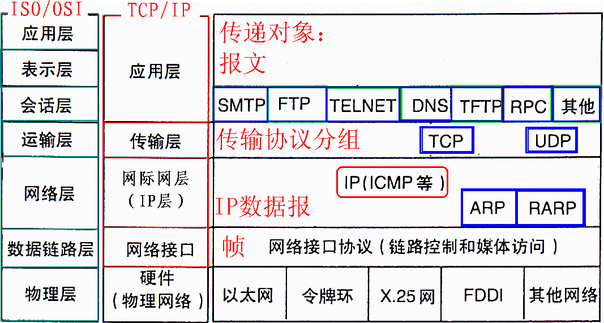
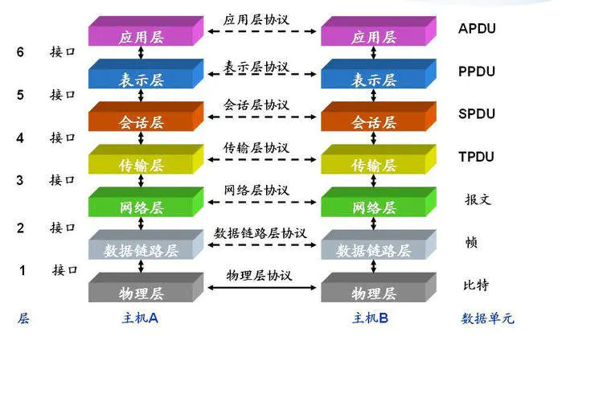
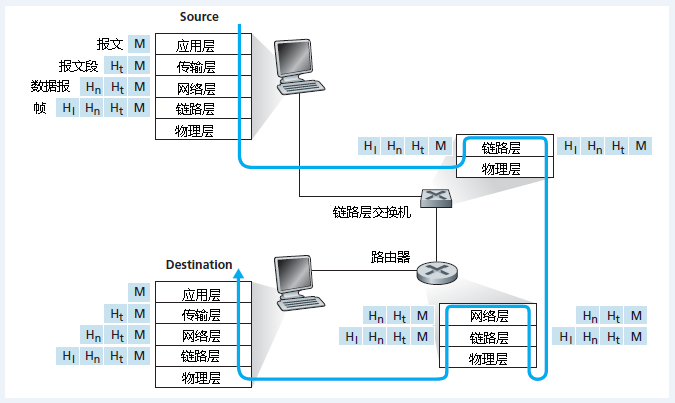

# 网络协议分层

## OSI七层模型的工作协议划分

| OSI层      | 功能                                   | 协议                                                         |
| ---------- | -------------------------------------- | :----------------------------------------------------------- |
| 应用层     | 文件传输、电子邮件、文件服务、虚拟终端 | DHCP、DNS、FTP、Gopher、HTTP、IMAP4、 IRC、NNTP、XMPP、POP3、SIP、SMTP、 SNMP、SSH、TELNET、RPC、RTCP、 RTSP、TLS、SDP、SOAP、GTP、STUN、NTP |
| 表示层     | 数据格式化、代码转换、数据加密         | 不用协议                                                     |
| 会话层     | 解除或建立与其他接点的联系             | 不用协议                                                     |
| 传输层     | 提供端对端的接口                       | TCP、UDP、DCCP、SCTP、RTP、RSVP、PPTP                        |
| 网络层     | 为数据包选择路由                       | IP (IPv4 · IPv6)、ARP、RARP、ICMP、ICMPv6、 IGMP、RIP、OSPF、BGP、IS-IS、IPsec |
| 数据链路层 | 传输有地址的帧，错误检测功能           | 802.11、802.16、Wi-Fi、WiMAX、ATM、DTM、 令牌环、以太网、FDDI、帧中继、GPRS、 EVDO、HSPA、HDLC、PPP、L2TP、ISD |
| 物理层     | 以二进制数据形式在物理媒体上传输数据   | RS-443 、RS-232C、RS-485 、理-2593OS                         |

上图显示了这样一条物理路径：数据从发送端系统的协议栈向下，经过链路层交换机和路由器的协议栈，进而向上到达接收端系统的协议栈。

我们需要知道的是，路由器和链路层交换机都是分组交换机，它们不实现协议栈中的所有层次，链路层交换机实现了第一层和第二层；路由器实现了第一层到第三层。这意味着，路由器能够实现IP协议（即第三层协议），而链路层交换机则不能，于是链路层交换机不能识别IP地址，但是能够识别第二层地址，比如MAC地址。

但是，因特网中的所有主机都实现了所有5个层次的协议。
