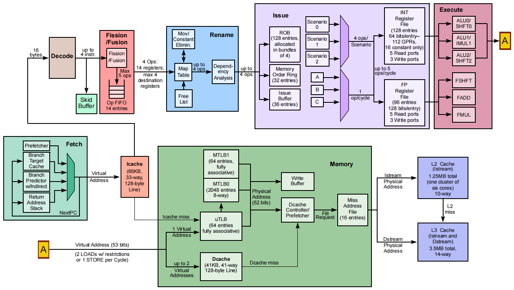

# CNF95XXO OCTEON Fusion-M® Cores

## Overview

The CNF95XXO processor includes up to six OCTEON Fusion-M® cores. Each OCTEON Fusion-M® core implements the Arm v8.2 64-bit instruction set architecture. The OCTEON Fusion-M® cores are custom designed by Marvell and represent Marvell’s own implementation of Arm v8.2 architecture, optimized for performance, performance/Watt, performance/Joule, and performance/mm2. Each core is fully cache-coherent with every other core in the CNF95XXO.

The cores have the following elements:

- Instruction cache: 66 KB, 33-way set associative, 128-byte block size
- Data cache: 41 KB, 41-way set associative, 128-byte block size
- MicroTLB (μTLB): 64 entries, fully associative
- MacroTLB (MTLB): 2112 entries, fully associative
- Page-table walker cache: 160 entries, fully associative

CNF95XXO处理器包括6核OCTEON Fusion-M®处理器。每个OCTEON Fusion-M®核心都实现了Arm v8.2 64位指令集架构。OCTEON Fusion-M®核是由Marvell定制设计的，代表了Marvell自己对Arm v8.2架构的实现，针对性能、性能/瓦特、性能/焦耳和性能/mm2进行了优化。在CNF95XXO中，每个核心与其他每个核心都是完全缓存一致的。

核心有以下元素:

- 指令缓存:66kb, 33路关联设置，128字节块大小
- 数据缓存:41 KB, 41路关联，128字节块大小
- MicroTLB (μTLB): 64条，全关联
- MacroTLB (MTLB): 2112条，全关联
- 页表walker缓存:160个条目，完全关联

 CNF95XXO核心框图：

