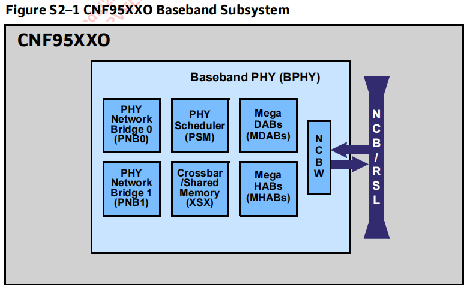
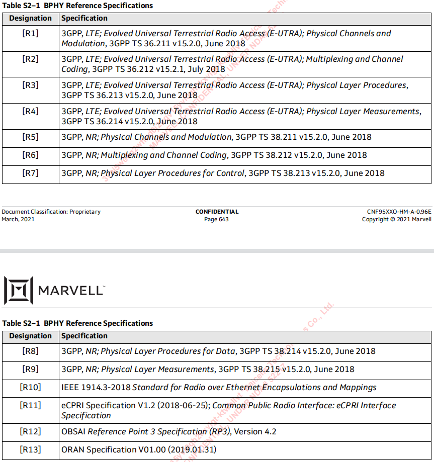
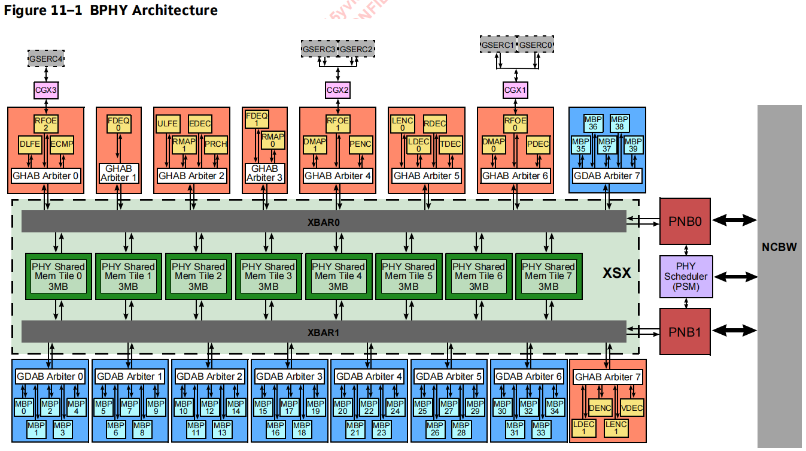

# Section 2 CNF95XXO Baseband PHY

This section contains all the chapters that make up the CNF95XXO baseband PHY (BPHY) except for the MegaHABs, which are described in separate sections (refer to Figure S2–1). 

本节包含构成CNF95XXO基带PHY (BPHY)的所有章节，MegaHABs除外，这些章节将在单独的章节中进行描述(参见图S2-1)。

The chapters include the following:

- BPHY Overview (BPHY)
- PHY Network Bridge (PNB)
- PHY Scheduler (PSM)
- Crossbar/Shared Memory Complex (XSX)
- BPHY Timer Unit (BFN)
- Mega Hardware Accelerator Block (MHAB)
- MegaDSP Accelerator Block (MDAB)

各章节内容如下:

- BPHY概述(BPHY)
- PHY网桥(PNB)
- PHY调度器(PSM)
- 交叉/共享内存复杂性(XSX)
- BPHY定时器单元(BFN)
- Mega硬件加速块(MHAB)
- MegaDSP加速器块(MDAB)

BPHY参考规格如表S2-1所示。

## Baseband PHY (BPHY)

This chapter contains the following sections:

- Overview
- Overall Architecture
- MegaHABs
- MegaDABs
- Baseband PHY Scheduler Module
- Crossbar and Shared Memory Complex (XSX)
- NCB Asynchronous I/O Bridge (NCBW)
- Memory Access Arbitration
- Data Packing
- BPHY Clocking
- BPHY EnumerationsBPHY Registers
- BPHY PCC PF Registers
- NCBW Registers

本章包括以下几个部分:

- 概述
- 总体结构
- MegaHABs
- MegaDABs
- 基带PHY调度器模块
- 交叉和共享内存复杂性(XSX)
- NCB异步I/O桥(NCBW)
- 内存访问仲裁
- 数据压缩
- BPHY 定时
- BPHY EnumerationsBPHY寄存器
- BPHY PCC PF寄存器
- NCBW寄存器

### Overview

CNF95XXO Baseband PHY (BPHY)是一个硬件子系统，同时提供5G-NR和LTE/LTE- a PHY。BPHY集成在CNF95XXO中，实现了5G-NR和LTE技术芯片上的宏基站。BPHY通过接口连接到NCBPHY网桥(PNB)和NCB异步I/O桥(NCBW)。

BPHY是一组用于处理基带PHY信号的超大DSP加速块(MegaDABs、mabs)、超大硬件加速块(MegaHABs、MHABs)和PHY调度器模块(PSM)。它也有一个高性能的片上存储器结构和互连称为SMEM (PHY共享内存)和XBAR (crossbar)提供PHY的性能要求。它通过射频over Ethernet (RFOE)天线接口与射频相连，直接交换天线样本。

HABs 对以下功能进行加速:

- 5G-NR/LTE物理随机接入信道前置处理。
- 5G-NR/LTE频域均衡
    - 可配置的MIMO设置(1、2、4或8层)，为MIMO分配未对齐的RB和连续干扰消除
- 5G-NR/LTE demapper， 支持
    - IDFT，软解调，解调，UCI合并，RS去除。
- 用于SIC加工的5G-NR/LTE映射器:
    - 用于SIC处理的基于决策的重映射，包括数据和控制复用、置乱、调制和层映射、DFT和RS插入
- 5 g-nr / LTE Reed-Muller译码器:
    - LTE: PUSCH UCI包含双RM, PUCCH F2×， F3×包含SORTD。
- 支持5G-NR下行LDPC编码器:
    - 完整的传输信道编码，包括CRC添加，LDPC编码和速率匹配
    - 5G-NR PDSCH的总吞吐量高达120 Gb/s。
- 5G-NR下行Polar编码器支持:
    - 完整的传输信道编码，包括CRC添加，分布式CRC交织，极坐标编码和速率匹配。
    - 5G-NR PDCCH和PBCH编码的总吞吐量高达3.6 Gb/s。
- 5G-NR LDPC译码器，支持:
    - 完整的传输通道解码，速率去匹配，和CRC。
    - 带有重新编码和速率匹配的软和硬输出。
    - 高达9gb /s的吞吐量。
- 5G-NR Polar解码器，支持:
    - 完成传输通道解码，速率去匹配，和CRC。
    - 带有重新编码和速率匹配的硬输出。
    - 高达760 Mb/s的吞吐量。
- LTE下行编码器支持。
    - 完整的传输信道编码(即调制，功率分配，REG和RE)映射PDCCH, E-PDCCH)。
    - E-PDCCH, PDCCH, PDSCH和PBCH编码。
    - LTE PDSCH的总吞吐量高达53.4 Gb/s。
- LTE Turbo译码器，支持:
    - 完成传输通道解码，速率去匹配，去交错，和CRC。
    - 带有重新编码和速率匹配的软和硬输出。
    - 高达2.7 Gb/s的吞吐量。
- LTE Viterbi解码器，支持:
    - 去交错，速率去匹配和CRC。
    - 带有重新编码和速率匹配的硬输出。
    - 高达2.4 Gb/s的吞吐量。
- RF over Ethernet硬件加速器(RFOE)，支持:
    - IEEE 1914.3以太网无线电标准。
    - CPRI over Ethernet标准(eCPRI)。
    - 支持100gb /s的MAC接口

### Overall Architecture

CNF95XXO具有独特的BPHY (baseband PHY)架构，如图11-1所示。

BPHY由以下组件组成:

- PHY调度器模块
- mabs (Mega DSP accelerator blocks): cnMBP
- 交叉和共享内存complex (XSX)
    - BPHY共享内存(SMEM)， 24MB
    - Crossbar interconnections (XBARs)
- 大型硬件加速器块(MHABs)
- 以太网射频(RFOE)
- PHY网桥(PNB)
- NCB异步I/O桥(NCBW)

