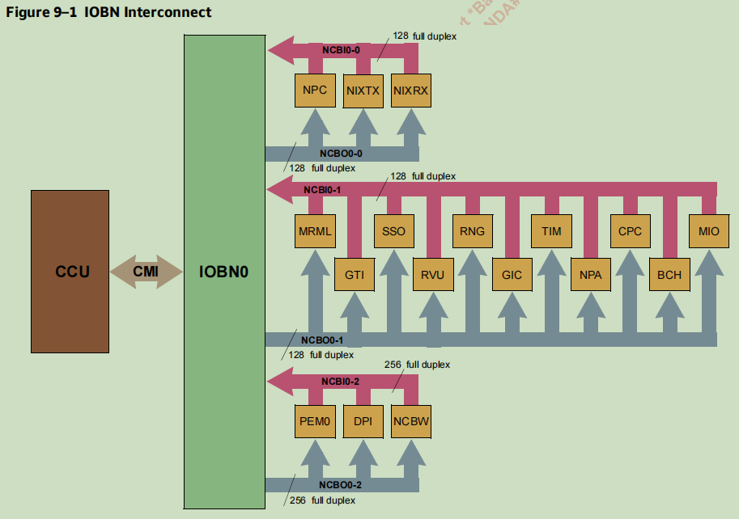

## 术语

-  **Memory Diagnostic Controller (MDC)：**内存诊断控制器 

- **Near-Coprocessor Bus (NCB)：**近协处理器总线
- **Baseband PHY (BPHY)：**
- **PHY Network Bridge (PNB)：**
- **Baseband PHY Scheduler Module (PSM)：**BPHY调度模块
- **Mega Hardware Accelerator Block (MHAB)：**Mega硬件加速块
- **Radio Frequency over Ethernet (RFOE)：**

- **Resource Virtualization Unit (RVU)** ：资源虚拟化单元
- **Physical Function (PF)：**
- **Virtual Function (VF)：**
- **Administrative Function (AF)：** 
- **Local Function (LF)：**
- **RVU Master (RVUM)：**
- **Large Atomic Store Unit (LMT)：**
- **Network Interface Controller (NIX)：**
- **Network Pool Allocator (NPA)：**网络池分配器
- **Network Parser CAM (NPC)：**
- **NCB Data Cache (NDC)：**
- **Schedule, Synchronize, and Order Unit (SSO and SSOW)：**
-  **Scheduled Timers (TIM)：**
-  **job-completion events(JCE)：**
-  **MHAB job descriptor(JD)：**

---

**缓存、系统内存和总线：**


**Near-Coprocessor Bus (NCB) and I/O Bridge (IOB)：**



---


**BPHY架构：**


The BPHY is composed of the following components:

- PHY scheduler module (PSM)
- Mega DSP accelerator blocks (MDABs): cnMBP
- Crossbar and shared memory complex (XSX)
    - BPHY shared memory (SMEM), 24MB
    - Crossbar interconnects (XBARs)
- Mega hardware accelerator blocks (MHABs)
- RF over Ethernet (RFOE)
- PHY network bridge (PNB)
- NCB asynchronous I/O Bridge (NCBW)

## PSM

**Baseband PHY Scheduler Module (PSM)**

PSM 将 jobs 排序并分派给 MHABs 和 MDABs。它管理 job 提交的时间、job 之间的控制流、job 状态记录和各种其他支持功能。

PSM具有以下特点：

- 128个可调整大小的命令队列共享16k个队列条目。
- 128个相关job计数器。
- 管理三个独立的资源集。
    - 每个资源集中的256个作业类型。
    - MHAB/MDAB资源的工作信用跟踪。
    - 每个MHAB/MDAB中支持两个内部作业队列。
- 定时器用于依赖协议的时间敏感功能。
- 支持4个通用中断，每个中断32个状态位。
- 支持提交SSO工作队列条目。
- 支持释放指向NPA的指针
- 记录作业启动、完成和错误。
- 支持调试和错误处理。

PSM架构如图13-1所示。主调度器在128个调度器队列中的就绪作业之间进行仲裁，然后将作业提交给MHABs/MDABs。作业完成后，他们可以向MAB FIFO提交其他命令和作业完成消息。MAB FIFO中的非作业命令要么进入立即队列（QID=0xFF）并立即仲裁以执行，要么进入128个调度程序队列之一。MAB FIFO中的所有作业命令都插入128个调度程序队列。


**Scheduler Queues and Commands**

**PSM Scheduler Queues：**

在执行之前，PSM命令将保留在队列中。128个调度程序队列在单个共享队列RAM结构中实现，如图13-2所示。队列RAM包含16K个条目，软件负责使用 `PSM_QUEUE(0...127)_CFG` 寄存器对RAM进行分区并将部分分配到各个队列。

每个队列充当循环缓冲区：

- 每个队列的头是下一个要执行的命令。

- 尾部是添加下一个新命令的位置。

当头指针和尾指针相等时，表示完全满或完全满空队列。`PSM_QUEUE(0...127)_PTR[FULL]` 和 `PSM_QUEUE(0...127)_PTR[NOTEMPTY]` 位允许区分满和空条件。此外，软件可以快速
通过读取 `PSM_QUEUE(0...127)_SPACE` 来确定队列中的可用空间量。


为获得最佳BPHY性能，应为PSM队列分配足够的空间，以便适应预期的命令负载。命令存在背压机制
由MHAB/MDAB引擎排队，但这会降低MHAB/MDAB作业率或导致死锁。OCTEON Fusion-M®堆芯没有用于指挥的背压机制排队，试图将命令添加到完整队列将导致队列溢出。

**PSM Commands：**

PSM命令是128位数据结构，用于指导PSM执行各种功能，例如，将作业分派给MHAB/MDAB或引发中断。泛型的结构PSM命令如图13-3所示。


PSM命令分为两类，其功能略有不同：

- **job commands** 提交要在MHABs/MDABs上运行的 jobs。
- **non-job commands** 在PSM内部执行功能，或与BPHY以外的其他区块。


**Enqueueing Commands：**

**Immediate Queue：**

除了128个命令队列外，还提供了一个即时队列，以允许快速执行某些命令。为了确保快速执行，某些命令可能会暂停，不允许在即时队列中使用作业启动和等待命令。这个立即队列标识为QID 0xFF。请注意，命令通过直接存储排队来自OCTEON Fusion-M®cores的操作可能不会针对即时队列。

**Enabling/Disabling Queues：**

可以通过软件使用`PSM_QUEUE_ENA_W1S(0..1)`和来启用或禁用队列`PSM_QUEUE_ENA_W1C(0..1)`分别注册。也可以通过PSM命令和硬件来禁用队列，以响应某些事件。PSM不会处理来自被禁用队列的任何命令。

**Dependent-Job Counters：**

PSM有128个八位 dependent-job 计数器（DJCNTs）。可以修改计数器值通过以下机制：

- OCTEON Fusion-M®软件可以写入 `PSM_DJCNT(0..127)_CFG` 寄存器。
- 当 `PSM_DJCNT(0..127)_CFG[DJCNT_SOSF] = 1` 时，DJCNT自动在每个子帧或帧的开始处递减1。
- `PSM_DJCNT_EXTDECR`选择的计数器可以在收到来自FDEQ块的符号完成信号。
- 提交给PSM的DJCNT命令可以增加或减少DJCNT，或设置DJCNT到特定值。
- 当`PSM_DJCNT(0..127)_CFG[DJCNT_SAT] = 1`时，DJCNT处于饱和模式，并且
    将不会在0xFF之后递增或在0x0以下递减。

**PSM Timer：**

PSM依靠BFN计时器跟踪本地时间。它可以与全局允许BPHY在更大的无线网络中共存的时间参考。计时器允许作业和命令的基于时间的管理。PSM使用帧、子帧和记号由BFN以与LTE和5G NR协议兼容的方式进行维护。PSM还使用纳秒计时器，由BFN维护，用于在RFOE块。


---

**资源虚拟化协处理器：**


RVU管理功能块及其与DPDK子系统的映射关系：

| #    | LF   | DPDK subsystem mapping                                       |
| ---- | ---- | ------------------------------------------------------------ |
| 1    | NIX  | rte_ethdev, rte_tm, rte_event_eth_[rt]x_adapter, rte_security |
| 2    | NPA  | rte_mempool                                                  |
| 3    | NPC  | rte_flow                                                     |
| 4    | CPT  | rte_cryptodev, rte_event_crypto_adapter                      |
| 5    | SSO  | rte_eventdev                                                 |
| 6    | TIM  | rte_event_timer_adapter                                      |
| 7    | LBK  | rte_ethdev                                                   |
| 8    | DPI  | rte_rawdev                                                   |
| 9    | SDP  | rte_ethdev                                                   |
| 10   | REE  | rte_regexdev                                                 |


## SSO


## NPA

### Overview

NPA维护指针池以释放LLC/DRAM内存。NPA使用RVU提供。

Arm核心软件和CNF95XXO其他硬件单元都可以分配和释放指针。这包括:核心软件，计划/同步/订单单元(SSO)(第37章)，网络接口控制器单元(NIX)(第40章)，DMA分组接口单元(DPI)(第47章)和定时器单元(TIM)(第38章)。

### Features

CNF95XXO的NPA主要功能如下:

- 128 NPA RVU本地函数(NPA_AF_CONST[LFS])。
- 每项当地活动可拥有多达100万个泳池。
- 每次本地功能可产生多达100万个光环。
- 隔离的空闲缓冲区指针堆栈，仅受DRAM内存大小的限制。
- 缓冲区大小为128 B到128 KB。
- 512 KB的缓存通过一个专用的NDC。
- 软件分配和回收。
- 网络(NIX)和其他单元的硬件分配和回收。
- 可选自动对齐返回的指针。
- 可选分配使用随机早期丢弃(RED)。
- 可选的指针边界

### Description

RVU提供了128个RVU本地函数(LFs)，可以使用RVU映射到SR-IOV物理函数(PF)和/或SR-IOV虚拟函数(VFs)。有关映射和RVU，参见第35章。

代表本地函数(LF)运行的软件或硬件协处理器通过向NPA请求指针来分配缓冲区。请求的目标是LF中的1百万个光环中的一个。每个光环指向一个1M的水池。每个池维护一个空闲指针堆栈;其中一个指针从堆栈中弹出，返回给请求的软件或硬件。同样，软件或硬件也可以通过类似的进程返回指向堆栈的指针。

NPA内存整体结构如图39-1所示。管理功能(AF)通过由AQ指令组成的管理队列(AQ)管理NPA(NPA_AQ_INST_S)，指向AQ结果结构体(NPA_AQ_RES_S)。AF软件分配内存来处理队列中断(NPA_QINT_HW_S)和一组auras(NPA_AURA_HW_S，是软件NPA_AURA_S的打包版本)。每个aura指向每个池(NPA_POOL_HW_S，它是NPA_POOL_S的打包版本)，后者又指向缓冲堆栈页(NPA_STACK_PAGE_S)，后者最终指向缓冲区本身，尽管缓冲区的内容对NPA是不透明的。NPA还支持使用来自池和aura的流控制信息更新内存。

AF软件直接访问AQ指令和AQ结果结构。软件只为剩余的LLC/DRAM结构分配内存，它们对软件是不透明的; NPA代表软件AQ指令或LF操作执行所有对它们的访问`(NPA_LF_ * _OP_ *)`。


图39-2描述了NPA硬件在内存中构建的包含指针的数据结构：


指针以64字节(`NPA_AF_CONST[STACK_PAGE_BYTES]`)堆栈页面结构块写入内存(推入堆栈)和从内存读取(从堆栈弹出)(`NPA_STACK_PAGE_S`)，每个包含11个(`NPA_AF_CONST[STACK_PAGE_PTRS]`)指针位，并带有奇偶校验。

`NPA_POOL_S[STACK_BASE]`是LF的第一个堆栈页的IOVA基地址。当页面被释放时，NPA要写入的下一个页面是页面号`NPA_POOL_S[STACK_PAGES]`，并且堆栈可以增长到`NPA_POOL_S[STACK_MAX_PAGES]`页面。

###  Administrative Queue


AF 软件不会直接修改 NDC/LLC/DRAM 中的 NPA 结构。反而，软件请求 NPA 通过将请求发布到管理队列 (AQ) 并等待响应。除非设置了 NPA_AF_GEN_CFG[AF_BE]，否则 AQ 指令和响应是小端的。所有操作都写入一个结果结构（节39.3.3）和可选的中断（第 39.3.4 节）

**AQ Instruction Queue：**

NPA AQ是LLC/DRAM中的循环队列。该队列由16到1024个条目组成(`NPA_AF_AQ_CFG[QSIZE]`)，从地址`NPA_AF_AQ_BASE`开始。AQ指令的大小固定为16字节(`sizeof(NPA_AQ_INST_S)`)，按16字节边界对齐。

AQ硬件维护队列的尾指针，核心软件维护头指针。要将数据包插入队列，软件必须首先写入AQ指令队列，然后使用16字节的指令执行写入NPA_AF_AQ_DOOR添加到队列中，例如添加一条指令1。软件必须保证LLC/DRAM包含了门铃写前门铃写的指示数达到NPA。软件可以针对每条AQ指令或按门铃编写操作可以将多个AQ指令累积成一个门铃写入操作。唯一的要求是队列中有效 AQ 指令的数量必须至少一样大作为门铃计数。

**AQ Instructions：**

AQ指令由一个`NPA_AQ_INST_S`报头组成，附加的数据在`NPA_AQ_INST_S[RES_ADDR]`中可选指定为与AF IOVA的偏移量。

该操作由`NPA_AQ_INST_S[OP]`指定，由`NPA_AQ_INSTOP_E`枚举:

- **NOP**
- **Init Pool**
- **Init Aura**
- **Write Pool**
- **Write Aura**
- **Read Pool**
- **Read Aura**
- **Lock**
- **Unlock**


---

# Marvell DPDK

> [6. Marvell OCTEON TX2 Platform Guide](https://doc.dpdk.org/guides-21.05/platform/octeontx2.html)

## RVU 架构

下图描述了 RVU 架构和资源配置示例。


资源虚拟化单元 (RVU) 将属于网络、加密和其他功能块的硬件资源映射到与 PCI 兼容的物理和虚拟功能上。

每个功能块都有多个本地功能 (LF)，用于为不同的 PCIe 设备提供服务。RVU 支持多个 PCIe SRIOV 物理功能 (PF) 和虚拟功能 (VF)。

RVU管理功能块及其与DPDK子系统的映射关系：

| #    | LF   | DPDK subsystem mapping                                       |
| ---- | ---- | ------------------------------------------------------------ |
| 1    | NIX  | rte_ethdev, rte_tm, rte_event_eth_[rt]x_adapter, rte_security |
| 2    | NPA  | rte_mempool                                                  |
| 3    | NPC  | rte_flow                                                     |
| 4    | CPT  | rte_cryptodev, rte_event_crypto_adapter                      |
| 5    | SSO  | rte_eventdev                                                 |
| 6    | TIM  | rte_event_timer_adapter                                      |
| 7    | LBK  | rte_ethdev                                                   |
| 8    | DPI  | rte_rawdev                                                   |
| 9    | SDP  | rte_ethdev                                                   |
| 10   | REE  | rte_regexdev                                                 |

PF0 被称为管理/管理功能 (AF)，并具有为每个 PF/VF 提供 RVU 功能块的 LF 的专有特权。

AF 始终附加到主机，但 PF/VF 可能由主机内核本身使用，或附加到 VM 或 DPDK 等用户空间应用程序。因此，AF 必须处理来自任何域的任何设备发送的配置/配置请求。

AF 驱动程序不接收或处理任何数据。它只是用于控制路径的配置驱动程序。

**包流：**

下图描述了 cnxk SoC 上的数据包流以及各种硬件加速器的使用。


## Marvell 特定 PMD

### 流分类和解析（RTE_FLOW）

网络解析器和 CAM 单元 (NPC) 解析 NIX 接收和传输数据包标头，并使用匹配 CAM (MCAM) 执行流识别。对于从 NIX 接收到的每个数据包标头，NPC 将结果返回给 NIX，标识已解析的标头层，以及 NIX 应如何处理数据包。


**rte_flow DPDK API：**

- 此处提供程序员指南

    > - https://dpdk.org/doc/guides/prog_guide/rte_flow.html

- 此处记录了完整的 rte_flow API 集

    > - https://dpdk.org/doc/api/rte__flow_8h.html

- API 和数据结构概述

| #    | API/Data structure                                           | Description                        |
| ---- | ------------------------------------------------------------ | ---------------------------------- |
| 1    | struct rte_flow_attr                                         | 存储规则优先级、方向(入口或出口)等 |
| 2    | struct rte_flow_item                                         | 一种模式                           |
| 3    | struct rte_flow_action                                       | 一种行为                           |
| 4    | struct rte_flow * rte_flow_create(port_id,struct rte_flow_attr *attr,struct rte_flow_item pattern[],struct rte_flow_action actions[],struct rte_flow_error *error) | 创建流规则                         |
| 5    | rte_flow_validate(port_id,struct rte_flow_attr *attr,struct rte_flow_item pattern[],struct rte_flow_action actions[],rte_flow_error *error) | 在创建规则之前验证规则             |
| 6    | rte_flow_destroy (port_id, struct rte_flow *flow,struct rte_flow_error *error) | Destroy a rule                     |

### 内存池驱动程序 (RTE_MEMPOOL)

内存池是固定大小对象的分配器。它由名称标识并使用内存池处理程序来存储空闲对象。在 DPDK 内存池库中，即 rte_mempool 提供了一些其他可选服务，例如每核对象缓存和对齐帮助器，以确保填充对象以在所有 DRAM 或 DDR3 通道上平均分布它们。

有关 DPDK 内存池库的更多详细信息，请参阅：

https://doc.dpdk.org/guides/prog_guide/mempool_lib.html

mbuf 使用 mempool 库，mbufs（消息缓冲区）是分配和释放到 mempool 的固定大小的对象。mbuf 库（rte_mbuf）提供了分配和释放缓冲区（mbufs）的能力，DPDK 应用程序可以使用这些缓冲区来存储消息缓冲区。rte_mbuf 结构通常承载网络数据包缓冲区，但它实际上可以是任何数据（控制数据、事件……）。

有关 DPDK mbuf 库的更多详细信息，请参阅：

https://doc.dpdk.org/guides/prog_guide/mbuf_lib.html

#### 网络池分配器 - NPA

网络池分配器 (NPA) 维护指向空闲 LLC/DRAM 内存的指针池。在内核上运行的软件以及一些硬件协处理器可能会从 NPA 池分配和释放缓冲区。

- NPA 使用 RVU 进行配置
- 每个 VF/PF 一百万个池和光环
- 软件free和分配操作
- 网络 (NIX) 和其他单元的硬件分配和解除分配
- 返回指针的可选自动对齐。
- 对软件的 Aura 和/或池级背压
- NIX-RX 的 Aura 级背压
- 用于 RED/QoS 计算的 n/256 填充状态
- 通过专用 NDC 提供 512 KB 缓存。
- 用于 QoS 的硬分区缓存的 CSR
- SRIOV 支持

在启动时，应用程序配置 NPA，然后通过为缓冲区分配内存并将缓冲区释放给 NPA 以创建缓冲池以供后续使用，从而填充 NPA 池。NPA 管理这些预先分配的缓冲池。一旦 NPA 和相关的协处理器正确初始化，使用 NPA 管理的缓冲区是高效、简单和方便的。每个池维护一个空闲指针栈；这些指针之一从堆栈中弹出并返回到请求的软件或硬件。同样，软件或硬件可以通过类似的过程返回指向堆栈的指针。


#### NPA 缓冲区对齐

NPA 硬件要求提交到空闲池的指针必须在 128 字节边界上对齐（地址位 `<6:0>` 必须为 0）。NPA 使用自然对齐或不透明对齐来管理指针。对齐方法必须适用于给定池中的所有指针，尽管不同的规则集可以在不同的池中使用。

- 自然对齐

    > 此模式设置后表示软件可以通过使用缓冲区内的任何地址来释放缓冲区。NPA 单元会在存储指针之前自动将地址调整回正确的地址。在此模式下，池中的所有缓冲区必须具有相同的大小，即 128 B 和 128 KB 之间的 128 B 的任意倍数。可以通过 BUF_OFFSET 指定可选的标头，以 128 字节为单位。BUF_OFFSET 为 0 或正数。NPA 存储并从分配操作返回的地址位于 (BUF_OFFSET * 128) 偏移处。

- 不透明对齐

    > 此模式的唯一要求是存储在池中的指针必须自然对齐到 128 B，并且只能在硬件单元释放确切地址时与硬件单元释放一起使用

如果可能，建议使用自然对齐模式，因为这会产生最有效的快速路径软件和最大程度地利用硬件加速。

#### Aura and pools

Auras 可用于将 pool 细分为多个虚拟池。可以限制每个 aura 允许使用的缓冲区数量，以便每个用户都有特定的缓冲区配额。

> 在 octeontx2/octeontx3 中，每个 VF/PF 最多可以有 100 万个池和 aura，因此不需要在 aura 内限制缓冲区，因此通常 aura 和 pool 是 1-1 映射的。

分配缓冲区需要两种资源：

- Aura count

    > NPA 硬件为每个aura维护一个计数器，NPA 可以在指针分配时递增，在指针返回时递减。aura count，必须低于限制。aura count级别是每个aura唯一的，通常跟踪可编程资源。

- NPA buffer-pool 可用性

    > 使用池的所有光环的池级别相同，并跟踪正在使用的内存量。池计数 =（堆栈页 ptrs * 堆栈页数）+ 堆栈偏移量 其中，堆栈页指针 - 堆栈页中的指针数 堆栈页 - 堆栈中的非部分页数 堆栈偏移量 - 没有有效指针在部分人口。

光环计数高表示使用率高，而池可用性低表示使用率高。每个级别都可以与硬限制、DROP 限制和阈值进行比较，以执行以下操作：

- 硬限制：

    > 当 aura 计数大于或等于限制（软件定义）时，分配给相应 aura 的任何缓冲区都会失败，就像池中的指针已用完一样。这允许在共享一个公共池的多个光环之间进行硬资源划分。始终强制执行池分配限制。当池用完指针时，即当堆栈页为 0 时，对该池的任何缓冲区分配都会失败。

- 光环掉落限制：

    > 光环可以指定比硬限制更严格的下降限制。Drop-applicable 分配由核心请求，或者在请求的 NIX 缓冲区分配的第一个段上请求。光环计数与配置的光环下降级别进行比较，如果计数低于该级别，则分配失败。而在池的情况下，当池计数小于或等于池丢弃级别时，分配失败。

- 阈值中断：

    > 当光环计数在向上或向下方向上超过配置的阈值时，软件可能会收到中断。当池堆栈页面向上或向下方向超过配置的阈值时，软件可能会收到中断。

- 流量控制写道：

    > 如果启用了流控制，NPA 可以定期将光环计数写入软件映射的 IOVA 地址，以避免与读取 CSR 相关的 I/O 延迟。同样，如果在池上下文中启用了 FC，则可以写入池级别。

- 光环和池平均：

    > NPA 计算时间平均光环和池缓冲区级别指示以支持软件和 NIX 的随机早期丢弃。当光环或池有更新时，会重新计算资源的移动平均值。

- 对 NIX 的背压：

    > 当缓冲区开始填满时，NPA 可能会向 NIX 提供背压。

#### DPDK mempool 和 mbuf 库 API 

Marvell 的 HW Mempool manager(NPA) pool/aura 之间存在 1-1 映射

此处记录了完整的 rte_mempool API 集：

https://doc.dpdk.org/api/rte__mempool_8h.html

此处记录了完整的 rte_mbuf API 集：

https://doc.dpdk.org/api/rte__mbuf_8h.html

#### Mempool DPDK API

*Mempool creation*

| #    | API                                                          | Description                                                  |
| ---- | ------------------------------------------------------------ | ------------------------------------------------------------ |
| 1    | struct rte_mempool *rte_mempool_create(const char *name, unsigned n,unsigned elt_size, unsigned cache_size,unsigned private_data_size,rte_mempool_ctor_t *mp_init,void *mp_init_arg, rte_mempool_obj_cb_t *obj_init,void *obj_init_arg, int socket_id, unsigned flags); | Generic version of SW Mempoolcreation which creates a newmempool named *name* in memory. |
| 2    | rte_pktmbuf_pool_create_by_op()                              | # Generic version With HW basedMempool# Arguments are same as aboveone. Additional argument opsdefines the HW pool selection |
| 3    | struct rte_mempool* rte_pktmbuf_pool_create(name, n,cache_size, priv_size, data_room_size, socket_id) | Packet Mempool creation (Basedon the platform, if HW poolmanager is available it createsfrom packet pool from that HWBuffer Pointerect. In OCTONTX2case, it will use NPA HW BufferPointerect) |

*Fast path API*

| #    | API                                                          | Description                                                  |
| ---- | ------------------------------------------------------------ | ------------------------------------------------------------ |
| 1    | struct rte_mbuf*rte_pktmbuf_alloc(struct rte_mempool *mp)    | # Alloc an Buffer Pointerectfrom Mempool# It is mapped NPA allocoperation on OCTEONTX2 |
| 2    | rte_pktmbuf_alloc_bulk(struct rte_mempool *pool,struct rte_mbuf **mbufs, count); | # Alloc an Buffer Pointerectsfrom Mempool# It is mapped NPA allocoperation on OCTEONTX2 |
| 3    | void rte_pktmbuf_free(struct rte_mbuf *m)                    | # Free an Buffer Pointerect toMempool# It is mapped to NPA freeoperation on OCTEONTX2. |

#### 经常问的问题

- 缓冲区的数量有限制吗？
    - 缓冲池的大小不受硬件限制；它仅受可用物理内存量的限制。

- 池可以包含不同大小的缓冲区吗？
    - 不，所有缓冲区在池中的大小应相同。

- 是否可以随时将更多缓冲区添加到缓冲池中？
    - 不，在创建池时应最清楚所需的最大缓冲区数，并应保留适当的内存。

- 如果池用完可用的数据包数据缓冲区怎么办？
    - 如果池用完缓冲区，软件和硬件将停止接收数据包（临界缓冲区耗尽），当缓冲区可用时，它将恢复接收数据包。应该使用拥塞控制机制来防止关键缓冲区耗尽。

### 流量管理器 (RTE_TM)

服务质量 (QoS) 是 Rx 和 Tx 上大多数设备的标准网络功能。DPDK 的 RTE TM 规范专门针对 Tx，旨在将 Tx QoS 的不同硬件实现抽象为通用接口，以便程序员可以轻松地在任何硬件上配置 Tx QoS。API 是不可知的，除了仅硬件实现之外，混合硬件+软件实现也是可能的。

RTE TM API 主要包括创建节点的层次结构（树），从 Leaf 开始，它只不过是以太网设备的 Tx 队列，一直到连接到物理网络链路的根节点。层次结构中的每个节点都是一个调度程序，调度来自其子节点的数据包并将它们传递给其父节点。规范支持且通常使用的调度算法是赤字加权循环（DWRR）或严格优先级（SP）。每个节点都可以与整形器相关联，该整形器将流量整形或速率限制为每秒数据包数 (PPS) 或每秒比特数 (BPS) 的特定速率。

#### DPDK TM library API 

- 此处记录了完整的 rte_tm API 集：

    > - https://doc.dpdk.org/api/rte__tm_8h.html

- 用于快速参考的高级 API 概述

能力（获取完整的TM、级别和节点的能力）

| #    | API                                                          | Description                                                  |
| ---- | ------------------------------------------------------------ | ------------------------------------------------------------ |
| 1    | rte_tm_capabilities_get(port_id,struct rte_tm_capabilities *cap) | Get capabilities likes number of levels, nodesport level, marking support, shaping supportrange(CIR, PIR max) |
| 2    | rte_tm_level_capabilities_get(port_id, level_id,struct rte_tm_level_capabilities *cap) | Get capabilities like max number of nodes, maxnumber of priority levels, priorities supportedstrict vs WRR |
| 3    | rte_tm_node_capabilities_get(port_id, node_id,struct rte_tm_node_capabilities *cap) | Get capabilities like dual rate limiting orsingle rate limiting, max number of childrennodes etc |

创建/销毁整形器配置文件（为了重用整形器参数，如 CIR、PIR）

| #    | API                                                          | Description           |
| ---- | ------------------------------------------------------------ | --------------------- |
| 1    | rte_tm_shaper_profile_add(port_id,shaper_profile_id,struct rte_tm_shaper_params *profile) | Create shaper profile |
| 2    | rte_tm_shaper_profile_delete(port_id, shaper_profile_id)     | Delete shaper profile |

每个 TLX 和 SMQ 代表层次结构中的节点。仅在层次结构提交时才会基于节点为每个端口分配资源。

*调度层次结构*

| #    | API                                                          | Description                                                  |
| ---- | ------------------------------------------------------------ | ------------------------------------------------------------ |
| 1    | rte_tm_node_add(port_id, node_id, parent_node_id,priority, weight, level_id,struct rte_tm_node_params *params) | Add a node to hierarchy and connect to it parent             |
| 2    | rte_tm_node_delete(port_id, node_id)                         | Delete a node from hierarchy                                 |
| 3    | rte_tm_hierarchy_commit(port_id, clear_on_fail)              | When the hierarchy is created using above API,it will be created on the local memory. Usecommit API to apply the hierarchy to HW |

运行时更新，OCTEONTX2 允许我们在运行时更新整形器参数和调度权重。可以通过停止 ethdev 设备来更新调度层次结构，然后重新连接层次结构，然后启动 ethdev 设备

| #    | API                                                          | Description                                                  |
| ---- | ------------------------------------------------------------ | ------------------------------------------------------------ |
| 1    | rte_tm_node_shaper_update(port_id, node_id,shaper_profile_id) | Update shaper parameters without stopping thedevice          |
| 2    | rte_tm_node_parent_update(port_id, node_id,parent_node_id, priority, weight,struct rte_tm_error *error) | Can be used to update schedule weight withoutstopping the device |

#### 限制

- 当启用 VF 时，PF 的 TL1 被限制为仅支持 DWRR，因为它将与该链路的 VF 共享其 TL1。

### 以太网设备框架 (RTE_ETHDEV)

DPDK 以太网设备框架提供了探测以太网设备、配置设备、设置 Rx 和 Tx 队列以及最终以轮询模式或事件模式从它们接收和 Tx 数据包的方法。RTE_ETHDEV 框架允许配置功能，从基本功能（如 RSS、MTU、校验和卸载等）到高级功能（如多播过滤器、速率限制、流量控制等）。在给定的 ethdev 上接收和发送数据包是使用轮询模式 API `rte_eth_rx_burst()`和`rte_eth_tx_burst()`.

RTE_ETHDEV 框架与 RTE_FLOW 框架集成以提供对入口和出口的数据包分类。它还与 RTE_TM 框架集成以提供 Tx 功能，如 affic 整形/速率限制、调度和数据包标记。

#### 网络接口控制器单元 (NIX)

网络接口控制器单元 (NIX) 是一个 RVU 模块，它在 Marvell OCTEONTx2+ SOC 中提供管理网络链接/接口、接收和传输数据包等功能。此 RVU 块提供“N”个逻辑功能 (LF)，这些功能足以自给管理链路。每个与 RVU PF/VF 和物理链路关联的 NIX LF 代表 RTE_ETHDEV 框架中的一个以太网设备。以太网设备的所有 Rx 队列和 Tx 队列都是在 NIX LF 中创建的。NIX Tx 的分层调度和整形功能通过 RTE_TM 公开。

NIX 提供网络设备功能并与 SoC 中的所有其他 RVU 模块进行交互，以获得如下所述的附加功能。

- 与 NPA(RTE_MEMPOOL) 块交互以访问硬件内存池的功能，以分配用于接收数据包的数据包 mbuf，并在无需软件干预的情况下传输数据包后释放数据包 mbuf。
- 与 SSO(RTE_EVENTDEV) 块交互以提供事件模式的功能，充当事件开发的 Rx 事件/数据包生产者。
- 与 NPC(RTE_FLOW) 交互，用于对 Rx 和 TX 上的数据包进行分类，并在分别传送到 SW 或 Wire 之前对它们执行各种操作。
- 与 CPT(RTE_CRYPTODEV/RTE_SECURITY) 块交互，用于在将 Rx 和 Tx 数据包分别传送到 SW 或 Wire 之前执行内联 ipsec 协议卸载处理。
- 与 MAC（CGX/RPM、LBK、SDP）交互以连接到以太网物理链路。


以下是 NIX 提供的高级功能列表。

> - 一般的
>
>     > - 每个协处理器时钟频率高达 1 亿个数据包的聚合性能
>     >
>     > - 128 个可以映射到 RVU PF 和 VF 的局部函数 (LF)
>     >
>     > - 每个 LF 最多 100 万个内存中发送、接收和完成队列
>     >
>     >     > - 两个 512 KB NCB 数据缓存 (NDC) 中的上下文缓存
>     >     > - 完成中断合并和限制
>     >     > - IEEE 802.1Qbu/802.3br 帧抢占
>     >     > - 硬件资源配置和管理的管理队列
>
> - 接收接口
>
>     > - 64 种端口类型，用于在每个端口或每个通道的基础上配置 NPC 解析策略
>     >
>     > - 基于NPC解析和流识别的动作
>     >
>     >     > - 接收数据包转向
>     >     > - 接收端缩放 (RSS)
>     >     > - 接收多播复制
>     >     > - VLAN 和/或 IEEE 802.1BR E-TAG 剥离
>     >
>     > - 完全可编程的 5 元组流密钥和哈希标签
>     >
>     > - 从 NPA 光环分配数据包和 WQE 缓冲区
>     >
>     > - Aura 和完成队列背压、拖尾和/或 RED
>     >
>     > - 数据包错误检查，包括内部和外部 TCP/UDP/SCTP 长度和校验和验证
>     >
>     > - 每个接收队列可选择 SSO 工作或完成队列提交
>     >
>     > - 每个接收队列的可编程 SSO 标签掩码
>     >
>     > - IPSEC 内联接收到 CPT
>
> - 传输接口
>
>     > - LMT 存储来自任何核心的数据包入队
>     >
>     > - 来自 CPT 的 IPSEC 内联 LMT 存储数据包入队
>     >
>     > - NIX 发送队列管理，包括 NPA 缓冲区分配和返回
>     >
>     > - 内存中的发送队列通过 DWRR 馈送到 512 个输入级调节器
>     >
>     > - 通过五个级别进行分层调度、整形和着色
>     >
>     > - TCP 和其他协议的可编程大型发送卸载 (LSO)
>     >
>     > - 灵活的传输数据包格式，包括
>     >
>     >     > - LSO 标头格式
>     >     > - 基于描述符的 VLAN 插入
>     >     > - 内部和外部 IPv4 标头校验和生成
>     >     > - 内部和外部 TCP/UDP/SCTP 校验和生成
>     >     > - 自定义 CRC 或校验和生成
>     >
>     > - 每个数据包的可选内存原子更新、SSO 工作提交和/或完成队列提交
>     >
>     > - 基于NPC解析和流识别的动作
>     >
>     >     > - 将数据包转向传输到以太网接口或环回到 NIX
>     >     > - 传输多播复制
>     >     > - 管理 VLAN 和/或 IEEE 802.1BR E-TAG 插入或替换
>     >
>     > - 对 NPA 光环免费的可选数据包缓冲区
>     >
>     > - PTP (IEEE1588) 时间戳

#### 以太网设备和 NIX 硬件映射

- 每个以太网设备即代表一个带有 NIX LF 和 CGX LMAC 的 RVU PF/VF。`struct rte_eth_dev`
- 一对 NIX LF 接收队列 (RQ) 和完成队列 (CQ) 代表一个 ethdev Rx 队列。
- 一个 NIX LF Send Queue(SQ) 代表一个 ethdev Tx 队列。
- 当使用 DPDK 事件接收适配器将 NIX Rx 配置为事件开发的生产者时，只有 NIX LF RQ 用于表示以太网设备 Rx 队列，数据包由 RQ 传递到相应的事件开发队列。
- 每个 RVU PF 支持多个 VF。可以基于单独的 DMAC、VLAN id 等创建 VF

#### HW Packet flow - Rx

在 Rx 上，数据包从 MAC 开始按以下顺序流动。

1、从 MAC 接收数据包，即 CGX、LBK 或 SDP

2、头部解析

- 已创建 MCAM 密钥
- 检测到元数据

3、包分类

4、RSS/UCAST/DROP

5、分配、后处理和推送

6、到 SSO / 调度程序

7、到 CQ / 原始 RX 环


#### HW Packet flow - Tx

在 Tx 上，数据包从发送队列（SQ）开始按以下顺序流动。

1、推送发送队列（原子地）

2、传输调度和整形

3、DMA数据包

4、TX分类

5、头部解析

6、MCAM 搜索

7、UCAST/DROP

8、后期处理

9、发送到 MAC + 后期操作


#### DPDK ethernet device library API

- 程序员指南可在获得 [https://dpdk.org/doc/guides/prog_guide/poll_mode_drv.html](https://dpdk.org/doc/guides/prog_guide/poll_mode_drv.html)
- 完整的 rte_ethdev API 集记录在这里 https://dpdk.org/doc/api/rte__ethdev_8h.html
- 用于快速参考的高级 API 概述
    - Ethdev 端口可以映射到 RVU PF 或 VF
    - ethdev 端口将被 ethdev 子系统枚举为 0 到 N id
    - 使用 ethtool 或 ip 等标准 Linux 工具来配置 VF 设备
    - 从应用的角度来看，PF 设备和 VF 设备在 Ethdev API 使用方面没有区别。某些功能仅适用于 PF 设备，例如仅 PF 支持混杂模式支持。

| #    | API                                                          | Description                                                  |
| ---- | ------------------------------------------------------------ | ------------------------------------------------------------ |
| 1    | rte_eth_dev_info_get(port_id, dev_info)                      | Get the RX and TX offload capabilities orinformation such number queue for the givenethdev port |
| 2    | rte_eth_dev_configure(port_id, nb_rx_queue,nb_tx_queue, eth_conf) | Configure the ethdev device based on the needlike, number of queues, RX and TX offloadsrequired etc |
| 3    | rte_eth_rx_queue_setup(port_id, rx_queue_id,nb_rx_desc, socket_id, rx_conf, mb_pool) | Configure the RX queue and point to theMempool to allocate the packets(On OCTEONTX2,(On OCTEONTx2+ SOC, mb_pool points to HW NPA) |
| 4    | rte_eth_tx_queue_setup(port_id, tx_queue_id,nb_tx_desc, socket_id, tx_conf) | Configure the TX queue                                       |
| 5    | rte_eth_dev_start(port_id)                                   | Start the device                                             |
| 6    | rte_eth_rx_burst(port_id, queue_id,struct rte_mbuf **rx_pkts, nb_pkts) | Request to receive nb_pkts in mbuf format and itreturns the number of packets actually received |
| 7    | rte_eth_tx_burst(port_id, queue_id,struct rte_mbuf ** tx_pkts, nb_pkts) | Send nb_pkts in mbuf format and it returns thenumber of packets actually transmitted.Application can use rte_eth_tx_Buffer Pointer()and rte_eth_tx_Buffer Pointer_flush() in caseapplication wants to queue the packet to reachto certain threshold and then send it throughrte_eth_tx_burst(). |

### 事件模式处理 (RTE_EVENTDEV)

DPDK 事件设备框架引入了事件驱动的编程模型。在轮询模型中，逻辑内核直接轮询以太网设备端口和相关的 Rx 队列以查找数据包。相比之下，在事件驱动模型中，逻辑内核调用调度程序，该调度程序根据程序员指定的标准为它们选择数据包。事件设备库增加了对事件驱动编程模型的支持，该模型为应用程序提供自动多核扩展、动态负载平衡、流水线、数据包入口顺序维护和同步服务，以简化应用程序数据包处理。

通过引入事件驱动的编程模型，DPDK 可以同时支持轮询和事件驱动的数据包处理编程模型，应用程序可以自由选择最适合其需求的模型。

Poll 模式和 Event 模式的主要区别如下：

| 轮询模式                                                     | 事件模式                                                     |
| ------------------------------------------------------------ | ------------------------------------------------------------ |
| 每个端口 + Rx 队列组合都绑定到一个特定的内核。               | 任何核心都可以接收来自任何端口/Rx 队列的数据包。             |
| 负载平衡是静态的。                                           | 动态负载平衡。                                               |
| 每个工人都有单独的责任。                                     | 每个工人可以是相同的，也就是自动多核扩展。                   |
| 使用RSS模型进行入口顺序维护，有利于多流。                    | 使用 ORDERED 计划类型有利于脂肪流和入口订单维护。            |
| 将工作人员拆分为特定工作以启用工作流水线。                   | 使用计划类型和/或事件队列来启用工作流水线，而无需为每个核心分配特定的作业。 |
| 如果工作是每个内核独有的，则可能不需要同步。否则同步是通过自旋锁。 | 通过硬件加速 ATOMIC 计划类型的同步服务，以实现更好的扩展。   |

有关 DPDK 事件设备库的更多详细信息，请参阅：

https://doc.dpdk.org/guides/prog_guide/eventdev.html

#### 调度/同步/顺序 (SSO)

调度/同步/顺序 (SSO) 单元是提供工作排队、调度/取消调度和同步的协处理器。协处理器和内核使用 256 个工作组之一将工作添加到 SSO，并且内核通过工作槽从这些组中获取工作。

- SSO 工作槽和工作组是通过 RVU 提供的。
- 从软件、NIX-Rx、NIX-TX、TIM、CPT、REE等提交的作品。
- 异步 getwork 操作。
- 256 个工作组和 52 个工作槽。
- 无限工作（溢出记忆）
- 按优先级安排工作。
- 通过标签空间隔离实现虚拟化。
- 多达 100 万个独特的流
- 基于工作组优先级的 QoS。

每个 HWGRP 和 HWS 都作为逻辑功能 (LF) 暴露给用户空间，每个都可以提供给 SSO PF。从应用角度看的工作组（HWGRP 硬件组）称为GGRP（Guest group）。从应用程序的角度来看，一个工作槽（HWS 硬件工作槽）被称为 GWS（Guest 工作槽）。

#### SSO 单元中的工作流

应用程序配置它想要使用的工作槽和工作组的数量，并将每个工作槽链接到它应该从其接收工作的一个或多个工作组。

应用程序还可以决定它正在排队进入 SSO 的工作的标签和标签类型，持有相同标签的工作被认为是同一流，SSO 根据流和标签类型将工作调度到一个工作槽。持有相同标签的流程或工作会受到基于标签类型的调度约束。共有三种不同的标签类型：

- `ORDERED` 此标签类型保证订购（原子性不是）。
- `ATOMIC` 这种标签类型保证了排序和原子性。标签类型为 ATOMIC 的两个工件不能同时调度。
- `UNTAGGED` 保证之间没有排序，并且标签与此标签类型无关。

其他协处理器（例如 NIX、CPT、TIM 等）或 CPU 可以将工作添加到 SSO 工作组中。一旦工作被添加到工作组中，它会在到达获取工作接口之前遍历多个内部队列，也称为准入队列。

每个准入队列由三部分组成，外部准入队列（XAQ）、临时输入和输出准入队列（TOAQ/TIAQ或简称TAQ）和单元内准入队列（IAQ）。工作组可以任意大，必要时溢出到 DRAM。当溢出到 DRAM 时，外部准入队列 (XAQ) 会参与其中。SSO 在 NPA 的帮助下自动管理、分配和返回 XAQ 条目。

如果 IAQ 中有可用空间，则当从协处理器或 CPU 向 SSO 添加工作时，SSO 硬件会立即缓冲 IAQ 中的工作并避免 XAQ 的开销。如果 SSO 硬件将工作放入 XAQ，它稍后会在空间可用时自动将工作从 DRAM 移至 IAQ，其顺序与最初添加工作的顺序相同。

当一个核心通过一个工作槽通过一个 getwork 操作向 SSO 请求工作时，SSO 内部维护三个队列，即准入队列（AQ）、取消调度队列（DQ）和冲突队列（CQ），它可以从中调度工作到工作槽。IAQ 中的所有工作都被认为是在飞行中或在 AQ 中。冲突的工作，例如持有相同 ATOMIC 标记等待调度的工作，被放置在 CQ 中。先前已安排到工作槽并使用 SWTAG_DESCHED 操作取消安排的工作驻留在 DQ 中。SSO 硬件将任何组的未调度工作优先于冲突工作，冲突工作高于准入队列工作。

应用程序配置它想要使用的工作槽和工作组的数量，并将每个工作槽链接到它应该从其接收工作的一个或多个工作组。

应用程序还可以决定它正在排队进入 SSO 的工作的标签和标签类型，持有相同标签的工作被认为是同一流，SSO 根据流和标签类型将工作调度到一个工作槽。持有相同标签的流程或工作会受到基于标签类型的调度约束。共有三种不同的标签类型：

- `ORDERED` 此标签类型保证订购（原子性不是）。
- `ATOMIC` 这种标签类型保证了排序和原子性。标签类型为 ATOMIC 的两个工件不能同时调度。
- `UNTAGGED` 保证之间没有排序，并且标签与此标签类型无关。

其他协处理器（例如 NIX、CPT、TIM 等）或 CPU 可以将工作添加到 SSO 工作组中。一旦工作被添加到工作组中，它会在到达获取工作接口之前遍历多个内部队列，也称为准入队列。

每个准入队列由三部分组成，外部准入队列（XAQ）、临时输入和输出准入队列（TOAQ/TIAQ或简称TAQ）和单元内准入队列（IAQ）。工作组可以任意大，必要时溢出到 DRAM。当溢出到 DRAM 时，外部准入队列 (XAQ) 会参与其中。SSO 在 NPA 的帮助下自动管理、分配和返回 XAQ 条目。

如果 IAQ 中有可用空间，则当从协处理器或 CPU 向 SSO 添加工作时，SSO 硬件会立即缓冲 IAQ 中的工作并避免 XAQ 的开销。如果 SSO 硬件将工作放入 XAQ，它稍后会在空间可用时自动将工作从 DRAM 移至 IAQ，其顺序与最初添加工作的顺序相同。

当一个核心通过一个工作槽通过一个 getwork 操作向 SSO 请求工作时，SSO 内部维护三个队列，即准入队列（AQ）、取消调度队列（DQ）和冲突队列（CQ），它可以从中调度工作到工作槽。IAQ 中的所有工作都被认为是在飞行中或在 AQ 中。冲突的工作，例如持有相同 ATOMIC 标记等待调度的工作，被放置在 CQ 中。先前已安排到工作槽并使用 SWTAG_DESCHED 操作取消安排的工作驻留在 DQ 中。SSO 硬件将任何组的未调度工作优先于冲突工作，冲突工作高于准入队列工作。


一旦工作被安排到工作槽应用程序可以改变工作的各种特征，例如标签类型、工作组，它也可以选择丢弃工作。下图解释了工作槽可以处于的各种状态：


#### 事件设备和适配器 - Marvell HW(SSO) 映射和功能

DPDK 事件队列和端口分别 1:1 映射到 SSO 工作组和工作槽。

各种 DPDK 事件入队操作类型映射如下：

- `NEW` SSO ADD_WORK 操作用于对新事件进行排队。

- `FORWARD` 如果工作槽组与事件组相同，则下面的开关标记操作用于转发事件。

    | cur_tt/new_tt     | SSO_SYNC_ORDERED | SSO_SYNC_ATOMIC | SSO_SYNC_UNTAGGED |
    | ----------------- | ---------------- | --------------- | ----------------- |
    | SSO_SYNC_ORDERED  | SWTAG_NORM       | SWTAG_NORM      | SWTAG_UNTAG       |
    | SSO_SYNC_ATOMIC   | SWTAG_NORM       | SWTAG_NORM      | SWTAG_UNTAG       |
    | SSO_SYNC_UNTAGGED | SWTAG_NORM       | SWTAG_NORM      | NOOP              |

    如果事件和工作槽之间的组不同，则使用 SWTAG_DESCHED 操作将事件转发到新的组/核心。

- `RELEASE` SWTAG_FLUSH 操作用于从事件端口释放事件。

DPDK 事件出队操作映射到 SSO GET_WORK 操作。事件端口和事件队列之间的映射可以是 1:N 用于出队操作。

DPDK 事件 Rx 适配器将 ethdev Rx 队列链接到事件队列。SSO 在硬件中支持它。NIX Rx 队列可以配置为以硬件事件格式 (WQE) 将数据包推送到 SSO，而不是将其存储在完成队列 (CQ) 中。类似地，事件可以直接从其他协处理器接收，如 CPT、DPI、TIM 和 ZIP。

#### DPDK event device library API

事件设备的剖析如下：


- 获取事件设备功能

    | rte_event_dev_info_get(dev_id, rte_event_dev_info *dev_info) | 获取事件队列数量、事件端口、最大出队超时等功能。 |
    | ------------------------------------------------------------ | ------------------------------------------------ |

- 设置事件队列

    | rte_event_queue_default_conf_get(dev_id, queue_id, struct rte_event_queue_conf *qc) | 获取默认队列参数                                             |
    | ------------------------------------------------------------ | ------------------------------------------------------------ |
    | rte_event_queue_setup(dev_id, queue_id, struct rte_event_queue_conf *qc) | 设置事件队列属性，如优先级、计划类型（ORDERED、ATOMIC、PARALLEL）。ALL TYPE 调度类型是有用的队列可以支持所有类型并且在入队操作上应用程序可以决定调度类型。 |

- 设置事件端口

    | rte_event_port_default_conf_get(dev_id, port_id, struct rte_event_port_conf *pc) | 获取默认事件端口参数。                                       |
    | ------------------------------------------------------------ | ------------------------------------------------------------ |
    | rte_event_port_setup(dev_id, port_id, struct rte_event_port_conf *pc) | 设置事件端口属性。这个 API 对于 OCTEONTX2 将是 NOP，但它为其他事件开发驱动程序提供了一些配置可能性。 |

- 在事件队列和事件端口之间建立链接

    | rte_event_port_link(dev_id, port_id, queues[], priorities[], nb_links) | 这将映射到 HWS 到 HW 上的 SSO 组成员功能。将队列中提供的多个源事件队列链接到由其 port_id 指定的目标事件端口，以及在其 dev_id 指定的事件设备上的优先级中提供的相关服务优先级。 |
    | ------------------------------------------------------------ | ------------------------------------------------------------ |
    | rte_event_port_unlink(dev_id, port_id, queues[], nb_unlinks) | 将队列中提供的多个源事件队列与其 dev_id 指定的事件设备上的 port_id 指定的目标事件端口断开链接。 |
    | rte_event_port_links_get(dev_id, port_id, queues[], priorities[]) | 在其 dev_id 指定的事件设备上检索源事件队列列表及其关联的服务优先级，该服务优先级链接到由其 port_id 指定的目标事件端口。 |

- 控制事件装置

    | rte_event_dev_start(dev_id) | 启动事件设备。 |
    | --------------------------- | -------------- |
    | rte_event_dev_stop(dev_id)  | 停止事件设备。 |
    | rte_event_dev_close(dev_id) | 关闭事件设备。 |

- 快速路径函数

    | rte_event_enqueue_burst(dev_id, port_id, struct rte_event ev[], nb_events) | 这将映射 SSO 操作，如 ADD_WORK、等到 TAG_SWITCH 完成。通过 struct rte_event ops 中可用的操作（例如 RTE_EVENT_OP_NEW、RTE_EVENT_OP_FWD）选择特定的 SSO 操作。可以对上述类型进行专门的入队操作，例如 rte_event_enqueue_new_burst() 和 rte_event_enqueue_fwd_burst()。 |
    | ------------------------------------------------------------ | ------------------------------------------------------------ |
    | rte_event_dequeue_burst(dev_id, port_id, struct rte_event ev[], nb_events) | 这将映射 SSO 操作，如 GET_WORK、启动 TAG_SWITCH、启动 SWTAG_DESCHED。特定 SSO 操作的选择将基于队列配置，例如 ALL TYPE QUEUE、状态机。 |

- 设备配置

    ```c
    const struct rte_event_dev_config config = {
            .nb_event_queues = 3,
            .nb_event_ports = 6,
            .nb_events_limit  = 4096,
            .nb_event_queue_flows = 1024,
            .nb_event_port_dequeue_depth = 128,
            .nb_event_port_enqueue_depth = 128,
    };
    int err = rte_event_dev_configure(dev_id, &config);
    ```

- 队列设置

    ```c
    struct rte_event_queue_conf atomic_cfg = {
            .schedule_type = RTE_SCHED_TYPE_ATOMIC,
            .priority = RTE_EVENT_DEV_PRIORITY_NORMAL,
            .nb_atomic_flows = 1024,
            .nb_atomic_order_sequences = 1024,
    };
    int dev = 0;
    int queue = 0;
    int err = rte_event_queue_setup(dev, queue, &atomic_cfg);
    ```

- 端口设置

    ```c
    struct rte_event_port_conf  port_cfg = {
            .dequeue_depth = 1,
            .enqueue_depth = 1,
    };
    int dev = 0;
    int port = 0;
    int err = rte_event_port_setup(dev, port, &port_cfg);
    ```

- 链接队列（0 和 1）和端口（0）

    ```c
    uint8_t queues[] = {0, 1};
    uint8_t port = 0;
    uin8t_t prio = RTE_EVENT_DEV_PRIORITY_NORMAL;
    int links_made = rte_event_port_link(dev, port, queues, prio, 2);
    ```

- 链接所有队列和所有端口

    ```c
    uint8_t queues[] = {0, 1};
    uin8t_t prio = RTE_EVENT_DEV_PRIORITY_NORMAL;
    for (port = 0; port < nb_ports, port++)
            links_made = rte_event_port_link(dev, port, NULL, prio, 0);
    ```

- 启动设备

    ```c
    int err = rte_event_dev_start(dev_id);
    ```

- 进入一个新事件

    ```c
    struct rte_event ev;
    ev.flow_id = some_flow;
    ev.op = RTE_EVENT_OP_NEW;
    ev.sched_type = RTE_SCHED_TYPE_ATOMIC;
    ev.queue_id = 0;
    ev.event_type = RTE_EVENT_TYPE_CPU;
    ev.priority = RTE_EVENT_DEV_PRIORITY_NORMAL;
    ev.event_ptr = mbuf;
    
    rte_event_enqueue_burst(dev, port, ev, 1);
    ```

- 转发新事件

    ```c
    struct rte_event ev;
    rte_event_dequeue_burst(dev, port, &ev, 1, timeout);
    /* Change the queue */
    ev.queue_id = ev.queue_id++
    /* Change the tag and schedule type*/
    ev.sched_type = RTE_SCHED_TYPE_ORDERED;
    ev.flow_id = new_flow_value;
    ev.op = RTE_EVENT_OP_FWD;
    
    rte_event_enqueue_burst(dev, port, ev, 1);
    ```

- 典型的工作循环

    ```c
    while (1) {
            rte_event_dequeue_burst(...);
            (event processing)
            rte_event_enqueue_burst(...);
    }
    ```

完整的事件设备 API 集记录在此： [https ://dpdk.org/doc/api/rte__eventdev_8h.html](https://dpdk.org/doc/api/rte__eventdev_8h.html)

#### DPDK event device adapter API

**事件以太网 Rx 适配器库：**

将数据包注入事件设备的硬件抽象库

- 创建 Rx 适配器

    | rte_event_eth_rx_adapter_create(id, dev_id, port_config)     | 设置适配器数据结构                                           |
    | ------------------------------------------------------------ | ------------------------------------------------------------ |
    | rte_event_eth_rx_adapter_queue_add（id，eth_dev_id，rx_queue_id，struct rte_event_eth_rx_adapter_queue_conf *conf） | 将每个 ethdev Rx 队列连接到事件设备。这将编程 NIX RQ 上下文以将数据包重定向到 SSO 而不是 CQ（在轮询模式下使用） |

- 启动 Rx 适配器

    | rte_event_eth_rx_adapter_start(id) | 启动 eventdev-ethdev Rx 适配器，这个 API 归结为在慢速路径上配置一些 NIX 寄存器，在快速路径上什么都没有，因为它可以将数据包直接发送到 SSO。 |
    | ---------------------------------- | ------------------------------------------------------------ |

完整的事件 Rx 适配器 API 集记录在此： [https ://doc.dpdk.org/api/rte_event_eth_rx_adapter_8h.html](https://doc.dpdk.org/api/rte__event__eth__rx__adapter_8h.html)

**事件以太网 Rx 适配器库：**

一个硬件抽象库，有助于为事件驱动的数据包处理模型的以太网传输阶段配置和数据路径 API。

- 创建 Tx 适配器

    | rte_event_eth_tx_adapter_create(id, dev_id, port_config)   | 使用指定的标识符创建一个新的以太网 Tx 适配器。 |
    | ---------------------------------------------------------- | ---------------------------------------------- |
    | rte_event_eth_tx_adapter_queue_add( id, eth_dev_id, queue) | 将每个以太网 Tx 队列连接到事件设备。           |

- 启动 Tx 适配器

    | rte_event_eth_tx_adapter_start(id) | 启动 eventdev-ethdev Tx 适配器。 |
    | ---------------------------------- | -------------------------------- |

- 将事件排入 Tx 适配器

    | rte_event_eth_tx_adapter_enqueue(id, port_id, struct rte_event ev[], nb_events, flags) | 通过 port_id 指定的事件端口，将一系列事件对象或 rte_event 结构中提供的事件对象排入由其 dev_id 指定的事件设备上。 |
    | ------------------------------------------------------------ | ------------------------------------------------------------ |

完整的事件 Tx 适配器 API 集记录在此： [https ://doc.dpdk.org/api/rte_event_eth_tx_adapter_8h.html](https://doc.dpdk.org/api/rte__event__eth__tx__adapter_8h.html)

**事件计时器适配器库：**

- 事件计时器适配器具有以下抽象工作模型：
- 它有一个基于枚举 rte_event_timer_adapter_clk_src 时钟源的虚拟单调递增 64 位定时器适配器时钟。时钟源可以是 CPU 时钟或平台相关的外部时钟。
- 应用程序使用给定的时钟源、事件定时器的总数和在桶之间遍历的分辨率（以 ns 表示）创建一个定时器适配器实例。
- 根据配置的最大超时（max_tmo_ns）和分辨率（timer_tick_ns），每个定时器适配器可能有 0 到 n 个桶。启动定时器适配器后，适配器以 timer_tick_ns 分辨率开始计时。
- 应用程序配备一个事件计时器，该计时器将从现在开始使 timer_tick_ns 到期。
- 应用程序可以取消一个待命的计时器，并且不会生成计时器到期事件。
- 如果计时器到期，则库将计时器到期事件注入指定的事件队列中。
- 定时器到期事件将通过 rte_event_dequeue_burst 接收。
- 应用程序释放计时器适配器实例。


- 创建并释放事件计时器适配器

    | rte_event_timer_adapter_create(const struct rte_event_timer_adapter_conf *conf) | 创建一个计时器适配器。初始化定时器环数据结构 |
    | ------------------------------------------------------------ | -------------------------------------------- |
    | rte_event_timer_adapter_free(struct rte_event_timer_adapter *adapter) | 释放计时器适配器。                           |

- 启动和停止事件计时器适配器

    | rte_event_timer_adapter_start(const struct rte_event_timer_adapter *adapter) | 启动定时器适配器。 |
    | ------------------------------------------------------------ | ------------------ |
    | rte_event_timer_adapter_stop(const struct rte_event_timer_adapter *adapter) | 停止定时器适配器。 |

- 布防和取消计时器

    | rte_event_timer_arm_burst(const struct rte_event_timer_adapter *adapter, struct rte_event_timer ** evtims, nb_evtims) | 使用单独的过期超时滴答来触发一系列事件计时器。 |
    | ------------------------------------------------------------ | ---------------------------------------------- |
    | rte_event_timer_arm_tmo_tick_burst(const struct rte_event_timer_adapter *adapter, struct rte_event_timer **evtims, timeout_ticks, nb_evtims) | 使用相同的过期超时时间触发一系列事件计时器。   |
    | rte_event_timer_cancel_burst(const struct rte_event_timer_adapter *adapter, struct rte_event_timer **evtims, nb_evtims) | 取消安排到事件设备的事件计时器突发。           |

完整的事件计时器适配器 API 集在此处记录： [https ://doc.dpdk.org/api/rte_event_timer_adapter_8h.html](https://doc.dpdk.org/api/rte__event__timer__adapter_8h.html)

#### 经常问的问题

问：可以排队的事件数量是否有限制？

A. SSO 支持无限事件。它仅受可用物理内存量的限制。

### 加密设备框架（RTE_CRYPTODEV）

DPDK cryptodev 设备框架提供了探测 cryptodev 设备、配置设备、设置队列对以及最终在轮询模式或事件模式下入队和出队操作的方法。RTE_CRYPTODEV 框架允许应用程序卸载对称/非对称操作。可以使用会话或无会话模式进行操作。给定队列对的入队和出队是使用轮询模式 API 完成的， `rte_cryptodev_enqueue_burst`并且`rte_cryptodev_dequeue_burst`.

RTE_CRYPTODEV 框架与 RTE_SECURITY 框架集成以提供协议卸载，例如 IPsec。

#### DPDK cryptodev device library API

- 程序员指南可在获得 [https://doc.dpdk.org/guides/prog_guide/cryptodev_lib.html](https://doc.dpdk.org/guides/prog_guide/cryptodev_lib.html)
- 此处记录了完整的 rte_cryptodev API 集 [https://doc.dpdk.org/api/rte_cryptodev_8h.html](https://doc.dpdk.org/api/rte__cryptodev_8h.html)

| #    | API                                                          | Description                                                  |
| ---- | ------------------------------------------------------------ | ------------------------------------------------------------ |
| 1    | rte_cryptodev_info_get(dev_id, dev_info)                     | 获取设备的上下文信息包括最大队列对数由cryptodev支持          |
| 2    | rte_cryptodev_configure(dev_id, config)                      | 根据需要配置cryptodev比如，队列对的数量，描述符等。          |
| 3    | rte_cryptodev_queue_pair_setup(dev_id, queue_pair_id,qp_conf, socket_id) | 配置 cryptodev 队列对。允许应用程序配置描述符的数量，用于无会话操作的内存池。 |
| 4    | rte_cryptodev_start(dev_id)                                  | 启动设备                                                     |
| 5    | rte_cryptodev_sym_session_create(mempool)                    | 从内存池创建对称会话标头                                     |
| 6    | rte_cryptodev_sym_session_init(dev_id, session,xforms, mempool) | 初始化对称会话设备特定私人数据                               |
| 7    | rte_cryptodev_asym_session_create(mempool)                   | 从内存池创建非对称会话标头                                   |
| 8    | rte_cryptodev_asym_session_init(dev_id, session,xforms, mempool) | 初始化非对称会话设备特定私人数据                             |
| 9    | rte_cryptodev_enqueue_burst(dev_id, qp_id, ops, nb_ops)      | 将一系列操作排入队列以进行处理在加密设备上                   |
| 10   | rte_cryptodev_dequeue_burst(dev_id, qp_id, ops, nb_ops)      | 出列一系列已处理的加密操来自加密设备上的队列                 |

### IPsec 协议卸载 (RTE_SECURITY)

RTE_SECURITY 启用了 3 种将加密/IPsec 操作卸载到 cryptodev/ethdev 的新模式。

1. 内联加密 ( `RTE_SECURITY_ACTION_TYPE_INLINE_CRYPTO`)
2. 内联协议卸载 ( `RTE_SECURITY_ACTION_TYPE_INLINE_PROTOCOL`)
3. Lookaside 协议卸载 ( `RTE_SECURITY_ACTION_TYPE_LOOKASIDE_PROTOCOL`)

内联协议 (IPsec) 卸载通过 OCTEON TX2 的`RTE_ETHDEV`PMD 公开，后备协议 (IPsec) 卸载通过 OCTEON TX2 的`RTE_CRYPTODEV`PMD 公开。

有关协议卸载的更多详细信息，请参阅[安全库](https://doc.dpdk.org/guides/prog_guide/rte_security.html)。

#### 安全库 API

- `rte_security_session_create()`

    创建安全会话以在硬件中添加 SA。

- `rte_security_session_destroy()`

    销毁安全会话。

#### 流库 API

- `rte_flow_create()`

    > 创建一个`rte_flow`将符合内联 IPsec 处理条件的入站 ESP 数据包定向到 CPT。有关详细信息，请参阅[入站。](#inbound)

#### 数据路径流

应用程序可以启用内联 IPsec 卸载以将 eth PMD 配置为透明地执行 IPsec 协议处理。当应用程序接收到带有 的入站数据包时`rte_eth_rx_burst()`，它会接收经过 IPsec 处理的数据包（已解密，已删除隧道标头）。同样，当应用程序使用 提交出站数据包时`rte_eth_tx_burst()`，这些数据包将在传输前进行 IPsec 处理（加密，添加隧道标头）。

应用程序应使用事件设备数据路径操作而不是 ethdev 操作，因为 OCTEON TX2 上的内联 IPsec 卸载使用 SSO。

|                | 轮询             | 事件                         |
| -------------- | ---------------- | ---------------------------- |
| 用于 Rx 的 API | rte_eth_rx_burst | rte_event_dequeue_burst      |
| 发送 API       | rte_eth_tx_burst | rte_event_tx_adapter_enqueue |

#### DPDK security library API 

- 此处记录了完整的 rte_security API 集 https://doc.dpdk.org/api/rte__security_8h.html
- 数据路径 API 与 rte_cryptodev API 相同。

| #    | API                                                          | 描述                                               |
| ---- | ------------------------------------------------------------ | -------------------------------------------------- |
| 1    | rte_security_session_create(ctx, session_conf,mempool，priv_mempool | 创建由指定的安全会话会话配置                       |
| 2    | rte_security_session_destroy(ctx, sess)                      | 免费安全会话标头和会话私有数据并将其返回到其原始池 |
| 3    | rte_cryptodev_enqueue_burst（dev_id，qp_id，ops，nb_ops）    | 将一系列安全操作排入队列在加密设备上处理           |
| 4    | rte_cryptodev_dequeue_burst（dev_id，qp_id，ops，nb_ops）    | 出列一系列已处理的安全操作来自加密设备上的队列     |

### 正则表达式引擎 (RTE_REGEXDEV)

#### 什么是正则表达式 (Regex)？

正则表达式 (regex) 是定义搜索模式的字符序列（可能是文字或特殊字符，例如星号 (*) 或问号 (?)）。通常这种模式被字符串搜索算法用于“查找”或“查找和替换”操作。正则表达式用于多个领域，主要是网络管理和网络安全。它适用于许多用例，例如：

- 网络监控和数据包过滤
- 协议分析与应用识别
- 反恶意软件和反病毒保护
- IDS/IPS 功能（入侵防御/检测系统）
- 网址过滤
- 下一代和 Web 应用程序防火墙 (NGFW/WAF)
- 数据丢失防护
- 自然语言处理

应用程序 RegEx API 导出的用于设置由其设备标识符指定的设备的函数必须按以下顺序调用：

**rte_regexdev_configure()** **rte_regexdev_queue_pair_setup()** **rte_regexdev_start()**


---


---

## DPDK mempool 和 mbuf 库 API 演练

Marvell 的 HW Mempool manager(NPA) pool/aura 之间存在 1-1 映射

此处记录了完整的 rte_mempool API 集：

https://doc.dpdk.org/api/rte__mempool_8h.html

此处记录了完整的 rte_mbuf API 集：

https://doc.dpdk.org/api/rte__mbuf_8h.html


---

## Reference

> [DPDK Doc](https://dpdk-docs.readthedocs.io/en/latest/prog_guide/ring_lib.html)
>
> [DPDK 赵子清](https://zzqcn.github.io/opensource/dpdk/code-analysis/mem.html)
>
> [DPDK : 解析内存初始化的过程](https://blog.csdn.net/pcokk/article/details/89737592)
>
> [dpdk内存管理——内存初始化](https://zhuanlan.zhihu.com/p/505567894)
>
> [DPDK 内存管理-爱代码爱编程](https://icode.best/i/47846145941486)
>
> [dpdk内存管理分析](https://itcn.blog/p/1811263341.html)
>
> [【5G NR学习笔记】5G NR帧结构](https://zhuanlan.zhihu.com/p/64108857)
> [CSR简介和CSR指令](https://ica123.com/archives/6238)

