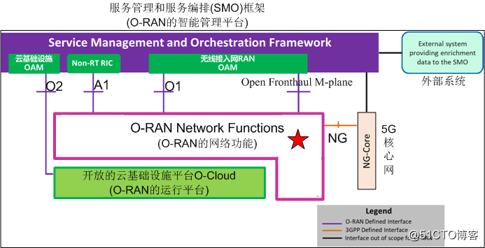
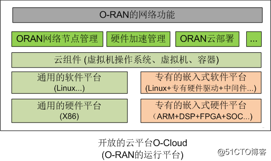
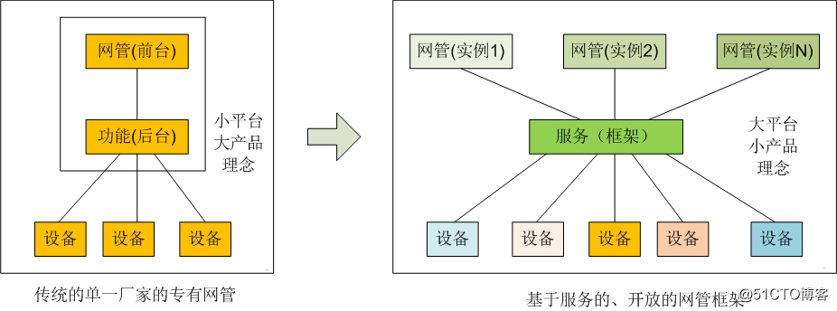
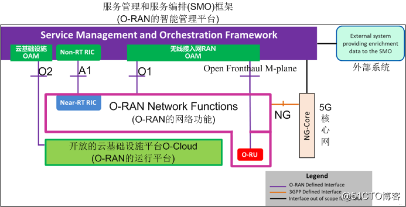
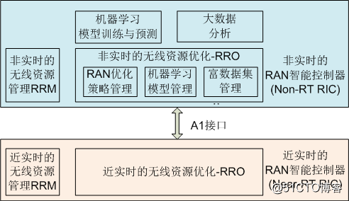
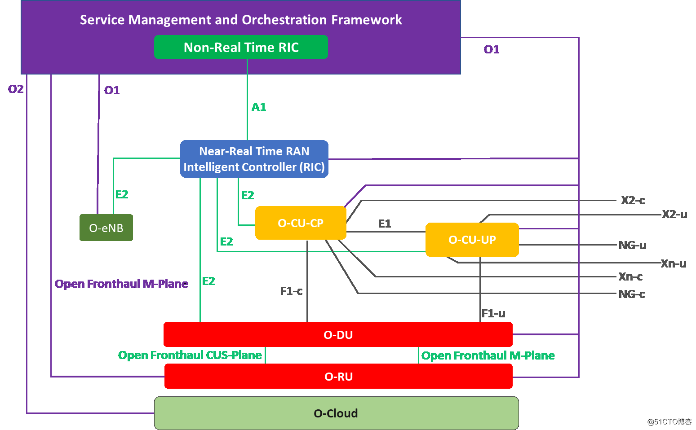
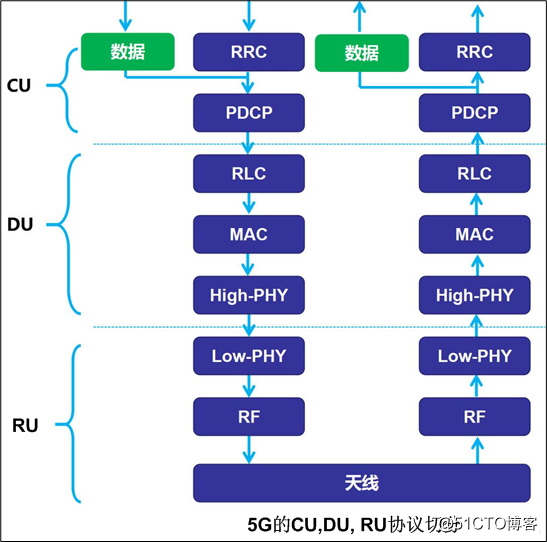
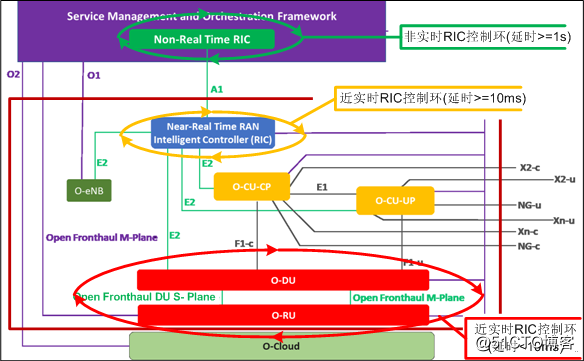

# O-RAN 系统架构

## 开放无线接入网O-RAN的“五化”目标

**硬件白盒化：**白盒是相对于黑盒而言的，就是开放和标准化网元硬件内部的功能模块以及硬件模块之间的接口，引入更多的厂家参与硬件的开发与生产，逐渐把专用硬件演变通用硬件，而直接使用现有的通用硬件是实现硬件白盒化最快捷的途径之一。

**软件开源化：**通过开源软件的方式实现网络功能。

**接口开放化：**所有的逻辑网元的的接口都进行开放，不同厂家的逻辑网元能够方便、轻松的进行对接。

**网络功能的虚拟化：**将网络节点的功能，分割成几个功能区块，分别以软件方式实现，不再拘限于特定的硬件架构。

**网络网络的智能化：**结合人工技术和大数据分析技术，对网络进行自动化部署、运营、维护、管理和优化以及宏观调控。

## 开放无线接入网O-RAN的总体架构

将按“自下而上”顺序的介绍各个逻辑网元的功能：

- O-RAN的**运行**平台
- O-RAN的**网络**功能
- O-RAN的智能**管理**平台

### O-RAN的运行平台：开放的云基础设施平台O-Cloud

O-Cloud是一个云计算平台，底层是由满足O-RAN要求的物理基础设施节点（如通用的计算机或专用硬件平台）和云平台软件、O-RAN相关的管理和编排功能三部分组成。

- **专有软、硬件平台**

> 这里指：传统的无线接入网RAN原有的专有硬件和专有软件的平台。
>
> 即使在O-RAN中，在短时间内，也很难做到全部的硬件、软件都通用化，部分功能，如射频处理和新增的实时基带处理等还将运行在专有的软、硬件平台RU之上。
>
> 但基于专有硬件和Linux操作系统的嵌入式软件的部分“虚拟化”已经实现了。RU的虚拟化是未来进一步研究的方向之一。

- **通用软、硬件平台**

> 通用硬件主要指基于X86的通用计算机硬件，通用软件主要指Linux这样的通用操作系统。
>
> O-RAN一个重要的目标，就是尽可能的把现有RAN的功能从专有的硬件和专有的嵌入式操作系统平台上剥离，迁移到通用的硬件、通用操作系统、通用的云平台上，并尝试开放软件接口，甚至软件开源。

- **通用的云平台组件**

> 包括虚拟机操作系统、虚拟机监视器、容器等。

- **O-RAN相关的管理和编排功能**

> （1）O-RAN网络节点的管理：
>
> ​			提供诸如O-RAN基础设施节点的发现、注册、软件生命周期管理、工作负载生命周期管理、故障管理、性能管理和配置管理等功能
>
> （2）硬件加速器管理
>
> （3）O-RAN云架构部署

- 承载（host）和运行O-RAN网络功能相关的软件实体。

### O-RAN网络功能：5G三大子系统之接入网RAN

这是O-RAN的核心，O-RAN的主体与核心功能都是在这里实现的，是在已有的5G RAN功能基础之上的扩展，包括Near-RT RIC, O-CU-CP, O-CU-UP, and O-DU和O-RU，下一节会对RAN内部的这些子功能进一步的探讨。

### 5G三大子系统之核心网Core

核心网络完成移动终端的接续、计费，移动性管理、相互通信，以及与网外设备进行通信（如互联网和固定电话网等）。在O-RAN标准中，并没有对5G的核心网进行扩展。

### O-RAN的运营管理平台：5G三大子系统之网管子系统（服务管理和编排SMO）

SMO的功能相当于传统的封闭的RAN接入网设备的网络运营和管理子系统OAM或NMS，即网管。

包括如下三大功能：

- **云基础实施OAM：**云基础实施的操作、维护、管理
- **RAN OAM：**无线接入网的操作、维护、管理
- **非实时的RAN智能控制器**（Non RT RIC: Non Real Time RAN Intelligent Controller）

为了体现O-RAN系统的网管与传统的封闭式网管的不同，体现O-RAN运营的高度智能化、网络功能的服务化和可定制化, 给它取了一个新的名称：服务管理和编排（SMO）框架，正所谓，名副其实。

之所以称之为框架，是因为这里提供的，不是传统的固化、面向单一厂家的网管，而是可以被调用的服务（service），SMO是多种管理服务的整合。

在服务提供商的网络中，**SMO提供服务远远超出对RAN管理的服务**，还可以包括诸如：核心网管理服务、传输管理服务、端到端切片管理服务等内容。

**注解：**

O-RAN系统的智能化管理框架SMO，在思想层面、设计层面上都与传统电信设备商的现有网管系统的有着**重大的区别：**

- **服务化：**SMO提供的是对设备运营管理的各种服务，而不是综合化后的实际网管。实际的、具体的、网络运营管理功能，由上图中的网管实例1,2,N来实施的。
- **开放化：**SMO服务框架是一个开放的运营管理平台，可以集成符合O-RAN规范的任何厂家的5G产品，可以应用符合O-RAN规范的任何厂家的5G网络运营管理软件。为5G进入定制化、垂直的工业领域提供了技术保障。
- **智能化：**利用人工智能、虚拟化、云计算、大数据分析、边缘计算等技术，实现对网络设备和网络功能的快速重构、智能运营与管理。

在SMO平台上，可以开展各种定制的网管“店面”，管理和运营各种定制化的“5G系统或应用”。

### 外部系统

能够利用SMO提供的各种O-RAN管理和编排的服务，设计和编写管理和运营5G系统的各种应用。

同时，还可以为SMO提供丰富的历史数据作为智能管理和运营5G系统的参考，帮助SMO进行更加智能化管理和运营的服务。

## 开放无线接入网O-RAN中各个子系统的总体接口

- **NG接口(Next Generation, 即5G)---已有**

> 核心网--控制面、数据面接口，是已有的5G接入网与5G核心网之间的标准接口。

- **O1接口 (Open 1接口)---更新**

> **无线接入网--资源的管理接口**
>
> 是SMO与O-RAN内部网元之间的新增的接口，用于SMO对O-RAN内部的逻辑网元进行智能化的管理和运营，如O-**CU-CP**, O-**CU-UP**, and O-**DU**和O-**RU**。
>
> CU-CP, CU-UP, DU, RU都是5G系统**已有**的逻辑网元。因此该接口可能与3GPP的标准保持一致。

主要的管理功能有：

**无线网络**功能（PNF）的发现、软件管理（SM）、配置管理（CM）、故障管理（FM）、性能管理（PM）、通信监视（心跳）、日志管理（log）、文件管理。

- **O2接口(Open 2接口)---新增**

> **“云”--资源的管理接口**
>
> 是SMO与O-Cloud的之间新增的接口，用于SMO对云平台O-Cloud之上运行的各个O-RAN网络服务节点进行智能化管理与运营。

主要的管理功能有：

**云资源**的发现、创建、删除、扩容、缩容、性能管理PM、故障管理FM、通信监视、软件管理等。

- **Fronthaul m-plane接口---可选**

> **RU--资源管理接口**
>
> 所谓fronthaul m-plane，在5G系统规范中, 是指分布式单元DU与无线单元RU 之间的内部管理接口。
>
> DU与RU之间，3GPP虽然对用于数据传输的CPRI接口和eCPRI接口进行了规范，但并没有对管理平面本身的接口协议进行规范，这个接口的协议规范留个给了各个设备厂家自行定义，并没有开放。
>
> 主要的管理功能有：“启动”安装、软件管理、配置管理、性能管理、故障管理、文件管理。
>
> 在O-RAN中，定义了O1接口来管理O-RU单元。为了与现有产品的后向兼容性，O-RAN希望设备厂家**开放各自**的fronthaul m-plane接口。
>
> 这样一来，O-RU就有两组不同的管理接口：**O-RU O1接口**与fronthaul m-plane接口，**并且不同厂家的fronthaul m-plane接口规范还不一样**。
>
> 通过两组接口对O-RU进行管理，称之**为混杂（hybrid）模式**，而通过单一的O1接口管理O-RU，称之为**扁平（flat）模式**。

- **A1接口---新增**

> **无线接入网--非实时控制和优化接口**
>
> 用于SMO对O-RAN内部的无线资源进行**智能化**和**动态**的**细粒度**的控制。
>
> **注解：**
>
> 如果说O1接口是SMO与O-RAN之间纯管理平面的接口。
>
> A1接口就是SMO对O-RAN内部**控制平面**实施的动态的、智能的**控制性**干预！
>
> 是SMO对整个开放无线接入网的一种“宏观”调控。
>
> 无论对国家、还是企业，无论是计划经济还是市场经济，如何**提高资源的利用率**，如何提**高资源的效率**，如何对资源进行**控制和优化**，是一个永恒的话题。
>
> **原先的无线接入网，更多关注的是每个基站内部无线资源的微观的调控，而O-RAN中的SMO，更多是对整个无线接入网中所有无线资源进行的宏观调控。**
>
> **而能够做到这一点的关键是：无线资源功能的云化和虚拟化！**

## O-RAN内部逻辑网元的整体架构

- **NRT-RIC（近实时的RAN智能控制器）**

> **这在前面讨论刚刚，这是O-RAN新引入。**

- **4G LTE的网元ENB**

> 因为，在很长的一段时间内，5G不是独立组网SA，而是4G+5G的混合组网NSA，因此O-RAN无法把4G LTE ENB排除在外。
>
> 但考虑到LTE已经是成熟部署的网络，因此O-RAN没有对LTE ENB再进行进一步的切分，而是把ENB作为一个整体无线资源对其进行了扩展：
>
> - O1接口：用于对O-ENB进行智能化的配置和管理。
>
> - E2接口：用于对O-ENB的无线资源进行控制。

- **5G NR的网元**

> **其他**, 都是5G系统定义标准的网元， CU-CP, CP-UP, DU, RU

5G的每个逻辑单元的功能，有多种方案，如下实例展示了其中的一种方案。

O-RAN对这些标准网元进行了开放性的**扩展**，以支持通过SMO对其进行智能化管理：

- O-RU（开放-无线单元）、
- O-DU（开放-分布式单元）、
- O-CU-CP（开放-集中单元-控制平面）、
- O-CP-UP（开放-集中单元-数据平面）。

**O1接口：**用于对O-RAN内部网元进行智能化的配置和管理。

E2接口：用于对O-RAN内部网元的无线资源进行控制。

**Open Fronthaul DU S-plane:** 用于DU对RU的时钟同步。

**Open Fronthaul M-plane：**用于DU对RU的配置管理。

## O-RAN无线资源控制的实时性类型与控制环的类型

在O-RAN中，对无线资源的实时性**控制**，进行了进一步的细分：非实时性、近实时性和实时性。

无线资源调度和控制环，是指从控制器实体发出控制指令，到被控制实体控制生效，最后到控制实体收到控制器实体的相应的整个环路。而控制环的类型，是根据控制环的实时性的类型来划分的。

- **Non TR: 非实时**

发生在SMO对O-RAN子系统的无线资源的调度和控制，控制环的**延时>1s**。

- **Near RT: 近实时**

实时性要求处于实时和非实时之间。发生在O-RAN内部的RIC对O-RAN内部无线资源的控制。控制环的**延时>=10ms，而<1s**.

- **RT：实时性**

发生在DU和RU实体之间的无线资源调度和控制，控制环**延时<10ms**。

## O-RAN对3GPP系统架构的影响

### 逻辑网元

O-RAN并没有对5G 3GPP定义的RU, DU, CU-CP, CU-UP, eNB这些逻辑网元进行更改，而是在这些既有的网元的基础上，**增加了两个新的逻辑网元**。

- Non  RT RIC（RAN智能控制器）：位于RAN接入网之外，RAN网络管理子系统SMO之内。
- Near RT RIC（RAN智能控制器）：位于RAN接入网之内。

### 接口

除了与网管子系统的接口之外，O-RAN并没有对5G 3GPP定义F1, E1, X2, Xn，NG这些既有的逻辑网元的接口进行更改，只在此基础之上**增加了新的接口：O1, O2, A1,  E2**.

**Fronthual M-plane接口比较特别，在5G中，这个接口是厂家私有接口，在O-RAN中，可选性的进行了开放**。

### 协议面

U-plane: 无修改

C-Plane: 无修改, **增加了A1, E2接口**。

S-Plane: 无修改

**M-Plane: 改动非常大, 增加O1, O2接口，开放了Fronthual M-plane接口**.

