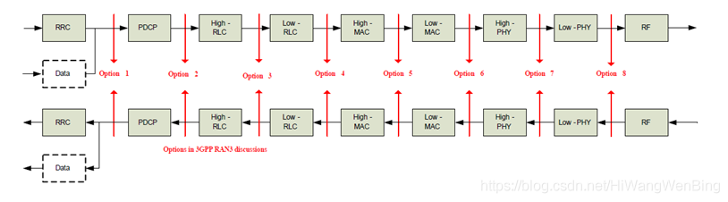
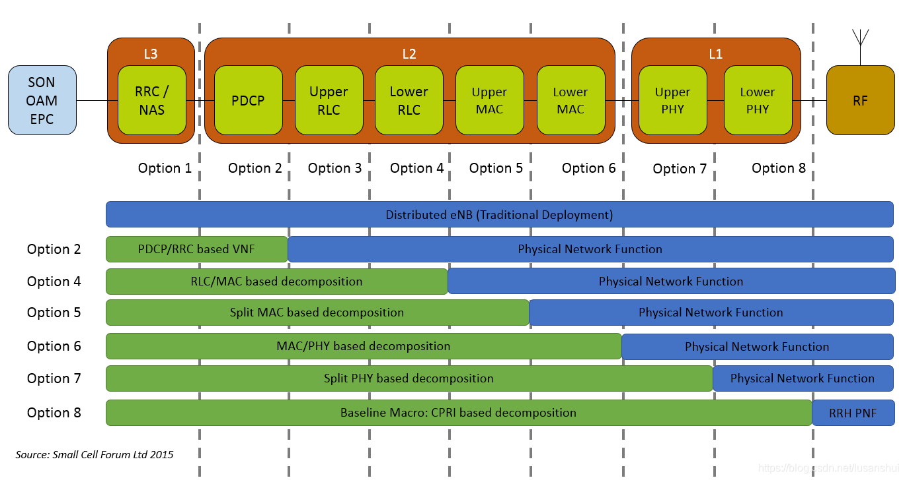
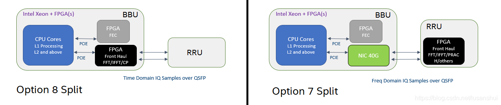
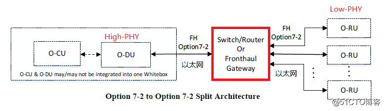
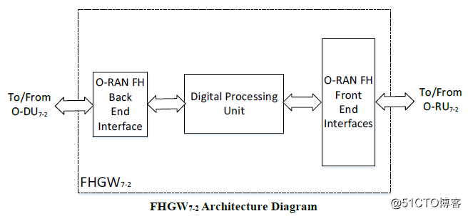

# O-RAN 的硬件白盒化

## 软件的黑盒测试和白盒测试

**1、软件的黑盒测试：**

又叫功能测试，把待测试软件对象看成一个黑盒子，只关注软件的对外接口，完全不考虑程序内部的逻辑结构和内部特性，依据程序的需求规格说明书，检查程序的功能是否符合它的功能说明。

 **2、软件的白盒测试**

有又叫结构测试，把测试软件对象看成一个打开的盒子，利用程序内部的逻辑结构及有关信息，设计或选择测试用例, 对程序的所有逻辑路径进行测试，通过在不同点检查程序状态，否与预期的状态一致。

## 5G协议栈功能切分选项与O-RAN白盒化

白盒化小基站经常提到Option6,7,8， 为啥没有Opiton1-5呢？

从下图就可以看出原因。

选项1-8是[5G](https://so.csdn.net/so/search?q=5G&spm=1001.2101.3001.7020)协议栈的功能切分点。

O-RAN分离式基站，只使用了Option6-8，也就是说，在O-RAN中，最多把High-PHY放到O-RU中实现。

High-PHY之上的功能需放到O-DU或O-CU中。

当然，一体化O-RAN小基站，对应的是Option2.

## O-RAN 分体式小基站Option6硬件白盒化的参考架构

在5G系统中，把L1 PHY层进一步分成了High-PHY和Low-PHY。

High-PHY是指L1中，与DSP没有直接的强相关性软件实体。

Low-PHY是那些与DSP有强相关性的软件实体。

根据把High-PHY和Low-PHY部署DU或RU的方案不同，分为了4中选项：

如下称为Option6,  Option7,  Option8 以及 option7-8。

High-PHY和Low-PHY部署的方案不同，O-DU和O-RU之间的Front Haul接口协议也随之有差别，这是Front Haul比较复杂的一个最重要的原因，后续再用单独的章节讨论Front Haul接口协议的开放问题。

### O-RU6的架构图

- **Ethernet：**以太网交换控制器
- **Timing Unit：**定时模块，包括本地晶振、本地锁相环和定时模块的参考时钟源，通常是IEEE 1588，也可以是GPS.
- **Digital Processing：**数字信号处理单元
- **RF Processing：**模拟射频信号处理单元

**RU RF处理单元:**

- **ANT:** 天线，用于把模拟的电磁波发送到空气中。
- **PA：**主要功能是功率放大，一般用在发射机的最后一级，把无线高频模拟载波信号的功率放大，功率越大，发送的距离越远。
- **LNA:** 低噪声放大器，主要用于接收电路设计中。因为接收电路中的信噪比通常是很低的，往往信号远小于噪声，通过放大器的时候，信号和噪声一起被放大的话非常不利于后续处理，这就要求放大器能够抑制噪声。
- **Transceiver ADC/DAC:** 数模转换器，用于把模拟信号转换成数字信号。

**数字信号处理单元：**

**Radio层数字信号处理单元**

- **CFR:** 是用来降低峰均功率比。
- **DPD:** 是为了解决峰均功率比过大所导致的非线性问题。

**L1 PHY数字信号处理单元**

- High-PHY
- Low-PHY

**nFAPIHandler：**

**Open-nFAPI原本不是5G的规范，而是小基站small-cell论坛制定的L2和L1之间一个跨网元通信的开放的接口协议，以允许VNF（网络功能虚拟化）和PNF（物理网络功能）和之间的互操作性，并促进不同VNF之间的PNF共享。**

这里VNF是L2，运行在O-DU上，PNF是L1,运行在O-RU上。

## O-RAN 分体式小基站Option7硬件白盒化的参考架构

### Option7分离式分层部署

O-DU与O-RU之间可以通过FHGW相连，称为分层部署。

在广覆盖的应用领域，推荐通过FHGW（fronthaul Gateway）网关相连。

通过FHGW的多播和汇集功能，大量节省O-DU和O-RU之间的数据传输带宽。

在此方案中，O-DU和O-RU之间，虽然是以太网连接, 但网关要进行多播和汇集的是IQ数据，因此通用的以太网交换机是不合适的，**eCPRI是这里的一种方案，把IO数据承载在UDP/IP/以太网之上**。

这个网关，这时候，也被称为eCPRI交换机，或eCPRI Hub。

### Option7部署下Front Gateway（FHGW7）的硬件白盒化

**（1）FHGW7的硬件架构图**

**前向和后向接口：**

这两个接口，都是普通以太网接口。

**数字信号处理单元：**

虽然上述接口是以太网，但以太网之上承载的High-PHY与Low-PHY交换的数据格式却是5G新定义的。eCPRI就在诞生在这里。

很显然FHGW7不是普通的以太网交换机，而是专用的数字信号处理单元，需要处理上图中的eCPRI协议层和IO user data层的数据，通常需要FPGA或专用的DSP来实现。

既然eCPRI是承载在以太网, 或者说是UDP之上的，为啥不像FHGW6，直接使用普通的以太网交换或路由器，在O-DU和O-RU之间转发以MAC层或IP层数据呢？

其根本原因是，为了降低O-DU和O-RU之间的数据传输流量，FHGW7还需要支持：

- 下行：支持蜂窝小区级（Cell）的数据的广播，而不是MAC层或IP层的广播
- 上行：支持蜂窝小区级（Cell）的数据的汇集，而不是MAC层或IP层的汇集

**（2）FHGW功能模块图的接口**

- **数字处理单元：**蜂窝小区级IQ数据的广播和汇集功能。
- **POE++：**power over ethernet，通过POE接口，可以给RU进行远程供电。
- DC/DC：直流电源转换。
- CLK: 本地时钟
- Memory：DDR3/4内存
- SPI: SPI flash，用于存放固件。
- Debug interface：串口、Jtag调试口。
- **Ethernet:** 以太网接口。

