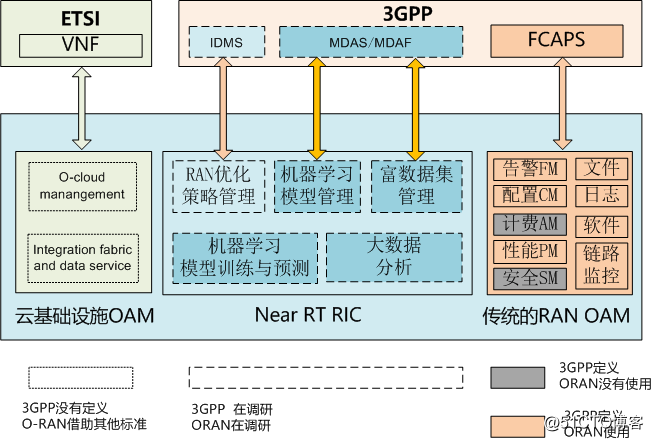
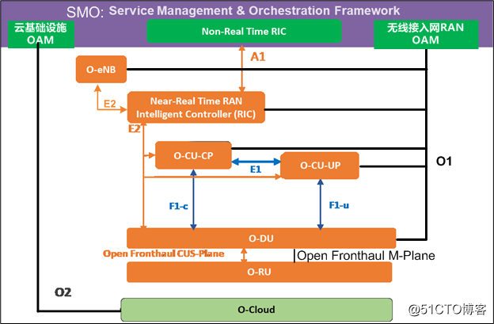
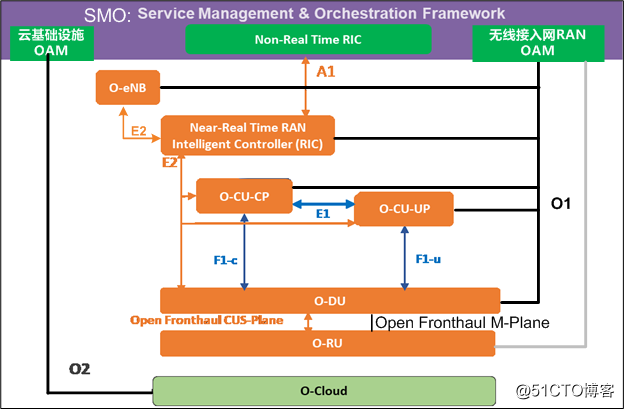
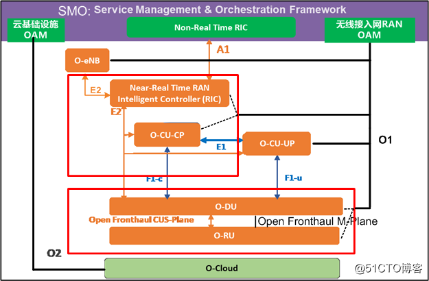

# O-RAN的OAM操作维护管理架构

## O-RAN OAM参考架构的原则

原则能够帮助理解设计背后原因以及遵循的规则，O-RAN OAM架构设计的基本原则：

1. RAN管理接口尽可能与3GPP规范保持一致，并尽可能的复用。
2. 网络功能虚拟化NFV尽可能与ETSI(欧洲电信标准化协会)保持一致，并尽可能的复用。
3. O-RAN OAM参考架构，重点关注O-RAN扩展的部分和现有标准不支持异常处理部分，并尽量推动它们成为3GPP和ETSI的技术标准。

这就是O-RAN与3GPP之间的相辅相成的关系。

## O-RAN OAM的基本参考架构

在《ORAN专题系列-2：O-RAN的系统架构》中，已经阐述了上述各个逻辑网元的功能和相应接口的功能。这里只简单的概述。

- RU, O-DU, O-CU-CP, O-CU-UP, eNB: 这是5G 3GPP定义的标准RAN接入网的网元
- O-Cloud：是虚拟的云基础设施，用于运行O-RAN系统中各个逻辑网元实体的软硬件功能。
- SMO（服务管理与编排）：是OAM网管和非实时无线资源控制的子系统。主要功能有：
    1. 云基础实施OAM：通过O2接口对云基础设施进行操作、维护、管理。
    2. RAN OAM：通过O1接口对无线接入网进行操作、维护、管理。
    3. 非实时的RAN智能控制（Non RT RIC）：结合人工智能技术，大数据分析技术，通过A1接口实施对O-RAN无线资源的非实时性的宏观调控和干预。

构成O-RAN架构的每个被管理的逻辑网元，实际上是一个虚拟的网络功能，可以部署在基于“云”的基础设施之上。

## O-RAN SMO规范与3GPP OAM规范之间的映射关系

MDAS：management data analytics service（管理数据分析的**服务**）

MDAF：management data analytic function（管理数据分析的**功能**）

IDMS：intent driven management service (意图驱动管理的**服务**)

FCAPS：Fault, Configuration, Accounting, Performance, Security

通过上图，可以看出

**在传统的RAN OAM方面：**

O-RAN完全采用了3GPP的规范。由于AM计费是核心网的功能，安全SM是传输的功能，因此在OAM架构，没有把他们包含进来。

**在“云”平台和虚拟网络功能方面：**

3GPP没有既定的规范，O-RAN借用了ETSI欧洲电信标准化协会的标准。

**在人工智能和大数据分析方面**

3GPP没有既定的规范，但3GPP已经有工作组在研究并制定相关的技术标准，

O-RAN也没有既定的规范，同样在积极的研究和制定相关的技术标准。

但O-RAN和3GPP在人工智能和大数据分析方面的侧重点是不一样的。

3GPP侧重于采集大量的无线通信网中的数据，并通过机器学习和大数据分析，对采集到的数据进行分析，并给出预测报告，以供OAM人员进行决策。

O-RAN在3GPP的基础之上，更近了一步，除了3GPP到达成的目标，还期望能够通过人工智能的算法，通过新定义的Non RT RIC和Near RT RIC这两个智能控制器，基于全网的实时分析的宏观数据分析，对RAN系统进行自动动态优化和动态宏观控制，而不是依赖网优人员来进行人工的优化和控制。

## O-RAN部署选项与OAM模型

上述是O-RAN的逻辑网元，然而在实际部署中，不同的逻辑网元有可能部署在同一个物理网元上，为了优化设计，O-RAN又定义多个不同的OAM管理模型。

### 选项1：偏平模型

(Near-RT RIC) + (O-CU-CP) + (O-CU-UP) + (O-DU) + (O-RU)

扁平架构图与逻辑架构图的区别，就是所有的是虚线接口，全部变成实线接口。

在扁平架构中，构成O-RAN架构的每个被管理的逻辑网元，包括O-RU，都作为一个独立的实体，使用独立的、公开的O1通信接口与SMO进行通信。

在此中，O-RU的地位得到了提升，不再接受O-DU配置和管理，而是直接受SMO的配置和管理。但O-RU还需要通过开放的S-Plane接口，从DU获取同步时钟(比如PTP 1588时钟, NTP时间)。

在这个架构中，被管理的逻辑网元实际上是**分布式**地部署“云”基础设施之上的。

### 选项2：分层管理架构模型

(Near-RT RIC) + (O-CU-CP) + (O-CU-UP) + (O-DU)

这里的分层，主要针对的是O-RU管理分层, 而不是其他逻辑网元。

分层管理架构模型与扁平模型的区别是，在该架构中，O-RU不受SMO O1接口的管理，O-RU只接受O-DU通过open fronthaul M-plane的管理，这是传统的4G/5G的管理模式。

SMO只能通过O-DU的O1接口，间接的管理O-RU。这就是分层的含义。

### 选项3：混合管理架构模型

(Near-RT RIC) + (O-CU-CP) + (O-CU-UP) + (O-DU) + (O-RU) + (O-RU)

在此模型中，O-RU接受O-DU和SMO的双重管理，并且都是使用的Open Fronthaul M-Plane的管理，而不是O1接口。

双重管理的麻烦就是O-RU和SMO的信息同步问题。

### 选项4：单一的集中模型

（Near-RT RIC + O-CU-CP + O-CU-UP + O-DU + O-RU）

在这种模型中，所有的逻辑网元，集中部署在一起，对外只提供统一的SMO O1

### 选项5:

(Near-RT RIC + O-CU-CP) + (O-CU-UP) + (O-DU + O-RU)

### 选项6：

### 选择7:

(Near-RT RIC + O-CU-CP + O-CU-UP) + (O-DU + O-RU)

### 选项8:

（Near-RT RIC） + (O-CU-CP + O-CU-UP) + (O-DU + O-RU)

