# O-RAN 近实时无线接入网智能控制器RIC的架构

## 4G/5G非O-RAN网络架构下的无线资源管理RRM，不过是RIC的前世

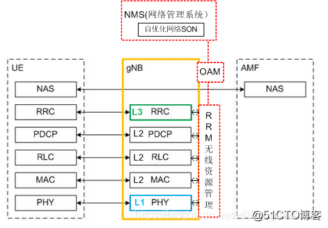

- L1, L2, L3：

> 完成了无线接入网4G/5G分层协议**控制面**的功能。

- RRM无线资源管理：它是**O-RAN中Rear RT RIC的A1**功能的**前身**

> 对移动通信系统的空中接口资源的规划和调度，包括访问控制、信道分配控制、功率控制、负荷管理、移动性管理、小区间干扰协调、无线承载控制、切换控制等。
>
> RRM能够跨越不同的协议层，对无线资源的**信息收集、配置管理和优化控制**。

- OAM:  它是O-RAN中**Rear RT RIC的O1**接口功能的前身。

> 负责单一gNB本地的操作维护管理，并与操作维护管理中心的网管系统NMS进行通信。

- **NMS:** 它是O-RAN中SMO的前身。

> 网络管理系统，负责RAN系统中**所有**的gNB的操作维护管理。

- **SON**(Self-Organized Networks): 它是O-RAN系统中**Non RT RIC**功能的前身。

> 是NMS系统的一个子模块，其主要思路是实现无线网络的一些自主功能，减少人工参与，降低运营成本。

## 5G O-RAN网络架构下的Rear RT RIC, 不过是4G/5G RRM的今生

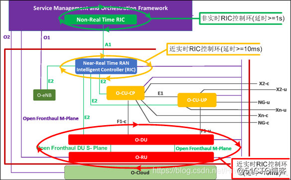

**Near RT RIC**(RAN Intelligent Controller)：近实时无线接入网智能控制器。

它完成类似4G/5G系统中的无线资源管理RRM的功能，但在原先的RRM能力的基础之上，进行了增强：

1. 把**NMS**中**SON**的功能剥离出来，成为SMO中的None RT RIC。
2. 把gNB中无线资源控制**RRM**的功能中剥离出来, 成为一个具有独立功能逻辑网元实体Real RT RIC。
3. 把RRM原先与NMS/OAM的接口独立出来，变成了RIC的A1接口。
4. 把RRM原先与L1、L2、L3的接口独立出来，变成了RIC的E2接口。
5. 虽然RIC在实际部署时，可以与O-CU部署在一起, 但逻辑上讲，RIC是一个独立的网元，独立于单个的CU, DU, 因此可以在更宏观的层面, 综合全网的CU, DU进行“宏观”的调控。
6. RIC增加了人工智能技术，使得RIC更加的 ，如利用机器学习的学习和预测功能。

## Rear RT RIC功能模块

RIC内部架构采用经典的、基于web的、服务器应用程序的三层的架构模型：数据层、逻辑业务层和表示层。

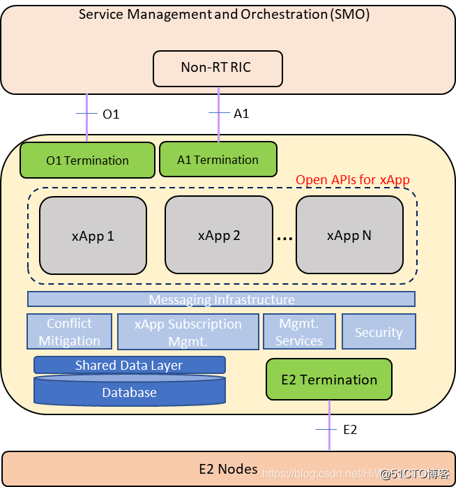

### 第一层：数据层

- **Database：**分布式数据库

> 数据库，用于存放UE上下文相关的信息、无线资源控制相关的信息。
>
> 分布式，是指数据库的存储与Near RT RIC不一定在同一个服务器上，数据库可基于云基础架构而部署。

- **Shared Data Layer：**共享数据层SDL

> 是对底层数据库的封装，简化了上层应用对数据库的访问。

### 第二层：业务逻辑层

- **xApp Subscription Management：订阅管理**

> xApp与E2的节点（ CU、DU、RU）通信采用的是订阅机制。
>
> 订阅管理通过注册/订阅和访问控制管理微服务xAPP。xAPP只有向E2的节点订阅成功后，才能收到E2节点发送的信息，xAPP才能访问和控制E2节点。

- **Conflict Mitigation：冲突缓解**

> 无线资源管理的控制对象可能是小区、UE或承载。而无线资源控制的功能包括接入控制、承载控制、切换控制、QoS控制、资源分配，这些功能是通过修改控制对象的一个或多个参数来完成的。因此多个微服务应用程序调整的参数之间可能会发生冲突，甚至可能是反向的参数配置。
>
> 这就需要对冲突进行控制和管理，以避免CU、DU、RU这些节点无所适从，行为混乱。
>
> 这是RIC实现的一个难点之一。

- **Security：安全**

> 防止恶意的xAPP滥用无线网络信息，增加网络的安全性。

- **Management Services：管理服务(O1接口)**

> （1）xApp生命周期管理
>
> （2）FCAPS: 故障、配置、计费（不需要）、性能和安全管理

- **Messaging Infrastructure：消息基础设施**

> 它在Near RT RIC内部节点之间提供低延迟的消息传递服务。

- **xApp：微服务应用程序**

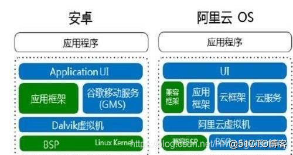

> 一个个独立的应用程序，每个应用程序可能由一个或多个微服务组成。
>
> 这些应用程序只有在运行时，才识别使用哪些数据以及它提供哪些数据。
>
> 与传统的封闭式、单体式程序的服务提供商不同，这里引入了最新的软件架构：微服务软件架构。
>
> 关于微服务以及微服务的软件架构在RIC中应用，在后续的文章中再进一步的探讨。
>
> 在Near RT RIC架构中，xAPP可以由第三方公司提供，xAPP的标准接口使得xAPP非常容易的集成到Near RT RIC系统中。xApp的引入，为RIC打开了一扇对外开放的窗，为第三方公司参与到O-RAN的生态中来，提供了技术上可能性。
>
> 设计出符合某种特定的应用场景下的特定服务（类似单体式应用程序下的功能库，如图形库等，如android平台上的各种百花齐放的应用程序）是第三方专长公司的价值所在。
>
> 传统的电信设备商，如Nokia在RIC这个逻辑网元上，扮演什么角色呢?
>
> 或许，Nokia期望成为xApp+RIC平台+RAN接入网，甚至整个生态的集成商，成为RIC平台的提供商。然而,就RIC平台而言，传统的电信设备上，除了在RIC的冲突管理模块有一定的技术优势外，在其他模块上，是乎没有任何的技术优势。结果如何，拭目以待。

### 第三层：表示层

如果把RIC作为一个系统，表示层就是O1 termination和 A1 termination，它们用来终止SMO Non RT的数据Http请求，然后分发到内部的各个xApp服务上。

如果把O-RAN作为一个系统，表示层就是SMO Non RT，而IE浏览器就是客户端。

## Rear RT RIC的对外接口

这些接口在O-RAN的系统架构和O-RAN OAM系统架构中讨论过，在这里不再深入。

需要说明和强调的是：

这里接口，采用的是：轻量级、低耦合、可伸缩、可定制的基于Http的通信协议。

**E2接口：**

通过该接口，Non RT RIC实现对多个O-CU-CP、O-CU-UP、DU、O-eNB的无线资源的监控、配置、管理和控制。

**O1接口：**

通过该接口，Non RT RIC实现对多个 RT RIC的无线资源的配置、管理。

**A1接口：**

通过该接口， Non RT RIC实现对多个 RT RIC的无线资源的监控和控制。

## 为xApp开放的API接口

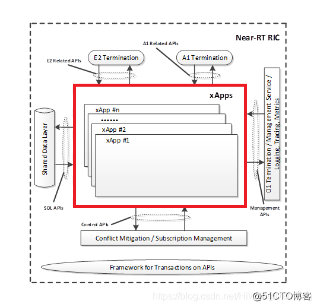

我们说，RIC提供了一种开发的平台，便于能够提供特定场景下的无线资源智能控制的算法和服务的第三方xAPP公司，方便和轻松得把他们的xAPP服务集成到RIC系统中。

这就意味着，RIC平台必须为xApp开放其内部的接口，以便于xApp从RIC平台获取信息，并对O-RAN进行控制。

这些开放的接口包括：

- A1相关的接口

> xApps根据非RT-RIC通过A1接口传输的策略或丰富信息或两者提供增值服务。
>
> 通过此接口，xApps可以完成与A1 termination的信息交互。

- E2相关的接口

> 通过此接口，xApps可以完成与E2 termination的信息交互。

- Management相关的接口

> （1）xApp生命周期的管理
>
> （2）机器学习模型的部署请求、更新请求、卸载请求等接口。
>
> （3）常规的配置管理、故障管理等。

- 共享数据访问层SDL接口

> 该接口提供了一种简单而灵活的存储和检索数据的方法，同时隐藏了数据库的类型和位置、数据库层的管理操作（如高可用性、可伸缩性、负载平衡）等细节。
>
> 该接口还允许多个xApp相互独立地访问数据。

- Control接口

> 该接口提供了xApp与负责控制功能的实体（如冲突缓解、xApp订阅管理）之间交换与控制相关的信息。例如，来自xApp的分析结果、决策或请求，可以通过接口进行传输，以缓解冲突、xApp订阅管理或其他必要的功能。

> 本节结束语：
>
> RIC是O-RAN提出的一个新的逻辑网元，通常与CU一起部署在云端。是对传统的无线资源管理RRM的拆分与重写汇聚， 综合了无线资源管理RRM、切片管理、服务水平协议SLA与Qos、机器学习与预测、微服务架构、云部署、Sass、与移动边缘云计算MEC的协同等技术, 从而实现对5G无线接入网提供近实时的智能控制。
>
> 这是O-RAN非常核心的网元，无论是运营商，还是设备商，对它对报以厚望，后续还讲进一步探讨。

## RIC的位置与使命

**RIC: RAN Intelligent Controller**

**RIC是对传统的无线资源管理RRM的拆分与重新汇聚， 它综合了无线资源管理RRM、切片管理、服务水平协议SLA与Qos、机器学习与预测、微服务架构、云部署+Paas+Sass、移动边缘云计算MEC的协同等技术, 从而实现对5G无线接入网提供近实时的智能控制。**

**RIC是O-RAN提出的一个新的逻辑网元，处于封闭RAN的最边缘，通常与O-CU一起部署在云端。**

**与RAN传统的其他网元不同，RIC诞生在“云”之上，拥有“云原生”很多属性和特点**，同时又承担这对封闭RAN智能控制的职责，注定这是一个新与旧的融合体，注定这里会涌现出新的想象空间，注定这里会诞生新的机会。

部分传统的电信设备商正在与运营商联手，以RIC作为切入点，试图建立一个更加开放的、更加智能的无线接入网；

并通过试图引入大量的第三方xApp微服务提供商，建议一个新的O-RAN的生态环境。

## “云”的基本概念

RIC是O-RAN新定义的网元，因此它没有历史包袱，从诞生那刻起，就在“云”上，RIC的部署完全遵循“云”计算的服务模式：IaaS、PaaS和SaaS。

把原先黑盒式、封闭的式RAN设备提供商的打包服务，转换成开放的、分层的增值服务模式，尽可能的利用已有的开放的云平台，为运营商提供有价值的增值服务。因此，有必要先澄清几个基本的“云”概念。

### 什么是云

相对于单台计算机或单个嵌入式设备而言的，“云”实质就是一个网络。

但“云”又不仅仅是网络。网络是把单个计算机连接起来，“云”是把连接起来的海量的机器协同起来，一起完成计算机最本质的两件事情： 计算与存储。把海量的单个计算机协同起来的“云”具有海量的计算能力和海量的存储能力，并能够按需进行计算能力和存储能力的扩展和伸缩，这是单台计算机和嵌入式设备无法比拟的。

### “云”计算

最初的云计算是分布式计算的一种，指的是先通过“云”将巨大的数据计算处理程序分解成无数个小程序，然后，再通过多部服务器组成的“云”进行处理和分析这些小程序，最后把得到的结果返回给用户。

现阶段所说的云服务已经不单单是一种分布式计算，而是分布式计算、效用计算、负载均衡、并行计算、网络存储、热备份冗杂和虚拟化等计算机技术混合演进的多种计算的综合。

**“云计算”中的计算机群，就像一个庞大的人类社会，分时、分工地合作完成各项活动。**

### “云”计算服务的三种模式

单台计算机为单个用户提供独占式的计算服务。

单台服务器为多各用户提供分时复用的计算服务。

“云”为海量的用户可以提供定制化的计算服务，可以定制CPU, 定制内存，定制操作系统，定制软件等等，行业内把各种定制化的“云”服务大致分进行分类，按照传统的分层的方法，自底向上把这些服务分为：IaaS、PaaS和SaaS。

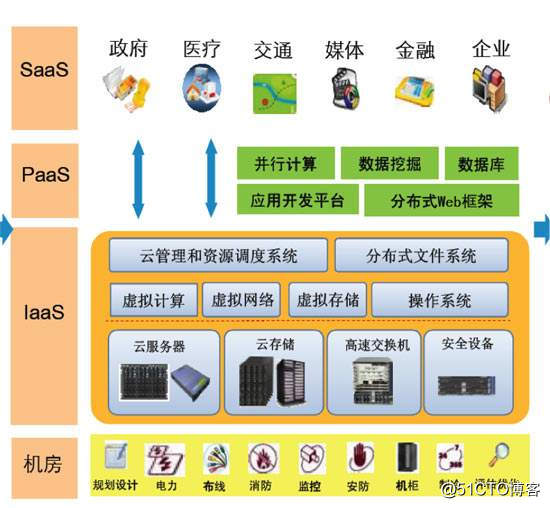

**IaaS（Infrastructure as a Service）：基础架构即服务**

就是云服务的提供商，把**IT基础设施**作为一种服务通过网络对外提供了客户。

IT基础设施包括虚拟的云服务器、虚拟的云存储器、虚拟的交换机等这些**硬件**设备。

操作系统最初作为PaaS平台服务提供给客户，但随着云服务的完善和发展，操作系统、虚拟网络、虚拟的存储器、分布式文件系统这些单机操作系统提供的**软件**功能，也成为了基础实施的一部分。

**PaaS是（Platform as a Service）：平台即服务**

就是云服务的提供商，把**IT云平台**作为一种服务通过网络对外提供了客户。

平台最初只是虚拟机的操作系统，但随着操作系统作成为基础设施的一部分，平台也进一步的上移，现在的平台通常是IT云平台，除了虚拟硬件和操作系统外，还包括应用程序的开发平台、Web应用开发框架、并行计算的平台、机器学习平台、**特定的业务开发平台**等。平台，即开发和运行应用程序的框架。

**SaaS: Software-as-a-Service（软件即服务）**

就是云服务的提供商，直接把**业务软件**作为一种服务通过网络对外提供了客户。

**SaaS平台供应商将应用软件统一部署在自己的服务器上，客户可以根据工作实际需求，通过互联网向厂商定购所需的应用软件服务，按定购的服务多少和时间长短向厂商支付费用，并通过互联网获得Saas平台供应商提供的服务。**

**软件的品种繁多，有通用软件，如云办公软件，也有像政府、医疗、交通、金融、企业等所需要的专业性的行业软件，如微软提供的云医疗诊断软件。**

**客户端：**

**客户通过轻量级的浏览器客户端或手机终端，访问部署在云上的软件。**

---

**IaaS、PaaS和SaaS的成熟，已经改变了传统软件的方方面面：**

**软件的开发模式:** 软件开发商、软件开发团队或个人，无需要投入大量的资金购买大量的用于软硬件开发的设备等生产资料，也无需要从无到有地手把手的搭建软件的开发环境。可以从云服务商那里直接租用PaaS平台作为自己的软件开发平台，节省了大量的**软件开发成本和办公成本**。

**软件的部署模式：**目标软件的部署也变得轻松，大量的应用场合，无需开发专用的嵌入式硬件平台，也无需要在嵌入式硬件平台上开发嵌入式操作系统和中间件等平台软件，目标业务软件直接部署在PaaS之上，软件开发者只需要关注业务软件本身；另外，由于业务软件脱离了专用的嵌入式硬件，而直接部署在虚拟的“云”上，软件的部署变得异常的轻松和方便，极大的节省了大量的**软件开发成本**的同时，也极大的节省了**业务设备本身的成本**。

**软件的使用模式：**软件的使用者，无需要登录到每台机器上使用软件，可以通过轻量级的IE浏览器远程使用软件，极大的提升了软件的**使用效率**。

## RIC出生在“云”上

传统的RAN设备，是专用的嵌入式设备，有专用的硬件电路、专用的硬件驱动程序、嵌入式Linux操作系统，厂家特定的中间件软件、厂家特有的RAN协议软件等等。

而RIC软件，并非运行在嵌入式设备中，而天生运行在“云”上，遵循者“云”服务的理念。

按照云服务的三种形态分类，RIC也是以“云”服务的方式，由设备商提供给运营商或特定的行业用户的。

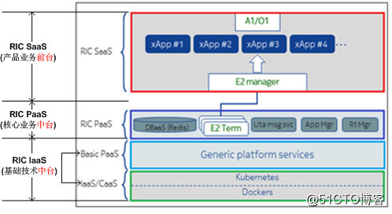

**RIC IaaS：RIC基础设施服务**

RIC直接把“云”服务商提供的基础设施IaaS和云平台PaaS，作为RIC的IaaS.

- Docker：是一个开源的应用容器引擎，让开发者把他们的应用程序以及依赖库打包到一个可移植的镜像文件中，然后发布到任何流行的 Linux或Windows 机器上。Docker是一个轻量级的虚拟机环境。
- Kubernetes：简称K8s，是一个开源的，用于管理云平台中多个主机上的、容器化的应用，它的目标是让部署容器化的应用简单并且高效，它提供了应用部署，规划，更新，维护的一套机制。
- Generic platform service：这是通用的“云”计算平台PaaS。

**RIC PaaS：近实时的RIC平台服务**

RAN智能控制的业务平台，用于运行第三方的RAN智能控制应用程序xApp。

这部分由数据库、E2 terminal、xApp、管理器等组件或服务组成。RIC内部详细的架构，参看《ORAN专题系列-10：5G O-RAN 近实时无线接入网智能控制器RIC软件架构》

近实时的RIC平台服务，是RIC的核心，也是O-RAN生态系统的最核心组成之一。

近实时的RIC平台服务，秉承着“平台即服务”的理念，为电信运营商或特定的行业用户提供了一个能够运行各种RAN智能控制软件的运行平台。

因此RIC平台是一个类似Android的开放的平台，允许第三方公司自由的开发具有自己特色RAN智能控制应用的xApp，只要遵循开放的接口标准，第三方的RAN智能控制应用程序xApp就可以在此平台上运行，实时地对O-RAN中的网元进行智能控制，这为第三方参与到O-RAN生态中提供了一定的技术保障。

**RIC SaaS：RIC应用软件服务**

软件即服务，这里的软件就是xApp，5G的RAN切片和特定的行业应用，为xApp提供了需求层面的土壤。

不同行业对RAN系统无线资源的管理策略是不相同的，O-RAN把此类应用的算法和代码实现从传统的运营商中剥离了出来，留给了第三方开发者。

> **本节结束语：**
>
> 虽然O-RAN定义了RAN的开发标准，但要实现RAN的完全的开放，还有很长的路要走。RIC为RAN的开放打开了一扇窗，RIC在RAN一时无法完全开放的情况下，为RAN的开放迈出了实质性和关键线性的一步。
>
> RIC把RAN开放到什么程度的控制权利留给RAN的设备供应商，允许RAN的设备供应商有条件、有步骤的、灵活的开放其内部无线资源。同时提供了一种开放的平台，允许第三方xApp公司，基于RAN设备开放的功能，开发特定业务场景下的无线资源智能制的应用程序。

## 微服务架构在5G O-RAN RIC中的应用

微服务架构的演进

### 单体应用程序架构

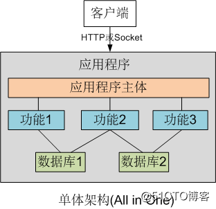

**特点：**

软件的所有功能集成在同一个软件包中，整体部署在服务器中运行。

**优点：**

- 在业务发展初期，为了快速落地应用，满足客户需求，一般会使用All in One的单体架构，
- 也是小项目的首选，开发成本低，架构简单。

**缺点：**

- 项目复杂后，模块与模块之间的交互与耦合就会很严重，很难扩展与维护，扩展成本高。
- 模块由于存在直接或间接的调用关系，编程语言也受限制。
- 所有的服务胶合在一起，没有分离，任何一点小的改动，都需要重新发布整个软件包。
- 新的技术很难在单体架构中实施。

**注解：**

这是典型的RAN系统中任一网元的传统的软件架构，导致组件间高度耦合。

### 垂直应用程序架构

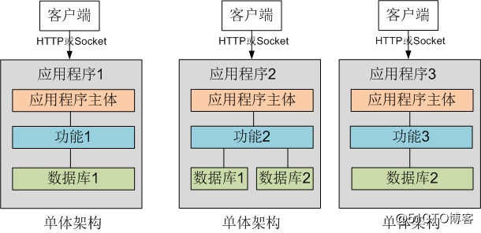

**特点：**

- 对于单体架构进行拆分，拆分成几个垂直的独立的单体架构的子应用程序，
- 子应用程序之间尽量相互独立，没有交互。
- 单体架构的应用程序如果需要通信，则采用进程间通信实现。

**优点：**

- 架构简单，只是单体架构的复制。
- 避免在原有单体架构上做无限的功能扩充，避免了单个应用程序内部变得过于复杂和臃肿。
- 新增单体可以采用新的技术实现，不必受限于原有系统。

**缺点：**

- 不同应用程序之间有公共代码的实现的冗余，长此以往，公共代码就有多份备份，会导致资源的浪费。
- 不同应用程序之间出现动态数据的冗余，不同应用程序之间需要进行数据的同步。
- 且存在大量的重复代码拷贝及模块功能需大量重复造轮子的情况

### SOA面向服务的架构

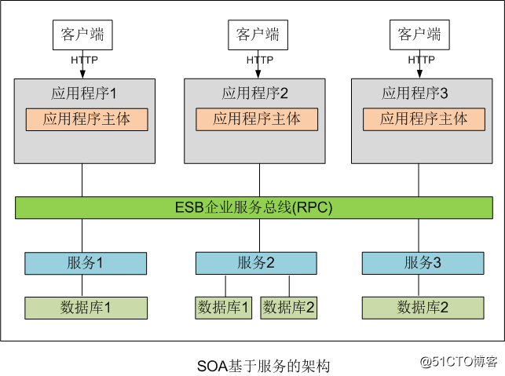

**特点：**

- 面向服务的体系结构已经逐渐成为IT集成的主流技术
- 一个服务定义了一个相对独立、自包含、可重用的业务功能。
- 服务间一般通过企业服务总线（ESB）的方式组装起来，对外提供更复杂的服务，满足客户更多样化的需求。
- ESB是传统中间件技术与XML、Web服务等技术结合的产物

**优点：**

- 提高了系统的可复用性、解决冗余代码
- 通过ESP通信，减少模块之间的耦合

**缺点：**

- 系统/应用与服务之间的界限不清晰，不利于开发
- ESP服务接口不固定，不利于系统维护
- 服务抽取的粒度过大。

### 微服务架构：（大平台）

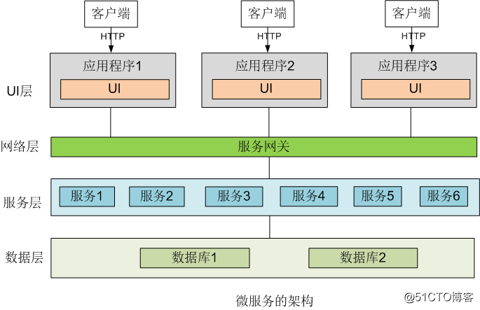

**特点：**

- 微服务架构是一种部署在“云”中的应用程序的架构模式，
- 提倡将系统各个功能，抽象出来，变成一个个独立的细小服务，
- 每个独立的小服务可以独立部署，因此细小服务是自带上下文的。
- 微服务之间采用基于Http协议的轻量级的通信机制。
- 应当尽量避免统一的、集中式的服务管理机制。
- 每个独立的小服务可以选择适合的编程语言和工具进行独立构建。

**优点：**

- 拆分粒度比较小，便于独立开发、部署、维护。
- 适用于互联网快速的更新迭代。
- 每个微服务可以通过独立的技术（编程语言或其他工具）实现
- UI和微服务间采用轻量级的HTTP协议进行通信。

**缺点：**

- 微服务太多，达到成千上万个，对微服务框架和微服务的治理平台要求较高。
- 把系统拆分的一个个独立的小服务的技术要求和难度大。

## O-RAN RIC的架构及微服务应用程序xApp

在上述RIC的架构中，RIC PasS的服务，是以微服务的方式提供。

当然，RIC PasS还包括微服务的开发平台、运行平台和治理平台。

而xApp是第三方开发的应用程序，基于微服务架构的应用程序，主要利用RIC PasS微服务提供的RAN系统的数据，进行特定行业或特定领域场景下对RAN资源进行控制。

> **本节结束语：**
>
> 微服务架构是新的软件架构，在互联网中得到了普遍的应用，而电信设备商的软件架构基本还停留在最初的单体程序架构上，因此电信设备商要想大幅度减少软件的发布周期，提升软件从开发到发布再到部署的整体效率，不仅仅需要组织架构的革新、软件开发流程的革新、IT基础设施的革新、管理人员和开发人员（劳动者）思维方式的变革、还包括目标系统（劳动对象）软件系统架构的革新。

