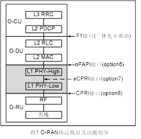

# O-RAN

**X-RAN:** 该工作组侧重于三个方面：将RAN控制平面与用户平面耦合，构建使用COTS硬件的模块化eNodeB软件堆栈，以及公开南向和北向接口。

**O-RAN的硬件白盒化：**

## Reference

> [美国力挺的Open RAN，真的能成功吗？](https://www.eet-china.com/mp/a34799.html)
>
> [通信-ORAN专题系列](https://blog.51cto.com/u_11299290/category33/p_1)
>
> [ORAN专题系列-1：什么是开放无线接入网O-RAN - Cache One](https://cache.one/read/2136366)

