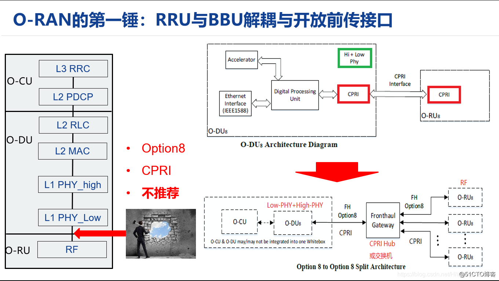
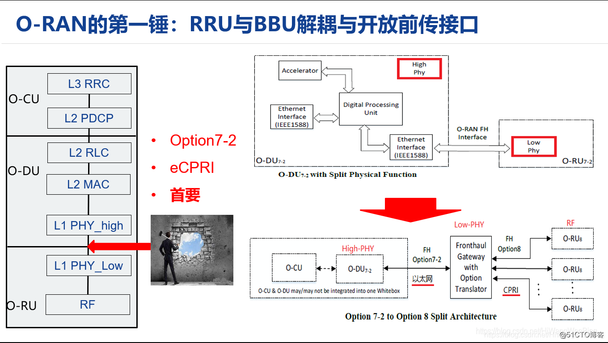
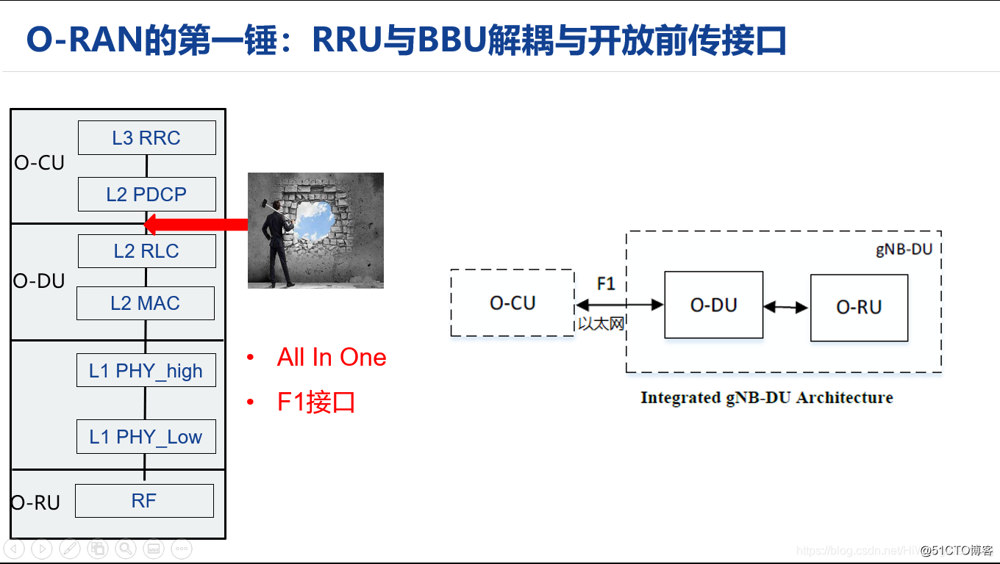
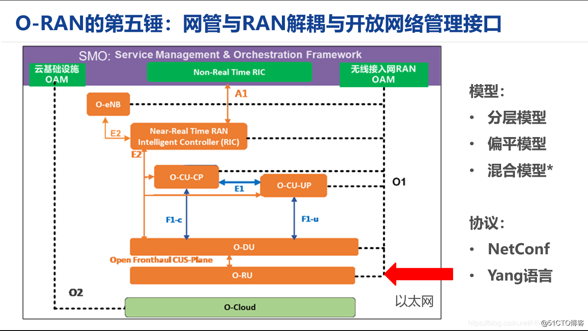
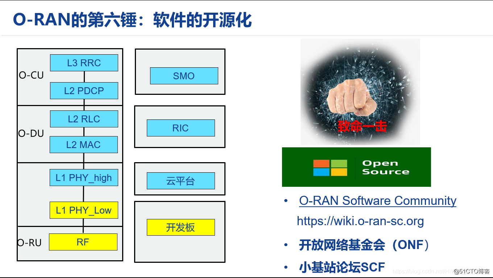
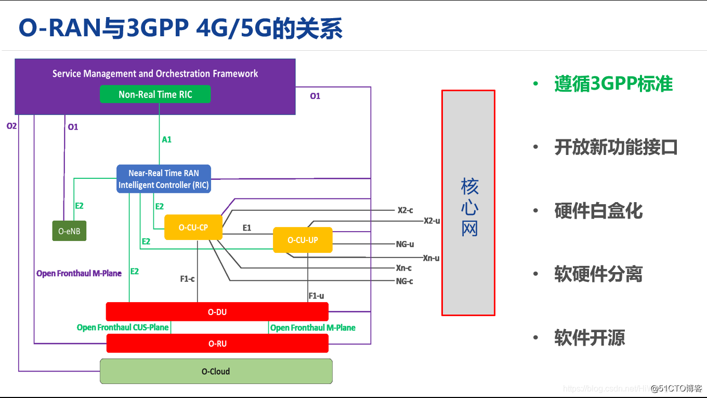

# O-RAN 总体架构与概述

## 什么是无线接入网RAN (Radio Access Network)

终端设备，如手机、电脑、智能终端等通过网络连接起来的通常方式有两种：

- 一种方式称为 **“有线”**：如网线、光纤、有线电视线。
- 另一种方式称为 **“无线”**：如果WiFi，WiMax，蓝牙，ZigBee，卫星通信，还有我们常听到的2G, 3G, 4G, 5G。

广义上讲，能够把无线终端连接通过无线的方式连接到网络中的设备组成的网络，都称为无线接入网RAN。为了进一步区分各种无线接入网，需要对无线接入网进一步的划分。

**划分方法1**：

- 专用无线接入网：特定的行业或部门面向内部服务而建立的无线接入网。如公安、军队、企业。
- 公众无线接入网：由电信运营商面向公共服务而建立起来的无线接入网，如2G/3G/4G/5G.

**划分方法2**：

- 利用免费的无线频谱接入：如WiFi，蓝牙。
- 使用授权的无线频谱接入：如2G/3G/4G/5G。

O-RAN中的RAN, 是指电信运营商如果中国移动、中国联通，中国电信，提供的2G/3G/4G/5G等公众无线接入网，我们暂称为狭义上的无线接入网RAN。后续提到的RAN就是这种狭义上的无线接入网。

无线接入RAN只为无线终端通过无线电磁波的方式连接到网络提供了手段，但如果终端要想相互间通信，还需要上图中的核心网。当然，核心网除了确保无线终端之间能够相互通信，还提供了计费、移动管理、与其通信网络互通、与互联网互通等功能。核心网和无线接入网共同组成公众移动/无线通信网。

## ORAN联盟的组织架构

由AT&T、中国移动、德国电信、NTT DOCOMO和Orange于2018年2月成立，于2018年8月作为德国的实体成立。管理架构包括一个由**15**家运营商组成的运营委员会和一个由斯坦福大学教授Sachin Katti博士和中国移动无线技术首席科学家Chih Lin I博士共同主持的技术指导委员会。剩余的成员由每个**技术工作组**的主席和联合主席组成。工作组由操作员和贡献者组成。

- **工作组1: 用例和总体架构工作组**。它全面负责O-RAN体系结构和用例场景，以及不同工作组的任务的划分、跨工作组的技术协调。
- **工作组2: 非实时运行的智能控制器和A1接口工作组**。支持非实时智能无线资源管理、高层过程优化、RAN中的策略优化，并为近实时（Near RealTime）无线智能控制器(RIC: RAN Intelligent Controller)提供AI/ML(人工智能/机器学习)模型。
- **工作组3：近实时RIC和E2接口工作组**。定义一个基于近实时无线电智能控制器（RIC）的体系结构，实现对RAN元素和资源的近实时控制和优化。
- **工作组4：开放前传（fronthaul）接口工作组**。提供真正的开放前传接口，可以实现多供应商的DU-RRU互操作性。FrontHaul（前向回传）主要是从BBU（Building Base band Unit：基带处理单元）到RRU（Radio Remote Unit：射频拉远单元）或RRH（Remote Radio Head：射频拉远头）之间的连接。
- **工作组5：开放的F1/W1/E1/X2/Xn接口工作组**。为这些3GPP定义的接口提供完全可操作的多供应商配置文件规范，是对3GPP现有接口规范的增强。
- **工作组6：云化和编排工作组**。推动RAN软件与底层硬件平台的剥离与脱钩，并提供相关的技术和参考设计，使通用的商用硬件平台能够用于RAN部署的所有网元，包括CU和DU。
- **工作组7：白盒硬件工作组**。这个工作组的目标是规范化、标准化、并发布一个完整的参考设计，以孵化一个实现分离的软硬件平台。
- **工作组8：协议栈参考设计工作**。开发O-RAN中央单元（O-CU）和O-RAN分布式单元（O-DU）的软件架构、设计，以及相应的发布计划。（没有包括AAU）

- **工作组9：数据传输工作组**。关注传输层，包括传输设备、物理介质和与传输网络相关联的控制/管理协议。

## O-RAN需要开放5G系统的哪些接口？

**（1）Fronthaul接口：**

该接口在5G系统中是DU和RU的接口，4G系统中是BBU与RRU直接的接口，该接口的私有化，导致运营商必须采购同一设备商的DU和RU设备。

O-RAN首先需要开发的是该接口，使得所有的5G网元的接口都是标准的。

**（2）RAN与网管系统NMS的接口：**

封闭系统里，特定设备商的RAN只能由设备商自家的NMS管理，而网管接口关系到O-RAN系统运维的自动化和智能化的水平，该接口是O-RAN是否能够成功的关键。

在这里O-RAN定义了一个新的网元RIC，以及其与O-RAN现有网元直接连接的E2接口,RIC SMO的A1接口等。

## O-RAN与v-RAN的区别以及演进线路

O-RAN的目标是RAN的接口开放化，O-RAN不一定是硬件的虚拟化，他强调的是硬件的白盒化，即设计开放。

v-RAN的目标是RAN硬件的虚拟化，虚拟化的vRAN不一定是开放的。

O-RAN和v-RAN之间有交集，也有错开的部分。

但RAN的虚拟化，能够促进O-RAN的实施：

- 通过RAN的虚拟化，供应商的软件和硬件被分离。软件将不再与特定于供应商的专用硬件绑定，RAN软件可以在虚拟机或容器中运行。
- 通过虚拟化，运营商可以通过通用处理器性能的周期性提升获得RAN系统性能的提升。
- 同时在虚拟机上运行，也便于O-RAN的功能软件的更频繁的升级、更易于安装。
- 还可以通过软件更新彻底改变原先的供应商， 这对O-RAN是一个很大的诱惑，可以弥补O-RAN在通用的虚拟平台上短期性能不足的问题。

**因此O-RAN有一个最佳实践性演进路线：**

**设备商专用硬件RAN => 设备商vRAN => 设备商的开放RAN  => 可替换开放RAN.**

## ORAN快速概览与创业机会

## Reference

> [美国力挺的Open RAN，真的能成功吗？](https://www.eet-china.com/mp/a34799.html)
>
> [通信-ORAN专题系列-new](https://blog.csdn.net/hiwangwenbing/category_10056821.html)
>
> [通信-ORAN专题系列](https://blog.51cto.com/u_11299290/category33/p_1)
>
> [ORAN专题系列-1：什么是开放无线接入网O-RAN - Cache One](https://cache.one/read/2136366)
>
> [O-RAN Docs](https://docs.o-ran-sc.org/projects/o-ran-sc-o-du-phy/en/latest/xRAN-Library-Design_fh.html)
>
> [xRan Controller Integration](https://wiki.onosproject.org/display/ONOS/xRAN+Controller+Integration)
>
> [通信人工智能的下一个十年](http://www.cww.net.cn/article?id=487657)

