## 电磁波概述

**电磁波的产生：**

- 变化的电场 + 变化的磁 场形成的统一场在空间传播，就形成电磁波。

**电磁波的分布：**

- 通过波长大小定义波的分布，波长从长到短（频率从小到大）分布为：**无线电波，红外线，可见光，紫外线，X射线，伽马射线等**。如下图所示。

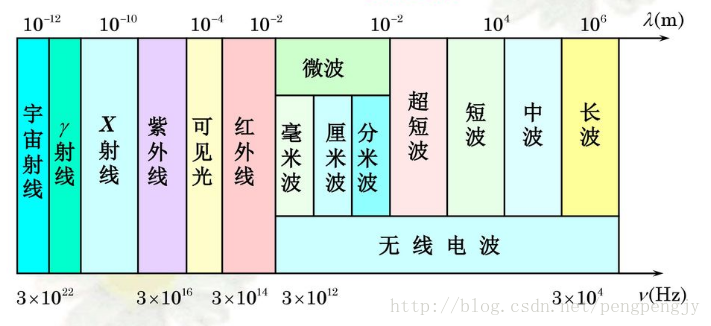

**无线电波：**

无线电波包括长波，中波，短波，超短波和微波，**频率范围为10KHz到30GHz**。我们日常所用的无线AP，手机，收音机，对讲机都依靠无线电波进行数据传输。如目前使用的wifi就工作在2.4GHz和5GHz频段，再如我国5G（第五代移动通信技术）通信工作的频段为**3.3GHz-3.6GHz,4.8GHz-5GHz**。有人可能会担心会不会与5Gwifi形成干扰，答案是不会，因为5GHz wifi包含5.1GHz和5.8GHz左右，与第五代通信频段没有重叠。

频率越高，是否穿透力越弱？

对于可见光以下的电磁波（包括可见光），如**电磁波，满足频率越高，穿透性越弱**，如5G wifi的穿墙能力没有2.4G wifi强。

**对于可见光以上的地磁波，如X射线，恰恰相反，频率越强，穿透力越强，如X射线可以穿透金属。**

具体原因和光子能量有关，可见光的光子能力大，足以让其他阻挡它传播的物体的粒子发生能量级跃变，所以能量被吸收了，无线电波光子能量不够，最多因为损耗失去一部分能量。而X光的光子能量更大，在使障碍物发生能级跃变之后，还有足够能量穿越障碍物。

---

## 无线电波

**无线电波**（英语：Radio waves）有时也称**无线电**、**射频**，是一种[电磁波](https://zh.wikipedia.org/wiki/电磁波)，其[波长](https://zh.wikipedia.org/wiki/波长)在[电磁波谱](https://zh.wikipedia.org/wiki/電磁波譜)中比[红外线](https://zh.wikipedia.org/wiki/红外线)长。无线电波的[频率](https://zh.wikipedia.org/wiki/頻率)在300 [GHz](https://zh.wikipedia.org/wiki/赫兹)到3 [kHz](https://zh.wikipedia.org/wiki/赫兹)之间，但也有定义将任何1 GHz或3 GHz以上的电波划为[微波](https://zh.wikipedia.org/wiki/微波)。当频率在300 GHz时，无线电波对应的波长为1 mm（0.039英寸）；在3 kHz时，波长为100 km（62 mi）。和其他电磁波一样，无线电波也以光速行进。

**自然界中的无线电波主要是由[闪电](https://zh.wikipedia.org/wiki/闪电)或者[宇宙天体](https://zh.wikipedia.org/wiki/射电天文学)形成。**

无线电波由[无线电发射器](https://zh.wikipedia.org/wiki/发送器)产生，并由[无线电接收器](https://zh.wikipedia.org/wiki/无线电接收机)使用[天线接收](https://zh.wikipedia.org/wiki/天线)。无线电波在现代技术中广泛用于固定和移动[无线电通信](https://zh.wikipedia.org/wiki/无线电)、[广播](https://zh.wikipedia.org/wiki/广播)、[雷达](https://zh.wikipedia.org/wiki/雷达)和[无线电导航](https://zh.wikipedia.org/w/index.php?title=无线电导航&action=edit&redlink=1)、[通信卫星](https://zh.wikipedia.org/wiki/通訊衛星)、[无线计算机网络](https://zh.wikipedia.org/wiki/无线网络)等。不同频率的无线电波在地球大气层中具有不同的传播特性；长波可以在山脉等障碍物周围[衍射](https://zh.wikipedia.org/wiki/衍射)并随地球表面进行传播（[地波](https://zh.wikipedia.org/wiki/面波)），较短的波可以从[电离层](https://zh.wikipedia.org/wiki/电离层)被反射并传播至地平线以外（[天波](https://zh.wikipedia.org/w/index.php?title=天波&action=edit&redlink=1)），而短得多的波长则很少弯曲或衍射并继续以[视线传播](https://zh.wikipedia.org/wiki/视线传播)，因此它们的传播距离仅限于[地平线](https://zh.wikipedia.org/wiki/地平線)。

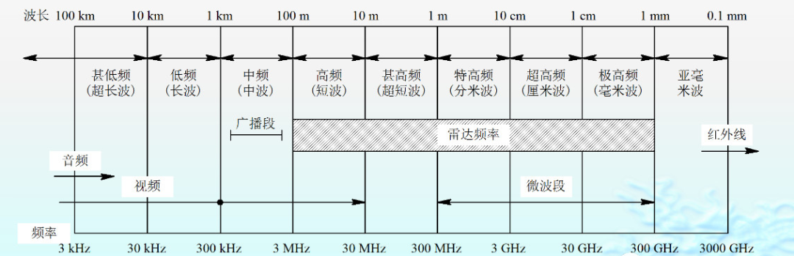

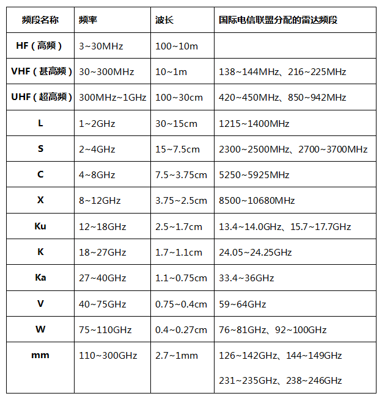

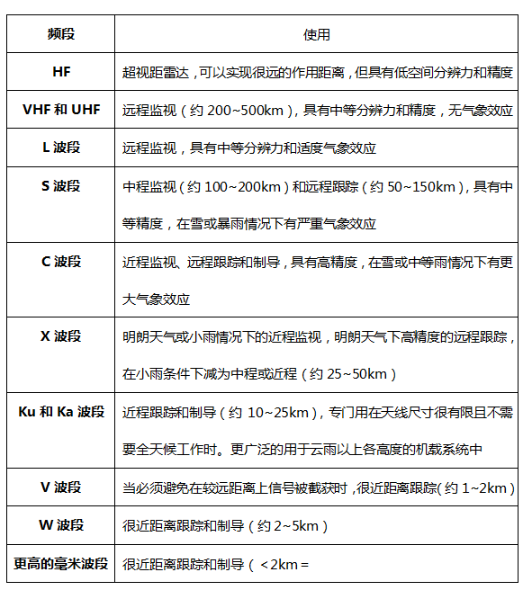

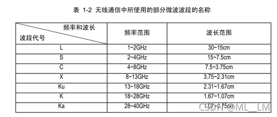

---

## 无线通信频率分配表

**先看看无线电信号的频谱如何划分：**

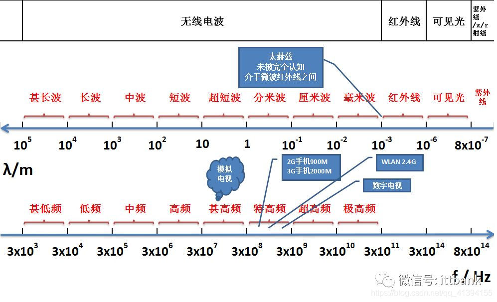

## 5G NR 频段

3GPP已指定[5G](https://so.csdn.net/so/search?q=5G&spm=1001.2101.3001.7020) NR 支持的频段列表，5G NR频谱范围可达100GHz，指定了两大频率范围：

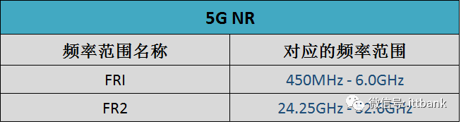

**①Frequency range 1 （FR1）：就是我们通常讲的6GHz以下频段**

**•频率范围**：**450MHz - 6.0GHz**

**•最大信道带宽100MHz**

**②Frequency range 2 （FR2）：就是毫米波频段**

**•频率范围**：**24.25GHz - 52.6GHz**

**•最大信道带宽400MHz**

5G NR支持 16CC 载波聚合。

由于5G NR定义了灵活的子载波间隔，不同的子载波间隔对应不同的频率范围，具体如下：

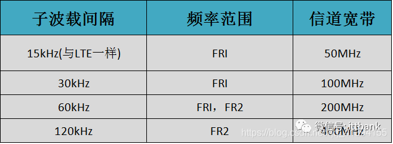

5G NR频段分为：FDD、TDD、SUL和SDL。SUL和SDL为辅助频段（Supplementary Bands），分别代表上行和下行。

**与LTE不同，5G NR频段号标识以“n”开头，比如LTE的B20（Band 20），5G NR称为n20**。

目前3GPP已指定的5G NR频段具体如下：

**FR1 (450 MHz–6000MHz)：**

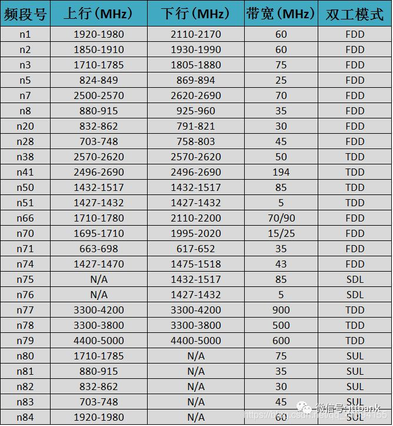

**FR2：**

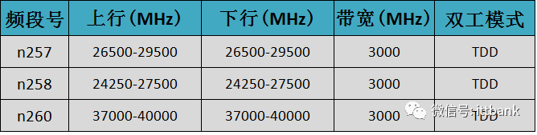

如上图所示，5G NR包含了部分LTE 频段，也新增了一些频段。目前，全球最有可能优先部署的5G频段为n77、n78、n79、n257、n258和n260，就是3.3GHz-4.2GHz、 4.4GHz-5.0GHz和毫米波频段26GHz/28GHz/39GHz。

## 国内频谱分配情况

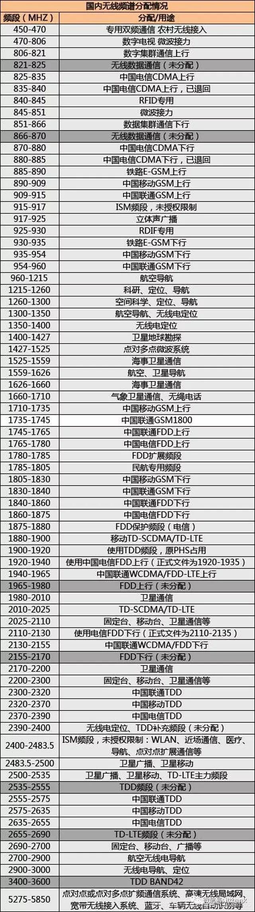

## 三大运营商频率划分

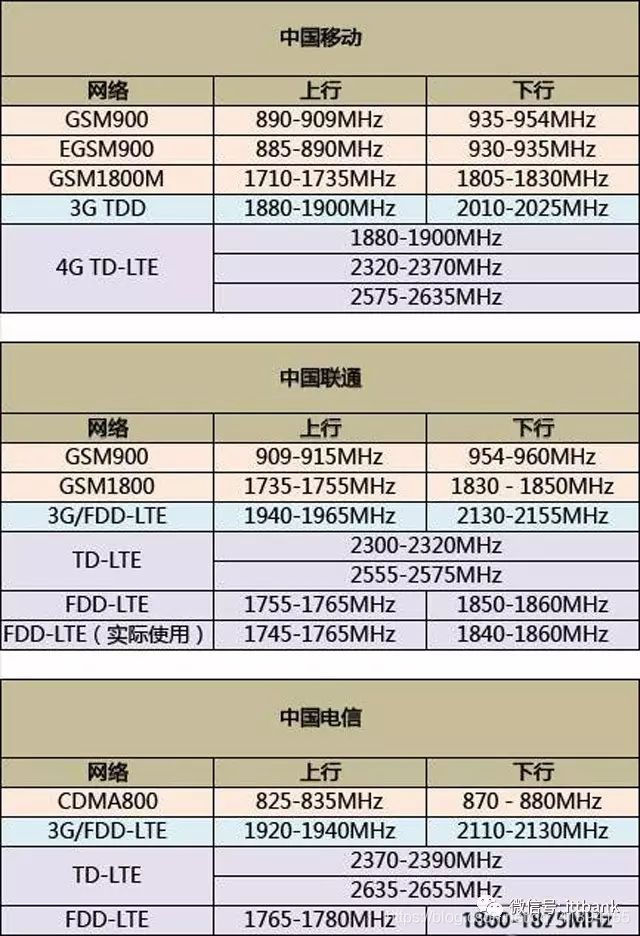

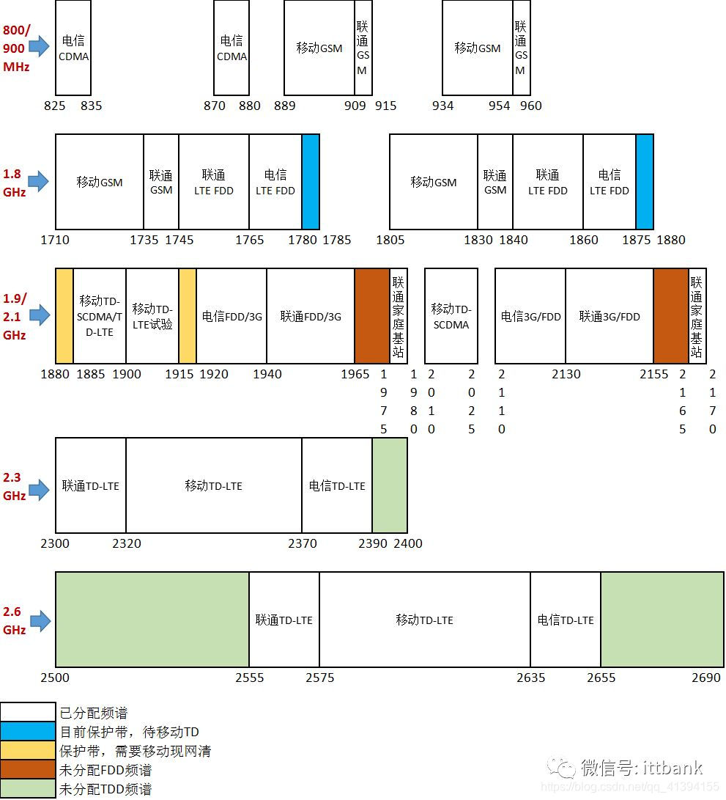

注：

- 1）黄色保护带：原移动用1880-1900（20M），电信用1860-1875（15M），由于TD和FDD之间有干扰，需留1875-1880间的5M出来做隔离带。电信把小灵通占用频段（1900-1920）清出来还给移动后，移动就拥有完整的从1880-1920的40M频段，但隔离带由移动侧出1880-1885间的5M。这样，电信就可以用1860-1880做完整的20M载波。移动用1885-1920的35M。
- 2）根据今年6月份《工信部同意关于中国电信使用800M和2100M频段开展LTE组网的批复》，中国电信可以在CDMA 1X/DO频段825-835/870－880，1920-1940/2110-2130上重耕LTE FDD。
- 3）根据最近《工信部同意关于中国联通调整部分频率用于LTE组网的批复》，中国联通可以在原2G和WCDMA频段909-915/954-960，1735-1750/1830-1845,1940-1965/2130-2155上重耕LTE FDD。

## Reference

1. [雷达波段划分](https://blog.csdn.net/qq_38961780/article/details/120400731)
2. [关于电磁波的几点常识](https://blog.csdn.net/pengpengjy/article/details/79516780)
3. [无线通信频率分配表（含最新5G NR）](https://blog.csdn.net/qq_41394155/article/details/88556457)